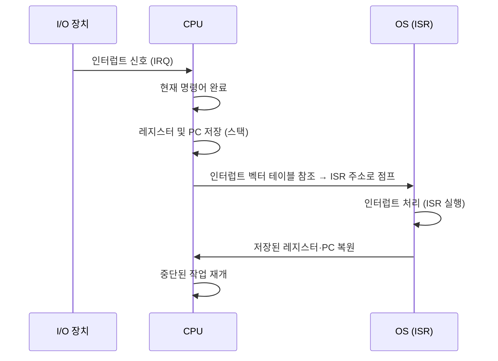
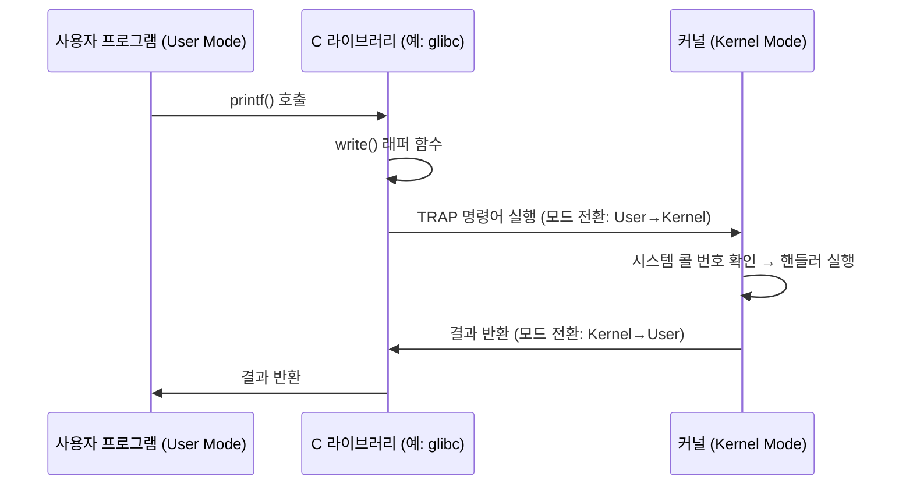
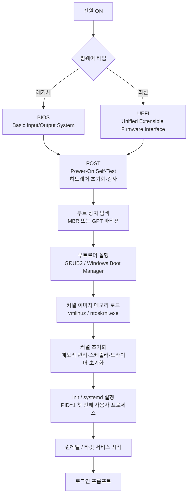

# Part 1. OS 개요 및 시스템 구조 (Ch. 1–2)

> 면접 빈도: ★★★★★ (운영체제 개념의 토대 — 거의 모든 면접의 1번 주제)

---

## Chapter 1. 서론 (Introduction)

### 1-1. 운영체제 정의와 역할

**운영체제(Operating System)** 란 하드웨어와 사용자 사이에서 **중개자(intermediary)** 역할을 하는 시스템 소프트웨어다.

| 관점 | 정의 |
|------|------|
| 자원 관리자 (Resource Manager) | CPU, 메모리, I/O 장치 등 하드웨어 자원을 효율적으로 할당·관리 |
| 제어 프로그램 (Control Program) | 프로그램 실행을 제어하고 오류 및 부적절한 사용 방지 |
| 커널 (Kernel) | 항상 실행 중인 핵심 프로그램 (협의의 OS) |

**4가지 핵심 목표**
1. 사용자 프로그램 실행 편의 제공
2. 컴퓨터 시스템을 사용하기 편리하게 만들기
3. 하드웨어를 효율적으로 사용
4. 보안 및 보호 (Security & Protection)

> 💡 **면접 포인트**
> "OS가 없으면 어떻게 되나요?" → 프로그램이 하드웨어를 직접 제어해야 하므로 이식성·안전성 모두 붕괴. OS는 하드웨어 추상화 계층(abstraction layer)을 제공해 프로그래머가 하드웨어 세부를 몰라도 되게 한다.

---

### 1-2. 컴퓨터 시스템 구조

```
┌─────────────────────────────────────────────────────────┐
│                    사용자 프로세스들                      │
├─────────────────────────────────────────────────────────┤
│                   운영체제 (Kernel)                       │
├──────────┬──────────┬──────────────┬────────────────────┤
│   CPU    │  Memory  │  Disk 컨트롤러│   USB 컨트롤러     │
│ (+ Cache)│  (RAM)   │              │                    │
└──────────┴──────────┴──────────────┴────────────────────┘
                    공유 버스 (System Bus)
```

**주요 구성 요소**

| 구성 요소 | 역할 | 특징 |
|-----------|------|------|
| CPU | 명령어 인출(Fetch)·해석(Decode)·실행(Execute) | 레지스터, ALU, 제어 장치 포함 |
| 메모리 (RAM) | CPU가 직접 접근 가능한 유일한 대형 저장소 | 휘발성(Volatile), 바이트 단위 주소 지정 |
| I/O 장치 | 디스크, 키보드, 네트워크 카드 등 | 장치 컨트롤러(Device Controller)가 각각 로컬 버퍼 보유 |
| 버스 (Bus) | 컴포넌트 간 데이터 통신 경로 | 주소 버스·데이터 버스·제어 버스로 구성 |

**부트스트랩 시 흐름**: ROM/EEPROM에 저장된 펌웨어(Firmware) → CPU 초기화 → 메모리 검사 → OS 커널 로드

---

### 1-3. 인터럽트 메커니즘 (Interrupt Mechanism)

인터럽트는 CPU에게 "지금 처리해야 할 이벤트가 생겼다"고 알리는 신호다. CPU는 현재 작업을 중단하고 **인터럽트 서비스 루틴(ISR, Interrupt Service Routine)** 을 실행한다.

#### 인터럽트 종류

| 구분 | 발생 주체 | 예시 |
|------|-----------|------|
| 하드웨어 인터럽트 (Hardware Interrupt) | I/O 장치, 타이머 등 외부 | 키 입력, 디스크 I/O 완료, 타이머 만료 |
| 소프트웨어 인터럽트 = 트랩 (Trap) | CPU 내부 (프로그램) | 시스템 콜, 0으로 나누기, 페이지 폴트 |
| 예외 (Exception) | CPU 내부 (비정상 조건) | 잘못된 명령어, 메모리 접근 위반 |

#### 인터럽트 벡터 (Interrupt Vector)

- 인터럽트 번호 → ISR 주소를 담은 **인터럽트 벡터 테이블(IVT)** 을 메모리 고정 위치에 저장
- x86: 메모리 0x0000 ~ 0x03FF (256개 × 4바이트)
- x86-64: **IDT(Interrupt Descriptor Table)** 로 대체 (IDTR 레지스터가 위치 기록)

#### 인터럽트 처리 흐름



> 💡 **면접 포인트**
> - 인터럽트 처리 중 다른 인터럽트가 오면? → **인터럽트 비활성화(Disable)** 후 처리하거나, 우선순위 기반 **중첩 인터럽트(Nested Interrupt)** 허용
> - 폴링(Polling) vs 인터럽트: 폴링은 CPU가 주기적으로 확인(바쁜 대기, Busy-Wait), 인터럽트는 장치가 알림 → 인터럽트 방식이 CPU 효율 높음

---

### 1-4. 저장장치 계층 (Storage Hierarchy)

속도, 비용, 용량 사이의 트레이드오프로 계층 구조를 형성한다.

```
       빠름 / 비쌈 / 작음
           ┌─────────┐
           │Register │  ← CPU 내부, 수십 개, 1 cycle
           ├─────────┤
           │  Cache  │  ← L1/L2/L3, 수십 KB ~ 수십 MB, 수 cycle
           ├─────────┤
           │   RAM   │  ← 수 GB ~ 수백 GB, ~100ns
           ├─────────┤
           │   SSD   │  ← 수백 GB ~ 수 TB, ~0.1ms
           ├─────────┤
           │   HDD   │  ← 수 TB, ~10ms (Seek 지배)
           ├─────────┤
           │ 광학/테이프│  ← 백업용, 수십 ms ~ 수십 초
           └─────────┘
       느림 / 쌈 / 큼
```

**캐싱 원리 (Caching Principle)**
- **시간적 지역성(Temporal Locality)**: 최근 접근된 데이터는 곧 다시 접근될 가능성 높음
- **공간적 지역성(Spatial Locality)**: 접근된 데이터 근처의 데이터도 곧 접근될 가능성 높음
- 캐시 히트(Cache Hit) vs 캐시 미스(Cache Miss) → 히트율(Hit Ratio)이 성능 좌우

> 💡 **면접 포인트**
> "캐시 일관성(Cache Coherency) 문제란?" → 멀티코어 환경에서 각 코어의 L1/L2 캐시가 서로 다른 값을 가질 때 발생. 해결: MESI 프로토콜 (Modified / Exclusive / Shared / Invalid)

---

### 1-5. DMA (Direct Memory Access)

I/O 데이터 전송 시 CPU 개입을 최소화하는 하드웨어 메커니즘.

```
CPU 개입 방식 (PIO, Programmed I/O):
  CPU → 장치 컨트롤러 → 메모리  (CPU가 1바이트씩 직접 이동 — CPU 낭비)

DMA 방식:
  CPU가 DMA 컨트롤러에 전송 명령 → DMA가 직접 메모리 ↔ 장치 간 데이터 이동
  → 전송 완료 후 DMA가 CPU에 인터럽트 전송
```

**DMA 사이클 스틸링(Cycle Stealing)**: DMA가 버스를 사용하는 동안 CPU는 메모리 접근 대기 → 버스 경합(Bus Contention) 발생 가능

---

### 1-6. 멀티프로세서 시스템 (Multiprocessor Systems)

#### SMP (Symmetric Multiprocessing)

```
┌──────┐ ┌──────┐ ┌──────┐ ┌──────┐
│ CPU0 │ │ CPU1 │ │ CPU2 │ │ CPU3 │
└──┬───┘ └──┬───┘ └──┬───┘ └──┬───┘
   └─────────┴──────┬──┴─────────┘
                    │
            ┌───────┴───────┐
            │  공유 메모리   │ ← UMA (Uniform Memory Access)
            └───────────────┘
```

- 모든 CPU가 **동일한 메모리**를 공유하고 동등한 권한 보유
- OS가 CPU들을 대칭적으로 스케줄링
- 장점: 부하 분산(Load Balancing) 자연스러움
- 단점: 메모리 버스 병목 → CPU 수 증가에 따른 확장성 한계

#### NUMA (Non-Uniform Memory Access)

```
┌──────┬──────┐         ┌──────┬──────┐
│ CPU0 │ CPU1 │◄──────► │ CPU2 │ CPU3 │
├──────┴──────┤  인터커넥트  ├──────┴──────┤
│  로컬 메모리0│         │  로컬 메모리1│
└─────────────┘         └─────────────┘
```

- 각 CPU(노드)가 **로컬 메모리**를 가짐 → 로컬 접근은 빠르고 원격 접근은 느림
- 현대 서버 아키텍처(멀티소켓)의 표준
- OS가 NUMA-aware 스케줄링으로 로컬 메모리 접근 선호

#### 클러스터 시스템 (Clustered Systems)

| 구분 | 설명 |
|------|------|
| 비대칭 클러스터링 (Asymmetric Clustering) | 한 노드가 Hot-Standby 대기, 나머지가 실행 |
| 대칭 클러스터링 (Symmetric Clustering) | 모든 노드가 작업 실행 + 서로 모니터링 |

- **고가용성(High Availability, HA)**: 노드 장애 시 다른 노드가 인계
- **병렬 클러스터**: 동일 스토리지에 여러 노드 동시 접근 → DLM(Distributed Lock Manager) 필요

> 💡 **면접 포인트**
> SMP vs NUMA 차이: 메모리 접근 지연(Latency)의 균일성. SMP는 모든 CPU가 동일한 메모리 접근 시간을 가지지만(UMA), NUMA는 로컬/원격에 따라 다름. 현대 멀티소켓 서버는 사실상 NUMA.

---

## Chapter 2. OS 구조 (OS Structures)

### 2-1. OS 서비스 (OS Services)

OS가 제공하는 서비스는 **사용자 지향**과 **시스템 효율 지향**으로 구분된다.

**사용자 지향 서비스**
- 프로그램 실행 (Program Execution)
- I/O 작업 (I/O Operations)
- 파일 시스템 조작 (File-System Manipulation)
- 통신 (Communications) — 공유 메모리 또는 메시지 패싱
- 오류 감지 (Error Detection)

**시스템 효율 지향 서비스**
- 자원 할당 (Resource Allocation)
- 로깅 및 계정 (Logging & Accounting)
- 보호 및 보안 (Protection & Security)

---

### 2-2. 시스템 콜 (System Call)

#### 정의와 동작 원리

**시스템 콜**은 사용자 프로그램이 OS 커널 서비스를 요청하는 인터페이스다.



- x86-64 Linux: `syscall` 명령어, 시스템 콜 번호는 `rax` 레지스터에 저장
- 모드 전환(Mode Switch)은 **컨텍스트 스위치(Context Switch)** 보다 비용이 작음 (레지스터 저장은 같지만 프로세스 전환 없음)

#### 시스템 콜 종류 (6가지 범주)

| 범주 | 예시 (Linux) | 설명 |
|------|-------------|------|
| 프로세스 제어 | `fork()`, `exec()`, `exit()`, `wait()` | 프로세스 생성·실행·종료·대기 |
| 파일 관리 | `open()`, `read()`, `write()`, `close()` | 파일 열기·읽기·쓰기·닫기 |
| 장치 관리 | `ioctl()`, `read()`, `write()` | 장치 요청·해제·속성 설정 |
| 정보 유지 | `getpid()`, `alarm()`, `sleep()` | 시간·날짜·시스템 정보 |
| 통신 | `pipe()`, `socket()`, `shmget()` | 메시지 패싱 또는 공유 메모리 |
| 보호 | `chmod()`, `setuid()` | 파일·자원 접근 제어 |

#### 파라미터 전달 3가지 방식

| 방식 | 방법 | 장단점 |
|------|------|--------|
| 레지스터 전달 | 파라미터를 직접 레지스터에 저장 | 가장 빠름, 파라미터 수 제한 (레지스터 개수) |
| 블록/테이블 방식 | 파라미터를 메모리 블록에 저장 후 블록 주소만 레지스터에 전달 | 파라미터 수 제한 없음 (Linux 사용) |
| 스택 방식 | 파라미터를 스택에 push, OS가 pop | 프로그래밍 언어의 함수 호출 방식과 유사 |

> 💡 **면접 포인트**
> "시스템 콜과 함수 호출의 차이?" → 함수 호출은 동일 주소 공간 내 점프(User Mode 유지), 시스템 콜은 TRAP 명령으로 **특권 모드(Privileged Mode = Kernel Mode)** 로 전환 후 커널 코드 실행. 보안 경계를 넘는 비용이 발생.

---

### 2-3. OS 구조 비교

#### 모놀리식 커널 (Monolithic Kernel)

```
┌────────────────────────────────────────┐
│              커널 공간                  │
│  파일시스템 | 스케줄러 | 메모리관리 | 드라이버│
└────────────────────────────────────────┘
```

| 항목 | 내용 |
|------|------|
| 구조 | 모든 OS 서비스가 단일 커널 주소 공간에 존재 |
| 장점 | 서비스 간 직접 함수 호출 → **성능 최고** |
| 단점 | 한 모듈 버그가 전체 커널 크래시 유발, 유지보수 어려움 |
| 예시 | 초기 UNIX, MS-DOS |

#### 계층형 구조 (Layered Approach)

```
계층 N   (사용자 인터페이스)
계층 N-1 (파일 시스템)
   ...
계층 1   (하드웨어 추상화)
계층 0   (하드웨어)
```

| 항목 | 내용 |
|------|------|
| 구조 | OS를 계층(Layer)으로 분할, 각 계층은 하위 계층만 사용 |
| 장점 | 디버깅·검증 용이 (계층별 독립 테스트) |
| 단점 | 계층 정의 어려움, 다중 계층 통과 오버헤드로 **성능 저하** |
| 예시 | THE OS (Dijkstra), OS/2 |

#### 마이크로커널 (Microkernel)

```
┌─────────────────────────────────────────┐
│                사용자 공간               │
│  파일서버 │ 장치드라이버 │ 네트워크스택  │
├─────────────────────────────────────────┤
│                마이크로커널              │
│   IPC │ 기본 메모리관리 │ 기본 스케줄링  │
└─────────────────────────────────────────┘
```

| 항목 | 내용 |
|------|------|
| 구조 | 커널은 최소 기능만, 나머지는 사용자 공간 서버 |
| 장점 | 안정성·보안성 높음 (커널 버그 최소화), 이식성 우수 |
| 단점 | 서비스 간 통신이 IPC(메시지 패싱) → **오버헤드 증가** |
| 예시 | Mach, QNX, MINIX 3, L4 |

#### 모듈형 구조 (Modular Approach)

| 항목 | 내용 |
|------|------|
| 구조 | 커널 코어 + 동적 로드 가능한 커널 모듈(LKM) |
| 장점 | 모놀리식의 성능 + 마이크로커널의 유연성 |
| 단점 | 모듈 간 인터페이스 설계 복잡 |
| 예시 | Linux (LKM: `modprobe`, `insmod`), Solaris |

#### 하이브리드 구조 (Hybrid)

| 항목 | 내용 |
|------|------|
| 구조 | 여러 방식 결합 |
| 예시 | macOS/iOS: XNU 커널 = Mach(마이크로) + BSD(모놀리식) 계층 |
| 예시 | Windows: 마이크로커널 + 모놀리식 요소 혼합 |

#### 전체 비교표

| 구조 | 성능 | 안정성 | 이식성 | 유연성 | 대표 OS |
|------|------|--------|--------|--------|---------|
| 모놀리식 | ★★★★★ | ★★☆☆☆ | ★★☆☆☆ | ★★☆☆☆ | 초기 UNIX |
| 계층형 | ★★★☆☆ | ★★★★☆ | ★★★☆☆ | ★★★☆☆ | THE OS |
| 마이크로커널 | ★★☆☆☆ | ★★★★★ | ★★★★★ | ★★★★☆ | QNX, Mach |
| 모듈형 | ★★★★☆ | ★★★★☆ | ★★★★☆ | ★★★★★ | Linux |
| 하이브리드 | ★★★★☆ | ★★★★☆ | ★★★☆☆ | ★★★★☆ | macOS, Windows |

> 💡 **면접 포인트**
> "Linux는 모놀리식인데 왜 안정적인가?" → **LKM(Loadable Kernel Module)** 으로 드라이버를 동적 로드·언로드 가능. 완전한 모놀리식이 아닌 모듈형에 가까움. 또한 코드 리뷰 문화와 커뮤니티 검증으로 품질 유지.

---

### 2-4. 가상 머신 (Virtual Machine)

```
┌────────────┐ ┌────────────┐
│  Guest OS  │ │  Guest OS  │  ← 각 VM은 독립된 OS 실행
│  (Linux)   │ │  (Windows) │
├────────────┴─┴────────────┤
│       하이퍼바이저          │  ← VMM (Virtual Machine Monitor)
│    (Hypervisor / VMM)     │
├───────────────────────────┤
│       Host OS (선택)       │
├───────────────────────────┤
│         하드웨어            │
└───────────────────────────┘
```

**하이퍼바이저 유형**

| 타입 | 설명 | 예시 |
|------|------|------|
| Type 1 (Bare-Metal) | 하드웨어 위에 직접 실행 (Host OS 없음) | VMware ESXi, Hyper-V, KVM |
| Type 2 (Hosted) | Host OS 위에서 프로세스로 실행 | VirtualBox, VMware Workstation |

**가상화 장점**: 격리(Isolation), 스냅샷(Snapshot), 이식성, 개발/테스트 환경 분리

> 💡 **면접 포인트**
> "컨테이너(Docker)와 VM의 차이?" → VM은 하드웨어 가상화(각 VM이 독립 OS 커널), 컨테이너는 OS 커널 공유(네임스페이스·cgroups 격리). 컨테이너가 경량·빠른 기동이지만 커널 취약점 공유.

---

### 2-5. 부팅 과정 (Booting Process)



**BIOS vs UEFI 비교**

| 항목 | BIOS | UEFI |
|------|------|------|
| 파티션 방식 | MBR (최대 2TB, 파티션 4개) | GPT (최대 9.4ZB, 파티션 128개) |
| 인터페이스 | 텍스트 기반 | GUI 지원 |
| 부팅 속도 | 상대적으로 느림 | 빠름 (병렬 초기화) |
| 보안 부팅 | 미지원 | Secure Boot 지원 |
| 모드 | 16비트 리얼 모드 | 32/64비트 보호 모드 |

> 💡 **면접 포인트**
> "부팅 시 커널은 어떻게 메모리에 올라오나?" → GRUB이 커널 이미지(vmlinuz)와 initramfs(초기 RAM 파일시스템)를 메모리에 로드 → 커널이 압축 해제 후 자체 초기화 → 루트 파일시스템 마운트 → `init`(systemd) 실행. initramfs는 루트 파일시스템 마운트 전 필요한 드라이버(스토리지 컨트롤러 등)를 임시로 제공.

---

## 핵심 요약

### Chapter 1 핵심

| 개념 | 한 줄 요약 |
|------|-----------|
| OS 역할 | 하드웨어 추상화 + 자원 관리 + 프로그램 실행 환경 제공 |
| 인터럽트 | 이벤트 기반 비동기 CPU 알림 → IVT/IDT로 ISR 호출 |
| 저장 계층 | 속도↑/비용↑/용량↓ (레지스터) ↔ 속도↓/비용↓/용량↑ (HDD) |
| DMA | CPU 개입 없이 장치↔메모리 직접 전송 → 완료 시 인터럽트 |
| SMP vs NUMA | SMP: 균등 메모리 접근 / NUMA: 로컬 빠름·원격 느림 |

### Chapter 2 핵심

| 개념 | 한 줄 요약 |
|------|-----------|
| 시스템 콜 | User→Kernel 모드 전환의 유일한 합법적 경로 (TRAP) |
| 파라미터 전달 | 레지스터 / 블록(Linux) / 스택 3가지 방식 |
| 모놀리식 | 고성능, 단일 버그가 전체 위험 |
| 마이크로커널 | 고안정성·이식성, IPC 오버헤드 |
| 하이브리드 | 현대 OS의 선택 (Linux LKM, macOS XNU) |
| 부팅 | BIOS/UEFI → POST → 부트로더 → 커널 → init |

---

## 연관 노트

- [[02-프로세스-관리]] — 프로세스/스레드, 스케줄링, 컨텍스트 스위치
- [[03-동기화-및-교착상태]] — 뮤텍스, 세마포어, 데드락
- [[04-메모리-관리]] — 페이징, 세그멘테이션, 가상 메모리
- [[05-저장장치-및-파일시스템]] — 디스크 스케줄링, 파일 할당
