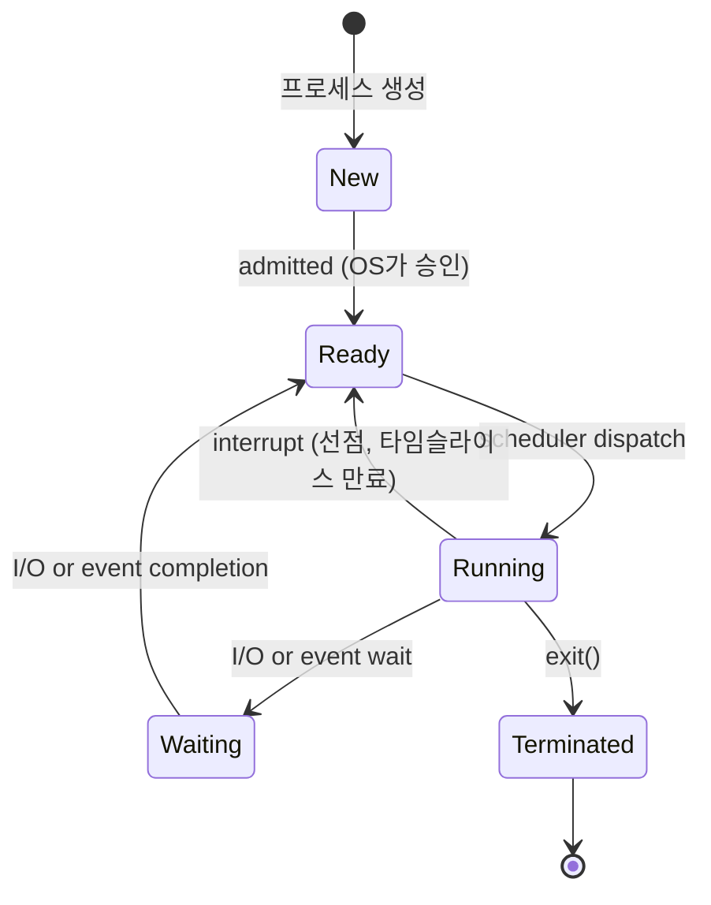

# Part 1-2. 프로세스 관리 (Ch. 3–5)

> 면접 빈도: ★★★★★ (멀티스레딩·스케줄링은 백엔드/시스템 면접 최빈출 토픽)

---

## Chapter 3. 프로세스 (Processes)

### 3-1. 프로세스 개념

**프로세스 = 실행 중인 프로그램 (Program in Execution)**

프로그램은 디스크에 저장된 수동적 개체(passive entity)이고, 프로세스는 다음 자원을 가진 능동적 개체(active entity)다.

```
프로세스 메모리 레이아웃 (높은 주소 → 낮은 주소)
┌──────────────────────┐  ← 높은 주소
│       Stack          │  ← 함수 호출 프레임, 지역 변수 (아래로 성장)
├──────────────────────┤
│          ↕           │  (Stack ↓  Heap ↑)
├──────────────────────┤
│        Heap          │  ← 동적 할당 메모리 malloc/new (위로 성장)
├──────────────────────┤
│    Data (BSS/DS)     │  ← 전역 변수, 정적 변수
│    Text (Code)       │  ← 실행 가능한 기계어 코드 (읽기 전용)
└──────────────────────┘  ← 낮은 주소
```

---

### 3-2. 프로세스 상태 전이 (5-State Model)



| 상태 | 설명 |
|------|------|
| **New** | 프로세스 생성 중 (PCB 할당, 자원 초기화) |
| **Ready** | CPU를 받기만 하면 실행 가능한 상태 (Ready Queue 대기) |
| **Running** | CPU에서 명령 실행 중 (단일 코어: 동시에 1개만) |
| **Waiting (Blocked)** | I/O 완료, 이벤트 발생 등을 기다리는 상태 |
| **Terminated** | 실행 완료 또는 강제 종료, PCB 정리 전 |

> 💡 **면접 포인트**
> - Running → Ready: **선점(Preemption)** 발생 (타이머 인터럽트, 더 높은 우선순위 프로세스 등장)
> - Running → Waiting: **자발적 블로킹** (`read()`, `sleep()` 등 시스템콜)
> - Waiting → Running으로 **직접** 가는 화살표는 없다 — 반드시 Ready를 거친다

---

### 3-3. PCB (Process Control Block)

PCB는 프로세스마다 OS가 관리하는 데이터 구조다. 프로세스의 "신분증"에 해당한다.

```
PCB 구조
┌─────────────────────────────┐
│ Process State               │ ← New/Ready/Running/Waiting/Terminated
│ Process ID (PID)            │ ← 고유 식별자
│ Program Counter (PC)        │ ← 다음에 실행할 명령 주소
│ CPU Registers               │ ← AX, BX, SP, BP, 플래그 레지스터 등
│ CPU Scheduling Info         │ ← 우선순위, 스케줄링 큐 포인터
│ Memory Management Info      │ ← 페이지 테이블, 세그먼트 테이블
│ Accounting Info             │ ← CPU 사용 시간, 실행 시작 시간
│ I/O Status Info             │ ← 열린 파일 목록, I/O 장치 할당 목록
└─────────────────────────────┘
```

---

### 3-4. 컨텍스트 스위치 (Context Switch)

CPU를 한 프로세스에서 다른 프로세스로 넘길 때, 현재 프로세스의 상태를 PCB에 저장하고 다음 프로세스의 상태를 PCB에서 복원하는 작업이다.

```
Process P0 실행 중          OS 개입                Process P1 실행
─────────────────┐         ┌──────────────────┐         ┌──────────────
  executing      │         │ save state P0→PCB0│         │  executing
                 │interrupt│                  │ restore  │
                 └────────►│ restore state    │◄─────────┘
                            │ from PCB1        │
                            └──────────────────┘
                                (순수 오버헤드)
```

**컨텍스트 스위치 비용**

| 비용 요소 | 설명 |
|-----------|------|
| 레지스터 저장/복원 | 범용 레지스터, PC, SP, 상태 플래그 저장 |
| 캐시 오염 (Cache Pollution) | 새 프로세스가 캐시를 덮어쓰면 이전 캐시 데이터 무효화 → **가장 큰 실질 비용** |
| TLB 플러시 | 프로세스마다 주소 공간이 다르므로 TLB 전체 무효화 필요 (ASID 최적화로 일부 완화) |
| 커널 → 유저 모드 전환 | 특권 레벨 전환 비용 |

> 💡 **면접 포인트**
> - 컨텍스트 스위치 자체는 **유용한 작업 없음** — 순수 오버헤드
> - 스레드 전환이 프로세스 전환보다 빠른 이유: **동일 주소 공간** → TLB 플러시 불필요
> - 컨텍스트 스위치 시간은 하드웨어 지원(FXSAVE 등)에 크게 의존

---

### 3-5. 프로세스 생성: fork() / exec() / wait()

UNIX 계열에서 프로세스 생성은 `fork()`로 복사 후 `exec()`로 새 프로그램을 덮어쓰는 패턴을 따른다.

```c
#include <stdio.h>
#include <stdlib.h>
#include <unistd.h>
#include <sys/wait.h>

int main(void) {
    pid_t pid = fork();   // 자식 프로세스 생성

    if (pid < 0) {
        // fork 실패
        perror("fork");
        exit(EXIT_FAILURE);
    } else if (pid == 0) {
        // 자식 프로세스 (fork 반환값 = 0)
        printf("Child PID: %d, Parent PID: %d\n", getpid(), getppid());

        // exec: 현재 프로세스 이미지를 /bin/ls로 교체
        // 성공 시 exec 이후 코드는 절대 실행되지 않는다
        char *args[] = {"ls", "-l", NULL};
        execvp("ls", args);

        // exec 실패 시에만 여기 도달
        perror("execvp");
        exit(EXIT_FAILURE);
    } else {
        // 부모 프로세스 (fork 반환값 = 자식 PID)
        int status;
        pid_t child = wait(&status);   // 자식이 종료될 때까지 블로킹
        printf("Child %d exited with status %d\n", child, WEXITSTATUS(status));
    }

    return 0;
}
```

**fork() 동작 원리**

```
부모 프로세스                    자식 프로세스
┌─────────────────┐   fork()  ┌─────────────────┐
│ PID: 1234       │ ─────────►│ PID: 1235       │
│ 코드, 데이터    │  복사(COW) │ 코드, 데이터    │  ← 처음엔 공유
│ 열린 파일 디스크│           │ 열린 파일 디스크│
│ 립터 (참조만)   │           │ 립터 (참조만)   │
└─────────────────┘           └─────────────────┘
```

**Copy-on-Write (COW)**: `fork()` 직후에는 부모/자식이 동일한 물리 메모리 페이지를 공유하며 읽기 전용으로 참조한다. 어느 쪽이든 쓰기가 발생하면 그때 해당 페이지만 복사한다. `exec()` 직후 전체를 교체하는 경우 복사 비용이 거의 없다.

> 💡 **면접 포인트**
> - `fork()` 후 자식에서 `exec()` 안 하면? 부모와 동일한 코드를 실행하지만 **완전히 독립된 프로세스**
> - **좀비 프로세스 (Zombie)**: 자식이 종료됐지만 부모가 `wait()`를 호출하지 않아 PCB가 남아있는 상태
> - **고아 프로세스 (Orphan)**: 부모가 먼저 종료된 자식 → Linux에서는 **init(PID 1)** 이 입양
> - `vfork()`: COW 없이 부모 메모리를 그대로 사용 → `exec()` 전용, 위험하지만 빠름

---

### 3-6. IPC (Inter-Process Communication)

프로세스 간 통신은 두 가지 기본 모델이 있다.

#### 공유 메모리 (Shared Memory)

```
프로세스 A          공유 메모리 영역          프로세스 B
┌─────────┐        ┌───────────────┐        ┌─────────┐
│         │◄──────►│  shared data  │◄──────►│         │
│  addr A │  mmap  │               │  mmap  │  addr B │
└─────────┘        └───────────────┘        └─────────┘
```

- OS는 최초 설정만 관여, 이후 통신은 **커널 개입 없음** → 속도 빠름
- **동기화 책임이 프로세스에 있음** → 경쟁 조건(Race Condition) 주의
- Linux API: `shmget()` / `shmat()` / `shmdt()` 또는 POSIX `shm_open()` + `mmap()`

**Producer-Consumer 패턴 (공유 메모리)**

```c
// 공유 버퍼 구조 (circular buffer)
#define BUFFER_SIZE 10

typedef struct {
    int buffer[BUFFER_SIZE];
    int in;   // 다음 쓰기 위치
    int out;  // 다음 읽기 위치
} SharedBuffer;

// Producer
void produce(SharedBuffer *sb, int item) {
    while (((sb->in + 1) % BUFFER_SIZE) == sb->out)
        ; // 버퍼가 꽉 찼으면 대기 (busy-wait — 실제론 세마포어 사용)
    sb->buffer[sb->in] = item;
    sb->in = (sb->in + 1) % BUFFER_SIZE;
}

// Consumer
int consume(SharedBuffer *sb) {
    while (sb->in == sb->out)
        ; // 버퍼가 비었으면 대기
    int item = sb->buffer[sb->out];
    sb->out = (sb->out + 1) % BUFFER_SIZE;
    return item;
}
```

#### 메시지 패싱 (Message Passing)

```
프로세스 A                   커널                   프로세스 B
┌─────────┐   send(msg)   ┌───────┐  recv(msg)   ┌─────────┐
│         │──────────────►│ queue │─────────────►│         │
└─────────┘               └───────┘               └─────────┘
```

- 커널이 메시지 복사를 중개 → **데이터 복사 오버헤드** 발생
- 동기화를 OS가 보장 → 사용이 안전하고 단순
- 소규모 데이터, 분산 시스템에 적합

**공유 메모리 vs 메시지 패싱 비교**

| 항목 | 공유 메모리 | 메시지 패싱 |
|------|-------------|-------------|
| 속도 | 빠름 (메모리 직접 접근) | 느림 (커널 경유, 복사) |
| 동기화 | 프로그래머 책임 | OS가 보장 |
| 데이터 크기 | 대용량 적합 | 소량 적합 |
| 구현 복잡도 | 높음 | 낮음 |
| 적합 환경 | 단일 머신 | 분산 / 네트워크 |

---

### 3-7. 기타 IPC 메커니즘

#### 파이프 (Pipe)

```c
int fd[2];
pipe(fd);   // fd[0] = 읽기 끝, fd[1] = 쓰기 끝

if (fork() == 0) {
    // 자식: 쓰기
    close(fd[0]);
    write(fd[1], "hello", 5);
    close(fd[1]);
} else {
    // 부모: 읽기
    close(fd[1]);
    char buf[10];
    read(fd[0], buf, 5);
    close(fd[0]);
}
```

- **단방향** 통신, 부모-자식 관계에서만 사용 가능 (익명 파이프)
- **Named Pipe (FIFO)**: `mkfifo()`로 파일 시스템 경로에 생성 → 무관한 프로세스 간 통신 가능

#### 소켓 (Socket)

- **동일 머신(Unix Domain Socket)** 또는 **네트워크(TCP/UDP)** 를 통한 통신
- 가장 범용적인 IPC → 분산 시스템의 기반

#### RPC (Remote Procedure Call)

- 원격 서버의 함수를 로컬 함수 호출처럼 사용하는 추상화
- 내부적으로는 소켓 + 마샬링(직렬화/역직렬화) 수행
- 현대: gRPC (Protocol Buffers), Thrift 등

---

## Chapter 4. 스레드 & 멀티스레딩 ★핵심

### 4-1. 프로세스 vs 스레드

> 💡 **면접 포인트 (최빈출)**
> - "스레드와 프로세스의 차이"는 99% 면접에서 나온다. 공유 자원 목록을 외울 것.

| 비교 항목 | 프로세스 | 스레드 |
|-----------|----------|--------|
| 정의 | 독립된 실행 단위, 자원 소유 단위 | 프로세스 내 실행 흐름 단위 |
| 주소 공간 | 독립적 (완전히 격리) | **공유** (같은 프로세스 내) |
| 코드/데이터/힙 | 프로세스별 독립 | **공유** |
| 스택 | 독립 | 스레드별 **독립** |
| PC, 레지스터 | 독립 | 스레드별 **독립** |
| 파일 디스크립터 | 독립 | **공유** |
| 생성 비용 | 높음 (fork: 새 주소 공간 복사) | 낮음 (같은 주소 공간) |
| 컨텍스트 스위치 | 느림 (TLB 플러시, 캐시 오염) | 빠름 (TLB 유지, 캐시 공유) |
| 통신 | IPC 필요 (파이프, 소켓 등) | 공유 메모리 직접 접근 |
| 장애 격리 | 강함 (한 프로세스 죽어도 타 프로세스 무관) | 약함 (한 스레드가 크래시하면 전체 프로세스 영향) |
| 동기화 필요성 | IPC 수준 동기화 | 공유 데이터에 대한 mutex/semaphore 필수 |

**스레드가 공유하는 것 vs 독립적인 것**

```
프로세스 메모리
┌─────────────────────────────────────────────┐
│           [ 공유 자원 ]                      │
│  Code Segment   Data/Heap   File Descriptors │
│  Signal Handlers   Environment Variables    │
├──────────────┬──────────────┬───────────────┤
│  Thread 1    │  Thread 2    │  Thread 3     │  ← 각 스레드별 독립
│  Stack       │  Stack       │  Stack        │
│  Registers   │  Registers   │  Registers    │
│  PC          │  PC          │  PC           │
│  TLS         │  TLS         │  TLS          │
└──────────────┴──────────────┴───────────────┘
```

**멀티스레딩의 이점 4가지 (교재 기준)**

1. **응답성 (Responsiveness)**: UI 스레드가 블로킹되지 않아 사용자 응답 유지
2. **자원 공유 (Resource Sharing)**: 프로세스 자원을 자연스럽게 공유 → IPC 불필요
3. **경제성 (Economy)**: 생성/소멸·컨텍스트 스위치 비용이 프로세스보다 작음
4. **확장성 (Scalability)**: 멀티코어에서 병렬 실행으로 처리량 향상

---

### 4-2. 멀티스레딩 모델

스레드는 **User Thread** (라이브러리 수준)와 **Kernel Thread** (OS 수준) 두 종류가 있으며, 이들의 매핑 방식에 따라 세 가지 모델이 있다.

#### M:1 모델 (Many-to-One)

```
User Thread:    T1  T2  T3  T4
                 \   |   |  /
                  └──┴───┴─┘
Kernel Thread:       K1
```

- 모든 유저 스레드가 **단 하나의 커널 스레드에 매핑**
- 장점: 스레드 관리가 유저 공간에서 이루어져 컨텍스트 스위치 빠름
- **단점 (치명적)**: 한 스레드가 블로킹 시스템콜 호출 → **전체 프로세스 블로킹**
- 멀티코어 활용 불가능
- 예: Green Threads (초기 유저 공간 구현), GNU Portable Threads

#### 1:1 모델 (One-to-One)

```
User Thread:   T1   T2   T3   T4
                |    |    |    |
Kernel Thread: K1   K2   K3   K4
```

- 유저 스레드마다 커널 스레드 1개 대응
- **장점**: 진정한 병렬 실행, 한 스레드 블로킹해도 다른 스레드 계속 실행
- **단점**: 스레드 생성 시 커널 스레드도 생성 → 생성 비용·오버헤드 증가
- **사용처**: Linux (pthread), Windows Thread — **현대 OS 표준**

> 💡 **면접 포인트**
> - Linux의 `clone()` 시스템콜이 1:1 스레드 생성의 핵심
> - `clone(CLONE_VM | CLONE_FS | CLONE_FILES | CLONE_SIGHAND, ...)` → 자원 공유하며 커널 스레드 생성

#### M:M 모델 (Many-to-Many)

```
User Thread:  T1  T2  T3  T4  T5  T6
               \   |  /    \   |  /
Kernel Thread: K1   K2      K3
```

- m개의 유저 스레드가 n개의 커널 스레드에 매핑 (m ≥ n)
- 장점: 1:1의 오버헤드 + M:1의 블로킹 문제 모두 해결
- 단점: 구현 복잡, 디버깅 어려움
- 예: Solaris LWP, 초기 Windows fiber, Go 런타임 goroutine 스케줄러 (유사 개념)

**Two-Level Model**: M:M 기반이지만 특정 유저 스레드를 특정 커널 스레드에 고정 바인딩 가능

| 모델 | 병렬 실행 | 블로킹 문제 | 생성 비용 | 현재 사용 |
|------|-----------|-------------|-----------|-----------|
| M:1 | 불가 | 심각 | 낮음 | 거의 없음 |
| 1:1 | 가능 | 없음 | 높음 | Linux/Windows 표준 |
| M:M | 가능 | 없음 | 중간 | Go, 일부 특수 목적 |

---

### 4-3. User Thread vs Kernel Thread

| 항목 | User Thread | Kernel Thread |
|------|-------------|---------------|
| 관리 주체 | 유저 공간 라이브러리 (pthreads, libcoro 등) | OS 커널 |
| 생성 비용 | 낮음 (시스템콜 없음) | 높음 (시스템콜 필요) |
| 컨텍스트 스위치 | 빠름 (유저 공간에서 처리) | 느림 (커널 모드 전환) |
| 블로킹 시스템콜 | M:1 모델에서 전체 블로킹 위험 | 독립적으로 블로킹 가능 |
| 멀티코어 활용 | M:1 단독: 불가 | 가능 |
| OS 인지 여부 | OS가 스레드 존재 모름 | OS가 스케줄 직접 수행 |

---

### 4-4. Pthreads (POSIX Threads) 코드 예제

```c
#include <pthread.h>
#include <stdio.h>
#include <stdlib.h>

#define NUM_THREADS 4

// 스레드 함수: void* 반환, void* 인자
void* thread_func(void *arg) {
    int id = *(int*)arg;
    printf("Thread %d: running\n", id);
    // 실제 작업 수행
    pthread_exit(NULL);   // return NULL; 과 동일
}

int main(void) {
    pthread_t threads[NUM_THREADS];
    int ids[NUM_THREADS];

    for (int i = 0; i < NUM_THREADS; i++) {
        ids[i] = i;
        // 스레드 생성: (스레드ID, 속성, 함수, 인자)
        if (pthread_create(&threads[i], NULL, thread_func, &ids[i]) != 0) {
            perror("pthread_create");
            exit(EXIT_FAILURE);
        }
    }

    // 모든 스레드 종료 대기
    for (int i = 0; i < NUM_THREADS; i++) {
        pthread_join(threads[i], NULL);
    }

    printf("All threads done.\n");
    return 0;
}
```

**Pthread 주요 API**

| 함수 | 설명 |
|------|------|
| `pthread_create()` | 스레드 생성 |
| `pthread_join()` | 스레드 종료 대기 (자원 회수) |
| `pthread_exit()` | 스레드 자발 종료 |
| `pthread_cancel()` | 다른 스레드 취소 요청 |
| `pthread_mutex_lock/unlock()` | 뮤텍스 잠금/해제 |
| `pthread_cond_wait/signal()` | 조건 변수 대기/신호 |

---

### 4-5. C++ std::thread 코드 예제

C++11부터 표준 라이브러리에서 `std::thread`를 제공한다. Linux에서는 내부적으로 pthreads(1:1 모델)를 사용한다.

```cpp
#include <iostream>
#include <thread>
#include <vector>
#include <future>

// 방법 1: 함수 포인터
void task_func(int id) {
    std::cout << "Thread " << id << ": running\n";
}

// 방법 2: 람다 (C++11+)
auto lambda_task = [](int id) {
    std::cout << "Lambda thread " << id << "\n";
};

int main() {
    // 기본 스레드 생성 및 join
    std::thread t1(task_func, 1);
    t1.join();  // 완료 대기

    // 람다 방식
    std::thread t2(lambda_task, 2);
    t2.join();

    // 여러 스레드 생성
    std::vector<std::thread> threads;
    for (int i = 0; i < 4; i++) {
        threads.emplace_back(task_func, i);
    }
    for (auto& t : threads) {
        t.join();
    }

    // std::async: 결과 반환 가능 (std::future 활용)
    std::future<int> fut = std::async(std::launch::async, []() {
        return 42;  // 비동기 작업 후 결과 반환
    });
    std::cout << "Result: " << fut.get() << "\n";

    return 0;
}
// 컴파일: g++ -std=c++17 -pthread program.cpp -o program
```

---

### 4-6. Thread Pool (스레드 풀)

> 💡 **면접 포인트**
> - 스레드 풀을 쓰는 이유: **스레드 생성·소멸 비용 절감** + **스레드 수 제한으로 자원 고갈 방지**
> - 적절한 스레드 풀 크기: CPU-bound → `CPU 코어 수`, I/O-bound → `코어 수 * (1 + I/O대기시간/CPU시간)`

```
Thread Pool 구조
┌──────────────────────────────────────────────┐
│                Thread Pool                   │
│  ┌──────────┐  ┌──────────┐  ┌──────────┐   │
│  │ Worker 1 │  │ Worker 2 │  │ Worker 3 │   │
│  └────┬─────┘  └────┬─────┘  └────┬─────┘   │
│       └─────────────┴─────────────┘          │
│                     ▲                        │
│              Task Queue                      │
│       [Task1][Task2][Task3][Task4]...        │
└──────────────────────────────────────────────┘
         ▲
  submit(task)  ← 호출자 스레드
```

```cpp
// C++ std::thread 기반 간단한 스레드 풀 개념
#include <thread>
#include <queue>
#include <mutex>
#include <condition_variable>
#include <functional>
#include <vector>

// 작업 큐 + 워커 스레드 패턴
std::queue<std::function<void()>> task_queue;
std::mutex queue_mutex;
std::condition_variable cv;
bool stop = false;

// 워커 스레드 함수: 큐에서 작업을 꺼내 반복 실행 (스레드 재사용)
void worker() {
    while (true) {
        std::function<void()> task;
        {
            std::unique_lock<std::mutex> lock(queue_mutex);
            cv.wait(lock, [] { return stop || !task_queue.empty(); });
            if (stop && task_queue.empty()) return;
            task = std::move(task_queue.front());
            task_queue.pop();
        }
        task();  // 작업 처리
    }
}

int main() {
    unsigned int num_threads = std::thread::hardware_concurrency(); // CPU 코어 수
    std::vector<std::thread> pool;
    for (unsigned i = 0; i < num_threads; i++)
        pool.emplace_back(worker);

    // 작업 제출
    for (int i = 0; i < 100; i++) {
        std::unique_lock<std::mutex> lock(queue_mutex);
        task_queue.push([i] { /* processTask(i) */ });
        cv.notify_one();
    }

    // 종료: 모든 작업 완료 후 워커 스레드 정리
    { std::unique_lock<std::mutex> lock(queue_mutex); stop = true; }
    cv.notify_all();
    for (auto& t : pool) t.join();
}
```

---

### 4-7. Fork-Join Framework

분할 정복(Divide-and-Conquer) 작업에 특화된 병렬 처리 패턴이다.

```
Fork-Join Pool
    solve(array[0..n-1])
         ├── solve(array[0..n/2-1])   ← fork
         │       ├── solve(array[0..n/4-1])
         │       └── solve(array[n/4..n/2-1])
         └── solve(array[n/2..n-1])   ← fork
                 ├── ...
                 └── ...
                              join ← 결과 합산
```

```cpp
// C++ std::async 기반 Fork-Join 패턴 (분할 정복 병렬 합산)
#include <future>
#include <numeric>
#include <vector>

const int THRESHOLD = 1000;

long parallel_sum(const std::vector<int>& arr, int start, int end) {
    if (end - start <= THRESHOLD) {
        // 기저 사례: 직접 계산
        long sum = 0;
        for (int i = start; i < end; i++) sum += arr[i];
        return sum;
    }
    int mid = (start + end) / 2;

    // fork: 왼쪽 절반을 비동기 실행
    std::future<long> left_fut = std::async(std::launch::async,
        parallel_sum, std::cref(arr), start, mid);

    // 오른쪽 절반은 현재 스레드에서 직접 계산
    long right = parallel_sum(arr, mid, end);

    // join: 왼쪽 결과 수집 후 합산
    return left_fut.get() + right;
}

// 사용
// std::vector<int> large_array(100000, 1);
// long result = parallel_sum(large_array, 0, large_array.size());
```

---

### 4-8. OpenMP

C/C++ 컴파일러 지시어(pragma) 기반의 공유 메모리 병렬 프로그래밍 API다.

```c
#include <omp.h>
#include <stdio.h>

int main(void) {
    int sum = 0;
    int array[1000];
    for (int i = 0; i < 1000; i++) array[i] = i;

    // 병렬 for 루프: 반복을 스레드에 분배
    #pragma omp parallel for reduction(+:sum)
    for (int i = 0; i < 1000; i++) {
        sum += array[i];
    }
    printf("Sum = %d\n", sum);

    // 병렬 섹션
    #pragma omp parallel num_threads(4)
    {
        int tid = omp_get_thread_num();
        printf("Thread %d of %d\n", tid, omp_get_num_threads());
    }

    return 0;
}
// 컴파일: gcc -fopenmp program.c -o program
```

> 💡 **면접 포인트**
> - OpenMP `reduction(+:sum)`: 각 스레드가 로컬 합산 후 최종 합산 → **경쟁 조건 없이** 병렬 집계
> - `#pragma omp parallel for` 는 루프 반복이 **서로 독립적(data-independent)** 일 때만 안전

---

### 4-9. Thread Local Storage (TLS)

> 💡 **면접 포인트**
> - TLS는 전역 변수처럼 접근하지만 **스레드마다 독립적인 복사본**을 가지는 저장소
> - 사용 예: 각 스레드의 에러 코드 (`errno`), DB 커넥션, 로그 컨텍스트

```c
// C11 / GCC
__thread int thread_id;           // 스레드마다 독립적인 int

// POSIX
pthread_key_t key;
pthread_key_create(&key, destructor_func);
pthread_setspecific(key, value);  // 현재 스레드에 값 저장
void* val = pthread_getspecific(key);  // 현재 스레드 값 읽기
```

```cpp
// C++11 thread_local 키워드: 전역처럼 선언하지만 스레드마다 독립 복사본
#include <thread>
#include <iostream>

thread_local int thread_id = 0;      // 스레드마다 독립적인 int
thread_local std::string thread_name;  // 복잡한 타입도 가능

void worker(int id) {
    thread_id = id;          // 이 스레드의 복사본에만 저장
    thread_name = "worker-" + std::to_string(id);
    std::cout << thread_name << " id=" << thread_id << "\n";
    // 함수 종료 시 thread_local 객체 자동 소멸 — 수동 해제 불필요
}

// int main() {
//     std::thread t1(worker, 1), t2(worker, 2);
//     t1.join(); t2.join();
// }
```

---

## Chapter 5. CPU 스케줄링

### 5-1. 스케줄링 기본 개념

**CPU-I/O Burst Cycle**: 프로세스는 CPU 연산(CPU Burst)과 I/O 대기(I/O Burst)를 반복한다.

```
실행 흐름:
[CPU Burst] → [I/O Burst] → [CPU Burst] → [I/O Burst] → ... → 종료
```

- **CPU-bound 프로세스**: CPU Burst가 길고 I/O Burst가 적음 (과학 연산, 암호화)
- **I/O-bound 프로세스**: CPU Burst가 짧고 I/O Burst가 많음 (대화형 앱, DB 서버)
- 대부분 프로세스: **짧은 CPU Burst 다수** → 스케줄링의 주 대상

**스케줄링 성능 지표**

| 지표 | 목표 | 설명 |
|------|------|------|
| CPU Utilization (이용률) | 최대화 | CPU가 쉬는 시간을 최소화 |
| Throughput (처리량) | 최대화 | 단위 시간당 완료된 프로세스 수 |
| Turnaround Time (반환 시간) | 최소화 | 제출~완료까지의 총 시간 |
| Waiting Time (대기 시간) | 최소화 | Ready Queue에서 대기한 총 시간 |
| Response Time (응답 시간) | 최소화 | 제출~첫 응답까지의 시간 (대화형 시스템 핵심) |

> 💡 **면접 포인트**
> - Turnaround Time = Waiting Time + Burst Time (+ I/O 등 포함)
> - 대화형 시스템은 **Response Time**이 핵심; 배치 시스템은 **Throughput**이 핵심

**선점 vs 비선점**

| 방식 | 설명 | CPU 뺏기 | 예 |
|------|------|----------|-----|
| **비선점 (Non-preemptive)** | 프로세스가 자발적으로 CPU 반납할 때까지 실행 | 불가 | FCFS, 비선점 SJF |
| **선점 (Preemptive)** | OS가 강제로 CPU 회수 가능 | 가능 | RR, SRTF, Priority(선점) |

---

### 5-2. 스케줄링 알고리즘 7가지

#### 1. FCFS (First-Come, First-Served)

- 도착 순서대로 처리, **비선점**
- **Convoy Effect**: 긴 프로세스 뒤에 짧은 프로세스들이 오래 대기

**예시** (모두 t=0 도착): P1(24ms), P2(3ms), P3(3ms)

```
간트 차트:
┌──────────────────────────┬─────┬─────┐
│          P1              │ P2  │ P3  │
└──────────────────────────┴─────┴─────┘
0                          24   27    30

대기 시간: P1=0, P2=24, P3=27  →  평균 = (0+24+27)/3 = 17ms
```

---

#### 2. SJF (Shortest Job First) — 비선점

- 다음 CPU Burst가 **가장 짧은** 프로세스를 선택
- **이론적으로 평균 대기 시간 최소** (최적 알고리즘)
- **문제**: CPU Burst 시간을 사전에 알 수 없음 → **예측(지수 평균)** 으로 근사

```
예측: τ_(n+1) = α × t_n + (1-α) × τ_n
     α = 0.5 (최근 버스트와 과거 예측의 가중 평균)
```

**예시**: P1(도착0, 6ms), P2(도착2, 8ms), P3(도착4, 7ms), P4(도착6, 3ms)

```
간트 차트 (비선점 SJF):
┌──────┬────┬───────┬──────────┐
│  P1  │ P4 │  P3   │    P2    │
└──────┴────┴───────┴──────────┘
0      6    9      16         24

대기 시간: P1=0, P2=16-2=14, P3=9-4=5, P4=6-6=0  →  평균 = (0+14+5+0)/4 = 4.75ms
```

---

#### 3. SRTF (Shortest Remaining Time First) — 선점 SJF

- SJF의 선점 버전: 새 프로세스 도착 시 남은 시간이 더 짧으면 즉시 선점
- 평균 대기 시간 관점에서 **모든 알고리즘 중 최소** (이론적)
- 잦은 선점 → 오버헤드, **기아(Starvation)** 발생 가능

**예시**: P1(도착0, 8ms), P2(도착1, 4ms), P3(도착2, 9ms), P4(도착3, 5ms)

```
간트 차트 (SRTF):
┌──┬────────┬──────────┬──────────────────┬───┐
│P1│   P2   │    P4    │       P1         │P3 │
└──┴────────┴──────────┴──────────────────┴───┘
0  1        5          10                 17  26

P2 도착(t=1): P1 남은시간 7 > P2 4 → P2 선점
P4 도착(t=3): P2 남은시간 2 < P4 5 → 선점 없음
...
대기 시간 평균 = 6.5ms (FCFS 대비 대폭 단축)
```

---

#### 4. Priority Scheduling (우선순위 스케줄링)

- 각 프로세스에 우선순위 숫자 부여, **낮은 숫자 = 높은 우선순위** (일반적)
- 선점/비선점 모두 가능
- **기아(Starvation) 문제**: 높은 우선순위 프로세스가 계속 들어오면 낮은 우선순위는 영원히 실행 못 함
- **해결책: Aging** — 대기 시간에 비례해 우선순위를 점진적으로 높임

**예시**: P1(우선순위 3, 10ms), P2(1, 1ms), P3(4, 2ms), P4(5, 1ms), P5(2, 5ms)

```
간트 차트 (비선점 Priority, 모두 t=0 도착):
┌──┬─────┬──────────┬───┬──┐
│P2│ P5  │    P1    │P3 │P4│
└──┴─────┴──────────┴───┴──┘
0  1     6         16  18  19

(우선순위: 1=P2, 2=P5, 3=P1, 4=P3, 5=P4)
```

---

#### 5. RR (Round Robin)

- 각 프로세스에 **타임 퀀텀(Time Quantum, q)** 만큼 CPU 할당, 초과 시 **선점**하여 Ready Queue 맨 뒤로
- 대화형 시스템에 적합, **기아 없음**
- **타임 퀀텀 선택**:
  - 너무 크면 → FCFS와 동일
  - 너무 작으면 → 컨텍스트 스위치 오버헤드 폭증
  - 일반적: CPU Burst의 80%가 q 이내에 완료되도록 설정 (Linux: 보통 4~100ms)

**예시** (q=4, 모두 t=0 도착): P1(24ms), P2(3ms), P3(3ms)

```
간트 차트 (RR, q=4):
┌────┬───┬───┬────┬────┬────┬────┐
│ P1 │P2 │P3 │ P1 │ P1 │ P1 │ P1 │
└────┴───┴───┴────┴────┴────┴────┘
0    4   7  10   14   18   22   26 (30)
                                  (P1: 20ms 남아서 계속...)

실제: P1이 20ms 남으므로 4ms씩 5번 더 실행
대기 시간: P1=10-4=6(누적 계산 복잡), P2=4, P3=7  →  평균 ≈ 5.67ms (FCFS 17ms 대비 개선)
```

> 💡 **면접 포인트**
> - RR에서 Response Time이 좋은 이유: **모든 프로세스가 q 시간 이내에 최초 실행**됨
> - RR의 Turnaround Time은 SJF보다 보통 나쁨 — 장단점 트레이드오프

---

#### 6. MLQ (Multi-Level Queue, 다단계 큐)

- Ready Queue를 **여러 개의 큐**로 분리, 각 큐마다 다른 스케줄링 알고리즘 적용
- 프로세스는 특성에 따라 **큐에 영구 배정** (이동 없음)

```
우선순위↑
┌─────────────────────────────────────────┐
│ Queue 1: System (커널 프로세스)   — FCFS │ ← 최고 우선순위
├─────────────────────────────────────────┤
│ Queue 2: Interactive (대화형)     — RR  │
├─────────────────────────────────────────┤
│ Queue 3: Interactive Editing      — RR  │
├─────────────────────────────────────────┤
│ Queue 4: Batch (배치 작업)        — FCFS│
├─────────────────────────────────────────┤
│ Queue 5: Student (낮은 우선순위)  — FCFS│ ← 최저 우선순위
└─────────────────────────────────────────┘
```

- 상위 큐가 비어야만 하위 큐 실행 → **낮은 우선순위 큐 기아 가능**

---

#### 7. MLFQ (Multi-Level Feedback Queue, 다단계 피드백 큐)

- MLQ의 개선: 프로세스가 **큐 간 이동 가능**
- 동작 원리:
  1. 새 프로세스는 **최상위(가장 높은 우선순위) 큐**에 배정
  2. CPU Burst를 많이 쓸수록 **하위 큐**로 강등 (CPU-bound 판별)
  3. 하위 큐에서 오래 대기하면 **상위 큐**로 승격 (Aging, 기아 방지)

```
큐 Q0 (q=8ms):  새 프로세스 진입 → q 초과 시 Q1으로 강등
큐 Q1 (q=16ms): q 초과 시 Q2로 강등
큐 Q2 (FCFS):   가장 낮은 우선순위, 장기 실행 배치 작업

예) 57ms 짜리 CPU Burst 프로세스:
  Q0: 8ms 실행 → Q1 강등
  Q1: 16ms 실행 → Q2 강등
  Q2: 나머지 33ms 실행
```

> 💡 **면접 포인트**
> - MLFQ는 프로세스의 **과거 행동을 학습**해 동적으로 우선순위 조정
> - "가장 일반적이고 현실에 가까운 스케줄링 알고리즘"으로 교재에서 강조
> - **MLFQ의 3가지 규칙**: ① 높은 우선순위 먼저 ② 같은 큐 내 RR ③ 타임슬라이스 소진 시 강등

---

### 5-3. 알고리즘 종합 비교

| 알고리즘 | 선점 | 평균 대기 | 기아 | 응답성 | 특징 |
|----------|------|-----------|------|--------|------|
| FCFS | N | 높음 | 없음 | 낮음 | Convoy Effect |
| SJF | N | **최소** | 없음 | 중간 | Burst 예측 필요 |
| SRTF | Y | **최소** | 가능 | 높음 | 이론적 최적, 실용성 낮음 |
| Priority | Y/N | 중간 | **가능** | 중간 | Aging으로 기아 해결 |
| RR | Y | 중간 | **없음** | **높음** | 대화형 최적, q 선택 중요 |
| MLQ | Y | 낮음 | 가능 | 높음 | 고정 큐 배정 |
| MLFQ | Y | 낮음 | **없음** | **높음** | 현실적 최선, 복잡 |

---

### 5-4. Linux CFS (Completely Fair Scheduler)

> 💡 **면접 포인트**
> - Linux 2.6.23(2007)부터 기본 스케줄러
> - O(log n) 스케줄링 결정 (Red-Black Tree)
> - "모든 프로세스에게 공평한 CPU 시간"이 목표

**핵심 개념: vruntime (가상 실행 시간)**

```
vruntime = 실제 실행 시간 × (기준 가중치 / 프로세스 가중치)

낮은 nice 값 (높은 우선순위) → 가중치 높음 → vruntime 느리게 증가
높은 nice 값 (낮은 우선순위) → 가중치 낮음 → vruntime 빠르게 증가
```

**Red-Black Tree 구조**

```
           vruntime 기준 정렬
                [P3: 120]
               /          \
         [P1: 80]        [P5: 200]
         /      \
    [P4: 50]  [P2: 95]
         ↑
    항상 가장 작은 vruntime을 가진 프로세스 선택 (leftmost node)
```

- 다음 실행할 프로세스: **vruntime이 가장 작은 프로세스** (가장 덜 실행된 프로세스)
- 새 프로세스: `min_vruntime` 값으로 초기화 (불공평한 선점 방지)
- `nice` 값으로 가중치 조정 (`-20` ~ `+19`, 기본값 `0`)

---

## 핵심 요약 — 면접 체크리스트

### 프로세스 기본
- [ ] 프로세스 5가지 상태와 전이 조건 (특히 Running→Ready vs Running→Waiting 차이)
- [ ] PCB에 저장되는 정보 목록
- [ ] 컨텍스트 스위치 비용의 실질적 원인 (TLB 플러시, 캐시 오염)
- [ ] fork()의 반환값: 부모=자식PID, 자식=0, 실패=-1
- [ ] COW(Copy-on-Write)가 fork() 성능에 미치는 영향
- [ ] 좀비 프로세스 / 고아 프로세스 정의와 해결

### IPC
- [ ] 공유 메모리 vs 메시지 패싱: 속도/동기화/복잡도 트레이드오프
- [ ] Producer-Consumer 패턴에서 경쟁 조건이 발생하는 지점
- [ ] 파이프: 단방향, 부모-자식 한정 / Named FIFO: 무관 프로세스 가능

### 스레드 (최빈출)
- [ ] 프로세스 vs 스레드: 공유 자원 목록 완전히 숙지 (힙/코드/파일 공유, 스택/레지스터/PC 독립)
- [ ] 멀티스레딩 4가지 이점: 응답성, 자원 공유, 경제성, 확장성
- [ ] M:1 / 1:1 / M:M 모델 특징과 현재 Linux가 1:1을 사용하는 이유
- [ ] 스레드 풀 사용 이유: 생성 비용 절감 + 자원 제한
- [ ] TLS: 전역 접근 + 스레드 독립성 (errno 구현 원리)
- [ ] C++ `thread_local`: 선언만으로 스레드별 독립 복사본 생성, 스레드 종료 시 자동 소멸

### CPU 스케줄링
- [ ] FCFS Convoy Effect 설명
- [ ] SJF = 이론적 최적 but 실용성 없음 (Burst 예측 불가)
- [ ] SRTF = 선점 SJF = 평균 대기 시간 최소
- [ ] Priority Scheduling → Aging으로 기아 해결
- [ ] RR 타임 퀀텀이 너무 작으면 → 컨텍스트 스위치 오버헤드
- [ ] MLFQ = 실제 OS 스케줄러의 이론적 기반
- [ ] Linux CFS: vruntime 기반, Red-Black Tree, O(log n)

---

## 관련 노트

- [[01-OS-개요-및-시스템-구조]] — 시스템콜, 커널 모드 전환 원리 (fork/exec의 기반)
- [[03-동기화-및-데드락]] — 뮤텍스, 세마포어, 모니터 (공유 자원 동기화 필수 후속 학습)
