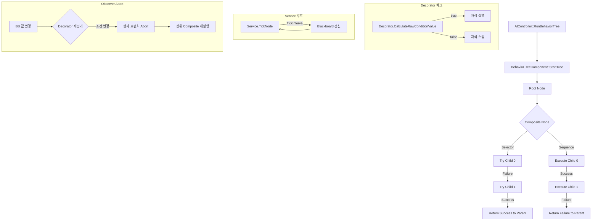
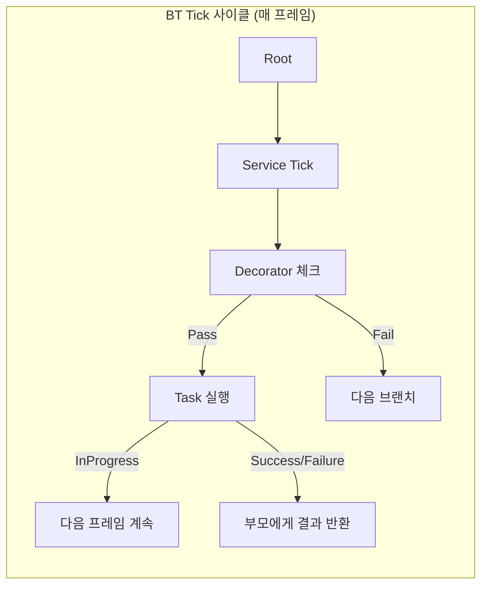
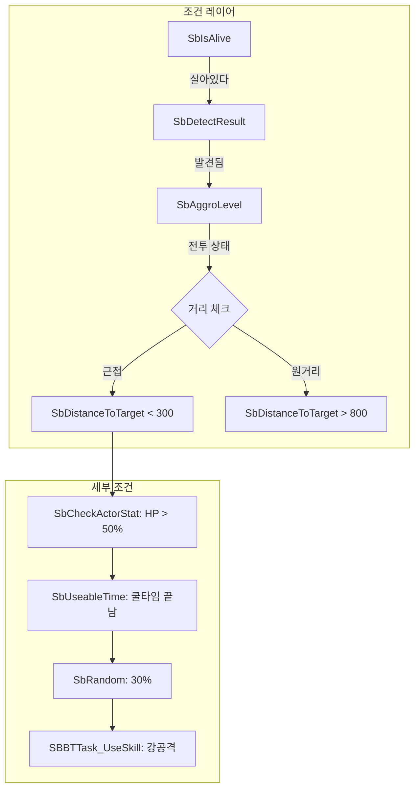
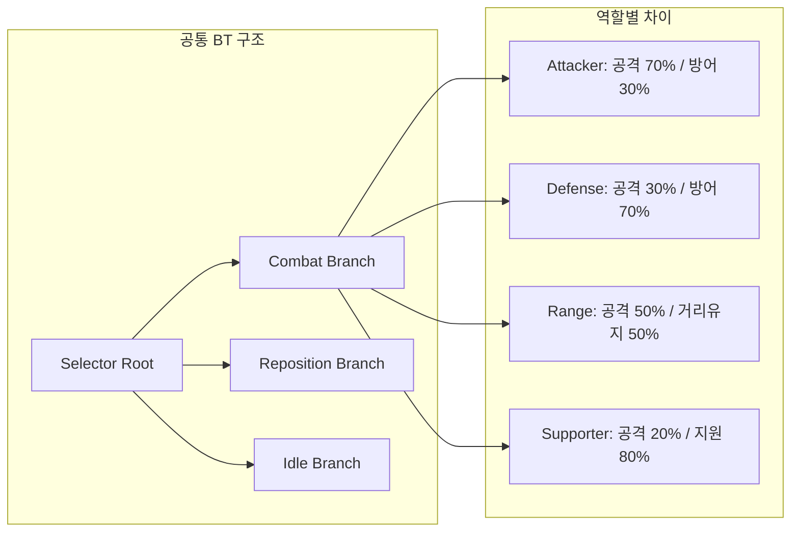
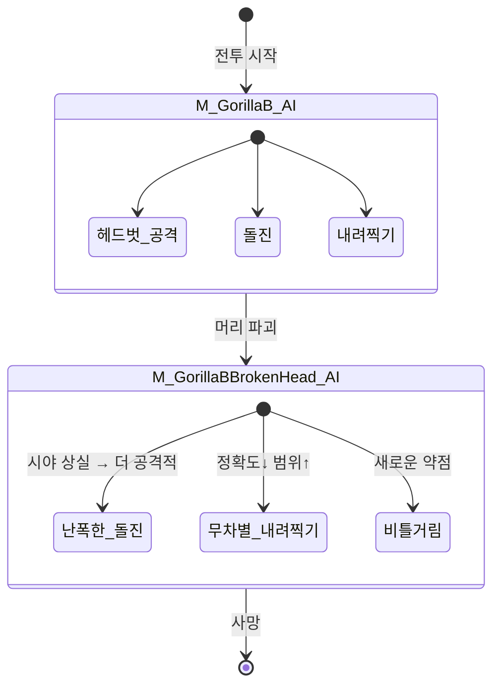
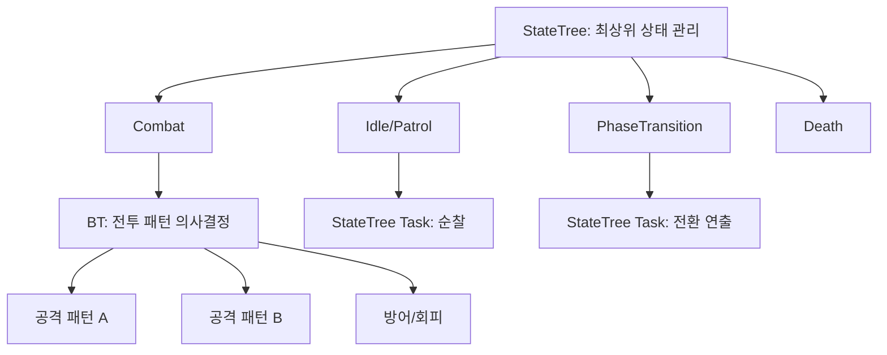
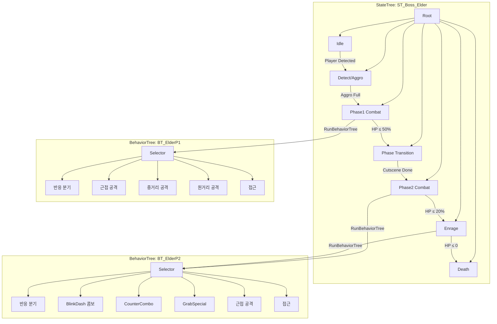

# 15. BehaviorTree 심층분석 — AAA 액션게임 AI 설계

> 스텔라블레이드(UE4.26) 추출 데이터 기반 BT 분석 + UE5 재현 가이드.
> [[04-AI-시스템]], [[03-전투시스템]], [[13-UE5-GAS-설계안]]과 연계.

---

## 1. BehaviorTree 핵심 복습

### 1-1. 노드 타입 총정리

BehaviorTree(이하 BT)는 **트리 구조의 의사결정 시스템**이다. 매 Tick마다 루트에서 시작해 자식을 순회하며, 각 노드가 `Success`, `Failure`, `InProgress` 중 하나를 반환한다.

| 노드 타입 | 역할 | 반환값 의미 |
|-----------|------|------------|
| **Composite** | 자식 노드 실행 순서/조건 결정 | 자식들의 결과를 종합 |
| **Task** | 실제 행동 수행 | 행동의 성공/실패/진행중 |
| **Decorator** | 조건 체크, 흐름 제어 | 자식 실행 여부 결정 |
| **Service** | 주기적 백그라운드 업데이트 | 반환값 없음 (Side-effect) |

### 1-2. Composite 노드 — 분기 전략의 핵심

#### Selector (OR 논리 / 우선순위 선택)
```
Selector: 첫 번째로 Success하는 자식을 찾는다
├── [0] 자식A → Failure → 다음으로
├── [1] 자식B → Success → ★ 여기서 중단, Selector = Success
└── [2] 자식C → (실행 안 됨)
```
- **핵심**: 우선순위가 높은 행동부터 시도, 실패하면 차선책으로 넘어감
- **보스 AI 활용**: "회피 가능하면 회피 → 아니면 방어 → 그것도 안 되면 공격"
- Children 배열 인덱스 **0이 최고 우선순위**

#### Sequence (AND 논리 / 순서 실행)
```
Sequence: 모든 자식이 순서대로 Success해야 한다
├── [0] 타겟확인 → Success → 다음으로
├── [1] 거리접근 → Success → 다음으로
├── [2] 공격실행 → Failure → ★ 여기서 중단, Sequence = Failure
└── [3] 후퇴 → (실행 안 됨)
```
- **핵심**: 하나라도 실패하면 전체 Sequence 실패
- **콤보 시퀀스**: "접근 → 약공 → 약공 → 강공" 순서 강제
- 중간에 실패하면 콤보 중단 = 자연스러운 행동

#### Simple Parallel (동시 실행)
```
SimpleParallel
├── Primary: MoveTo(Target) ← 메인 Task
└── Secondary: Service_UpdateTarget ← 보조 (Background)
```
- **Primary Task** + **Background Tree** 동시 실행
- Primary 완료 시 정책: `FinishMode`
  - `Immediate`: Primary 끝나면 Secondary 즉시 중단
  - `Delayed`: Secondary도 끝날 때까지 대기
- **활용**: 이동하면서 타겟 갱신, 공격하면서 주변 감시

### 1-3. Task 노드 — 실제 행동

UE 기본 제공 Task:

| Task | 설명 | 보스 AI 활용 |
|------|------|-------------|
| `BTTask_MoveTo` | 타겟/위치로 이동 | 접근, 포지셔닝 |
| `BTTask_Wait` | 지정 시간 대기 | 패턴 간 텀 |
| `BTTask_PlayAnimation` | 애니메이션 재생 | 어그로/위협 모션 |
| `BTTask_PlaySound` | 사운드 재생 | 경고음, 포효 |
| `BTTask_RunEQSQuery` | EQS 쿼리 실행 | 포지셔닝 (SB는 미사용) |
| `BTTask_RotateToFaceBBEntry` | 블랙보드 대상으로 회전 | 타겟 주시 |
| `BTTask_SetTagCooldown` | 태그 쿨다운 설정 | 스킬 재사용 방지 |
| `BTTask_GameplayTaskBase` | GA/Task 연동 베이스 | GAS 통합 |

커스텀 Task는 `UBTTaskNode`를 상속하여 `ExecuteTask()` 오버라이드:

```cpp
// UE5 커스텀 Task 기본 구조
UCLASS()
class UBTTask_UseGameplayAbility : public UBTTaskNode
{
    GENERATED_BODY()

public:
    UPROPERTY(EditAnywhere, Category="Ability")
    TSubclassOf<UGameplayAbility> AbilityClass;

    virtual EBTNodeResult::Type ExecuteTask(
        UBehaviorTreeComponent& OwnerComp,
        uint8* NodeMemory) override;

    virtual EBTNodeResult::Type AbortTask(
        UBehaviorTreeComponent& OwnerComp,
        uint8* NodeMemory) override;
};
```

### 1-4. Decorator 노드 — 분기 진입 조건

Decorator는 **자식 노드의 실행 여부를 결정**하는 게이트키퍼다.

| Decorator | 설명 | 활용 |
|-----------|------|------|
| `BTDecorator_Blackboard` | BB 키 값 비교 | HasTarget, IsInCombat |
| `BTDecorator_CheckGameplayTagsOnActor` | GameplayTag 확인 | 상태 체크 (Stunned, Phase2) |
| `BTDecorator_CompareBBEntries` | BB 키 간 비교 | HP < Threshold |
| `BTDecorator_ConeCheck` | 시야각 내 존재 | 전방 타겟만 반응 |
| `BTDecorator_Cooldown` | 쿨다운 | 스킬 재사용 방지 |
| `BTDecorator_DoesPathExist` | 경로 존재 여부 | 도달 불가능 시 우회 |
| `BTDecorator_ForceSuccess` | 항상 Success 반환 | 실패해도 진행 |
| `BTDecorator_IsAtLocation` | 위치 도달 여부 | 이동 완료 체크 |
| `BTDecorator_IsBBEntryOfClass` | BB 키 클래스 체크 | 타겟 타입 분기 |
| `BTDecorator_KeepInCone` | 원뿔 범위 유지 | 측면 공격 방지 |
| `BTDecorator_Loop` | 반복 실행 | 순찰, 반복 공격 |
| `BTDecorator_SetTagCooldown` | 태그 쿨다운 설정 | 패턴별 독립 쿨다운 |
| `BTDecorator_TagCooldown` | 태그 쿨다운 체크 | 특정 패턴 재사용 방지 |
| `BTDecorator_TimeLimit` | 시간 제한 | 행동 타임아웃 |

#### Observer Aborts — 실시간 분기 전환의 핵심

Observer Aborts는 **Decorator 조건이 변할 때 현재 실행 중인 노드를 중단**시키는 메커니즘이다.

```
Selector [Root]
├── [0] Sequence [위험 회피] ← Decorator: HP < 20%, AbortType=LowerPriority
│   └── Task: 도주
├── [1] Sequence [공격] ← Decorator: HasTarget, AbortType=Self
│   └── Task: MeleeAttack
└── [2] Task [순찰] ← fallback (조건 없음)
```

| AbortType | 동작 | 시나리오 |
|-----------|------|---------|
| `None` | 중단 안 함 | Decorator 체크는 진입 시에만 |
| `Self` | 자기 브랜치 중단 | 공격 중 타겟 사라지면 → 공격 중단 |
| `LowerPriority` | 하위 우선순위 중단 | HP 위험하면 → 공격 중단하고 회피로 전환 |
| `Both` | Self + LowerPriority | 양방향 반응 |

**LowerPriority가 AAA 액션게임의 핵심**:
- 보스가 공격 패턴 실행 중 → HP가 임계값 이하로 → 즉시 페이즈 전환
- 일반 공격 중 → 플레이어가 패링 성공 → 즉시 경직 반응

### 1-5. Service 노드 — 주기적 업데이트

```cpp
// TickInterval마다 실행 (예: 0.5초마다)
UCLASS()
class UBTService_UpdateTargetInfo : public UBTService
{
    GENERATED_BODY()

protected:
    virtual void TickNode(UBehaviorTreeComponent& OwnerComp,
        uint8* NodeMemory, float DeltaSeconds) override
    {
        // Blackboard에 타겟 거리, 방향 등 갱신
        AAIController* AIController = OwnerComp.GetAIOwner();
        // ...
    }
};
```

- **Composite 노드에 부착**되어 해당 브랜치 활성 중 주기 실행
- 주요 용도: 타겟 갱신, 거리 계산, 어그로 업데이트, 상태 체크
- `TickInterval`: 0.1~1.0초 (너무 짧으면 성능 부담)
- `RandomDeviation`: 여러 AI가 동시에 Tick하는 것 방지

### 1-6. Blackboard — AI의 공유 메모리

Blackboard는 BT 노드 간 데이터를 공유하는 **Key-Value 저장소**다.

| Key 타입 | 용도 | 예시 |
|----------|------|------|
| `Bool` | 상태 플래그 | `bHasTarget`, `bIsInCombat` |
| `Int` | 카운트, 인덱스 | `ComboCount`, `PhaseIndex` |
| `Float` | 수치 | `DistanceToTarget`, `HPPercent` |
| `Object` | 액터 참조 | `TargetActor`, `PatrolPoint` |
| `Vector` | 위치 | `TargetLocation`, `HomeLocation` |
| `Enum` | 상태 열거 | `CombatState`, `AIStance` |
| `Name` | 이름/태그 | `CurrentSkillName` |
| `Class` | 클래스 참조 | `TargetActorClass` |

```cpp
// Blackboard 값 읽기/쓰기
UBlackboardComponent* BB = OwnerComp.GetBlackboardComponent();
AActor* Target = Cast<AActor>(BB->GetValueAsObject(TargetKey.SelectedKeyName));
float Distance = BB->GetValueAsFloat(DistanceKey.SelectedKeyName);
BB->SetValueAsFloat(DistanceKey.SelectedKeyName, NewDistance);
```

### 1-7. 실행 흐름 다이어그램





---

## 2. 스텔라블레이드 커스텀 BT 체계

> 출처: [[04-AI-시스템]] 에셋 추출 + [[03-전투시스템]] MoveCurve 분석

### 2-1. 커스텀 노드 계층

스텔라블레이드은 UE4 기본 BT 노드 대신 **SB 접두사 커스텀 노드**를 사용한다. 이는 GAS 미사용 + 커스텀 전투 시스템에 맞춘 전용 인터페이스다.

#### Task 노드

| 커스텀 Task | 역할 | 빈도 |
|-------------|------|------|
| `SBBTTask_UseSkill` | 스킬/공격 패턴 실행 | ★★★★★ 최다 사용 |
| `SBBTTask_UseableTimeReset` | 스킬 쿨타임/타이머 리셋 | ★★★ |

`SBBTTask_UseSkill`이 **가장 핵심적인 Task**다. 스텔라블레이드의 모든 몬스터 행동(공격, 특수기, 그랩, QTE 트리거)이 이 노드를 통해 실행된다. GAS의 `ActivateAbility`에 대응하는 개념이다.

#### Decorator 노드 — 조건 체계

| 커스텀 Decorator | 역할 | 체크 대상 |
|------------------|------|----------|
| `SBBTDecorator_SbCheckActorStat` | HP/스탯 기반 조건 | 몬스터/플레이어 수치 |
| `SBBTDecorator_SbCheckActorEffect` | 이펙트/버프/디버프 체크 | 상태이상 여부 |
| `SBBTDecorator_SbDistanceToTarget` | 거리 기반 행동 선택 | 전투 거리 |
| `SBBTDecorator_SbCheckStance` | 스탠스/페이즈 분기 | AI 모드 |
| `SBBTDecorator_SbRandom` | 확률 기반 분기 | 랜덤 패턴 선택 |
| `SBBTDecorator_SbBlackboard` | 블랙보드 값 비교 | 커스텀 BB 키 |
| `SBBTDecorator_SbUseableTime` | 쿨타임 체크 | 스킬 재사용 가능 여부 |
| `SBBTDecorator_SbAimMe` | 타겟팅 체크 | 플레이어가 조준 중인지 |
| `SBBTDecorator_SbAggroLevel` | 어그로 레벨 | 적대 수준 |
| `SBBTDecorator_SbDetectResult` | 탐지 결과 | 발견 수치 도달 여부 |
| `SBBTDecorator_SbIsAlive` | 생존 여부 | 자신/타겟 생사 |

#### 조건 체계의 설계 철학



**핵심 인사이트**: 조건이 **계층적으로 중첩**된다. 가장 바깥층은 생존/탐지 같은 기본 조건, 안쪽으로 들어갈수록 거리 → 스탯 → 쿨타임 → 확률 순으로 세분화된다.

### 2-2. 이펙트 기반 조건 시스템

`SBBTDecorator_SbCheckActorEffect`는 스텔라블레이드 AI의 **반응형 행동**을 담당한다.

| 접두사 | 대상 | 예시 |
|--------|------|------|
| `M_` | 몬스터 자신의 상태 | `M_Stagger`, `M_Down`, `M_Enrage` |
| `P_` | 플레이어의 상태 | `P_Grab`, `P_Parry`, `P_Down`, `P_Evade` |

```
Selector [공격 선택]
├── Sequence [그랩 후속] ← SbCheckActorEffect: P_Grab = Active
│   └── UseSkill: GrabFollowUp
├── Sequence [패링 당함] ← SbCheckActorEffect: M_Stagger = Active
│   └── UseSkill: StaggerRecover
├── Sequence [플레이어 다운] ← SbCheckActorEffect: P_Down = Active
│   └── UseSkill: DownAttack
└── Sequence [일반 공격] ← fallback
    └── UseSkill: NormalCombo
```

이 시스템은 UE5의 **GameplayTag**와 직접 대응된다:
- `M_Stagger` → `State.Combat.Staggered`
- `P_Grab` → `State.Combat.Grabbed`
- `P_Parry` → `State.Combat.Parrying`

### 2-3. EQS 대신 커스텀 포지셔닝

> 출처: 언리얼 페스트 2024 시프트업 발표 ([[04-AI-시스템]])

스텔라블레이드은 UE4의 EQS(Environment Query System)를 사용하지 않고, 완전 커스텀 포지셔닝 시스템을 구축했다.

```
┌─────────────────────────────────────────┐
│          55 x 55 Cell Grid              │
│                                         │
│   ┌───┬───┬───┬───┬───┬───┬───┐        │
│   │   │   │ M │   │   │   │   │        │
│   ├───┼───┼───┼───┼───┼───┼───┤        │
│   │   │   │   │   │ M │   │   │  M=Monster │
│   ├───┼───┼───┼───┼───┼───┼───┤        │
│   │   │ X │   │ P │   │   │   │  P=Player  │
│   ├───┼───┼───┼───┼───┼───┼───┤        │
│   │   │   │   │   │   │ M │   │  X=Obstacle │
│   ├───┼───┼───┼───┼───┼───┼───┤        │
│   │   │   │   │   │   │   │   │        │
│   └───┴───┴───┴───┴───┴───┴───┘        │
│                                         │
│   경로: Theta* 알고리즘                   │
│   충돌: 스킬 > 체형 > 속도 우선순위        │
└─────────────────────────────────────────┘
```

- **플레이어 중심** 55x55 셀 그리드
- **Theta\* 알고리즘**: A\*보다 부드러운 임의각도 경로 생성
- **체형별 상호작용**: 대형 몬스터 = 장애물 파괴, 소형 = 우회
- **충돌 우선순위**: 스킬 사용 중 > 큰 체형 > 빠른 속도 → 낮은 우선순위가 밀려남

### 2-4. 네이밍 컨벤션

| 패턴 | 의미 | 예시 |
|------|------|------|
| `M_{Monster}_AI` | 몬스터 BT | `M_Behemoth_AI` |
| `N_{NPC}_AI` | NPC BT | `N_Adam_AI` |
| `M_{Monster}{Variant}_AI` | 변형 | `M_BotAttacker_Nikke_AI` |
| `M_{Boss}Phase{N}_AI` | 보스 페이즈 | `M_ElderPhase1_AI` |
| `M_{Monster}Broken{Part}_AI` | 부위파괴 | `M_GorillaBBrokenHead_AI` |

**주목할 점**: 전통적 UE 접두사 `BT_`, `BB_`를 사용하지 않는다. 에셋 관리가 폴더 기반(`GameDesign/Combat/BehaviorTree/`)이므로 접두사 대신 접미사 `_AI`로 BT임을 표시한다.

---

## 3. AAA 액션게임 BT 설계 패턴

스텔라블레이드과 유사한 AAA 액션게임에서 공통적으로 발견되는 BT 설계 패턴 7가지.

### 패턴 1: 보스 페이즈 시스템

보스 페이즈를 관리하는 두 가지 접근법:

#### 방식 A: 별도 BT (스텔라블레이드 방식)
```
M_ElderPhase1_AI  ← HP > 50%일 때 실행
M_ElderPhase2_AI  ← HP ≤ 50%일 때 BT 교체
```

| 장점 | 단점 |
|------|------|
| 페이즈별 완전 독립 설계 | BT 교체 시 상태 초기화 |
| 트리 복잡도 분산 | 공유 로직 중복 |
| 디자이너가 페이즈별 독립 작업 | BT 간 전환 로직 별도 구현 |

#### 방식 B: 단일 BT + Stance 분기
```
Selector [Root]
├── Sequence [Phase2] ← SbCheckStance: Phase2
│   ├── BlinkDash (신규 패턴)
│   ├── CounterCombo (신규 패턴)
│   └── Explosion (신규 패턴)
├── Sequence [Phase1] ← SbCheckStance: Phase1
│   ├── SmashCombo
│   ├── JumpAttack
│   └── GrabAttack
└── Task [Idle]
```

| 장점 | 단점 |
|------|------|
| 하나의 BT로 전체 관리 | 트리 복잡도 증가 |
| 상태 유지 용이 | 디자이너 협업 충돌 |
| 공유 로직 한 번만 작성 | 디버깅 난이도 증가 |

**스텔라블레이드의 선택**: 방식 A (별도 BT). `M_ElderPhase1_AI` / `M_ElderPhase2_AI`로 완전 분리. 페이즈별 패턴 세트가 크게 다르고 (Phase2에 BlinkDash, CounterCombo, Explosion 추가), 디자이너가 독립적으로 튜닝할 수 있어야 하기 때문.

**UE5 권장**: [[13-UE5-GAS-설계안]]의 **StateTree + BT 하이브리드**. StateTree가 페이즈 전환(방식 A의 장점)을 담당하고, 각 페이즈 내 패턴은 BT(방식 B의 장점)로 실행.

### 패턴 2: 거리 기반 행동 선택

모든 액션게임 AI의 기본 패턴. 플레이어와의 거리에 따라 행동을 분기한다.

```
Selector [Root]
├── Sequence [근접 공격] ← SbDistanceToTarget < 300
│   ├── Decorator: SbRandom(40%) → UseSkill: LightCombo
│   ├── Decorator: SbRandom(30%) → UseSkill: HeavyAttack
│   └── Decorator: SbRandom(30%) → UseSkill: GrabAttack
│
├── Sequence [중거리 공격] ← 300 ≤ SbDistanceToTarget < 800
│   ├── Decorator: SbRandom(50%) → UseSkill: DashAttack
│   └── Decorator: SbRandom(50%) → UseSkill: LeapAttack
│
├── Sequence [원거리 공격] ← SbDistanceToTarget ≥ 800
│   ├── Decorator: SbRandom(60%) → UseSkill: Projectile
│   └── Decorator: SbRandom(40%) → UseSkill: AreaAttack
│
└── Task [접근] ← fallback (조건 없음)
    └── MoveTo: TargetActor
```

**거리 임계값 설계 기준**:
- **근접(~300)**: 무기 사거리 + 약간의 여유 (캐릭터 2~3인분)
- **중거리(300~800)**: 대시 공격으로 도달 가능한 범위
- **원거리(800~)**: 이동 없이 공격 가능한 범위
- 단위: UE 유닛 (1uu = 1cm, 300uu = 3m)

### 패턴 3: 역할 기반 AI 분화

스텔라블레이드의 Bot 계열은 **전투 역할별로 AI를 분리**한다:

| AI | 역할 | 행동 특성 |
|----|------|----------|
| `M_BotAttacker_AI` | 근접 딜러 | 적극 접근, 높은 공격 빈도 |
| `M_BotDefense_AI` | 탱커 | 방어 우선, 느린 공격 |
| `M_BotRange_AI` | 원거리 딜러 | 거리 유지, 원거리 공격 |
| `M_BotSupporter_AI` | 지원 | 힐/버프, 회피 우선 |



**구현 전략**:
1. **공통 베이스 BT** + 역할별 **Blackboard 초기값** 차이
2. 또는 완전 별도 BT (스텔라블레이드 방식)
3. UE5: **DataAsset**으로 역할별 파라미터 세트 정의 → 하나의 BT에 주입

### 패턴 4: 확률 기반 패턴 다양성

`SBBTDecorator_SbRandom`은 같은 조건에서 **다른 행동을 선택**하게 만든다.

```
Selector [근접 공격 선택]
├── Sequence ← SbRandom: 35%
│   └── UseSkill: ComboA (약-약-강)
├── Sequence ← SbRandom: 25%
│   └── UseSkill: ComboB (강-강)
├── Sequence ← SbRandom: 20%
│   └── UseSkill: GrabAttack
├── Sequence ← SbRandom: 15%
│   └── UseSkill: BackStep (회피)
└── Sequence ← SbRandom: 5%
    └── UseSkill: SpecialMove (레어 패턴)
```

**설계 원칙**:
- 합계 100%일 필요 없음 — Selector 순서대로 확률 평가
- **강력한 패턴 = 낮은 확률** → 희소성이 위협감 부여
- **기본 패턴 = 높은 확률** → 플레이어가 기본기를 연습할 기회
- **난이도 연동**: 난이도 높을수록 강력한 패턴 확률 상승

```cpp
// UE5 구현 예시: 난이도 연동 랜덤 Decorator
UCLASS()
class UBTDecorator_WeightedRandom : public UBTDecorator
{
    GENERATED_BODY()

    UPROPERTY(EditAnywhere, Category="Random")
    float BaseChance = 0.3f; // 기본 확률

    UPROPERTY(EditAnywhere, Category="Random")
    float DifficultyMultiplier = 0.1f; // 난이도당 추가 확률

protected:
    virtual bool CalculateRawConditionValue(
        UBehaviorTreeComponent& OwnerComp,
        uint8* NodeMemory) const override
    {
        float Difficulty = GetDifficultyLevel(); // 0~3
        float FinalChance = BaseChance + (Difficulty * DifficultyMultiplier);
        return FMath::FRand() < FinalChance;
    }
};
```

### 패턴 5: 이펙트/상태 기반 반응형 AI

플레이어와 몬스터의 **현재 상태에 따라 행동을 분기**하는 패턴. 이것이 액션게임 AI를 "똑똑하게" 만드는 핵심이다.

#### 플레이어 상태 반응

| 플레이어 상태 | AI 반응 | 전투 의도 |
|--------------|---------|----------|
| `P_Grab` (그랩됨) | 추가타 | 유리한 상황 활용 |
| `P_Down` (넘어짐) | 다운 공격 or 대기 | 난이도에 따라 자비/무자비 |
| `P_Parry` (패링 중) | 패링 불가 공격 사용 | 플레이어 리스크/리워드 |
| `P_Evade` (회피 중) | 추적기 or 대기 | 회피 남발 방지 |
| `P_Heal` (회복 중) | 돌진 공격 | 자유 회복 방지 |

#### 몬스터 자기 상태 반응

| 몬스터 상태 | AI 반응 | 전투 의도 |
|------------|---------|----------|
| `M_Stagger` (경직) | 복구 모션 | 경직에서 빠져나감 |
| `M_Down` (넘어짐) | 기상 공격 | 안전하게 일어남 |
| `M_Enrage` (격노) | 공격 강화 | 페이즈 전환/위험 시그널 |
| `M_LowHP` (저체력) | 도주 or 필살기 | 마지막 발악 |

### 패턴 6: 쿨타임/타이머 기반 행동 제어

`SBBTDecorator_SbUseableTime` + `SBBTTask_UseableTimeReset`은 **스킬 남발을 방지**하는 쿨다운 시스템이다.

```
Selector [공격]
├── Sequence [필살기] ← SbUseableTime: UltimateSkill (쿨타임 30초)
│   ├── UseSkill: UltimateAttack
│   └── UseableTimeReset: UltimateSkill (30초 리셋)
│
├── Sequence [강공격] ← SbUseableTime: HeavyAttack (쿨타임 8초)
│   ├── UseSkill: HeavyCombo
│   └── UseableTimeReset: HeavyAttack (8초 리셋)
│
└── Sequence [약공격] ← 쿨타임 없음 (항상 사용 가능)
    └── UseSkill: LightCombo
```

**설계 원칙**:
- **강력한 스킬 = 긴 쿨타임** → 희소성 = 위협감
- **기본 공격 = 쿨타임 없거나 매우 짧음** → AI가 멍하니 서 있지 않도록
- **쿨타임 = 플레이어의 공격 윈도우** → 보스가 필살기 후 2~3초 동안 무방비 = 반격 기회
- UE5 GAS 대응: `UGameplayAbility::CommitAbilityCooldown` + `CooldownGameplayEffect`

### 패턴 7: 부위파괴/변형 AI

`M_GorillaBBrokenHead_AI`는 스텔라블레이드에서 발견되는 **부위파괴 시 BT 교체** 패턴이다.



**설계 의도**:
- 부위파괴 → 외형 변화 + 행동 변화 → 플레이어에게 전술적 보상
- 머리 파괴 → 시야 상실 → 패턴이 부정확하지만 더 공격적
- 절단 시스템([[03-전투시스템]] ProceduralMesh)과 연계

**UE5 구현 접근**:
```cpp
// 부위파괴 이벤트 → BT 교체
void AMonsterCharacter::OnPartDestroyed(EBodyPart Part)
{
    if (Part == EBodyPart::Head)
    {
        if (AAIController* AIC = Cast<AAIController>(GetController()))
        {
            AIC->GetBrainComponent()->StopLogic(TEXT("PartDestroyed"));
            AIC->RunBehaviorTree(BrokenHeadBehaviorTree);
        }
        // 또는 GameplayTag 기반:
        AbilitySystemComponent->AddLooseGameplayTag(
            FGameplayTag::RequestGameplayTag("State.BrokenPart.Head"));
    }
}
```

---

## 4. UE4 vs UE5 BT/AI 차이점

### 4-1. 기능 비교 표

| 항목 | UE4 (스텔라블레이드, 4.26) | UE5 (5.4+) |
|------|--------------------------|------------|
| **BehaviorTree** | 동일 | 동일 (완전 하위호환) |
| **Blackboard** | 동일 | 동일 |
| **EQS** | 있음 (SB 미사용) | 개선됨 (Generator/Test 추가) |
| **AIPerception** | 기본 | 개선 (Sense Config UI) |
| **StateTree** | ❌ 없음 | ✅ **신규** — Hierarchical FSM + BT 하이브리드 |
| **Smart Objects** | ❌ 없음 | ✅ **신규** — 환경 상호작용 |
| **Mass Entity** | ❌ 없음 | ✅ **신규** — 대규모 AI (군중) |
| **Gameplay Targeting** | ❌ 없음 | ✅ **신규** — 타겟 선택 시스템 |
| **Navigation** | NavMesh (RecastNavMesh) | NavMesh + **NavMesh Invokers** (동적 생성) |
| **Animation** | State Machine + Montage | + **Motion Matching** + **Animation Layer Interface** |
| **Motion Warping** | ❌ (커스텀 필요) | ✅ 기본 제공 |

### 4-2. StateTree vs BehaviorTree — 언제 뭘 쓰나

| 기준 | StateTree | BehaviorTree |
|------|-----------|-------------|
| **설계 패러다임** | 상태 기반 (FSM+) | 우선순위 기반 (트리) |
| **적합한 AI** | NPC 생활, 상태 전이, 단순 AI | 전투 AI, 복잡한 의사결정 |
| **GameplayTag 통합** | ✅ 네이티브 | ⚠️ Decorator 통해 간접 |
| **디버깅** | 상태 흐름 시각화 | 트리 순회 시각화 |
| **병렬 실행** | ✅ 네이티브 (여러 상태 동시) | ⚠️ SimpleParallel만 |
| **학습 곡선** | 가파름 (신규) | 완만 (레퍼런스 풍부) |
| **성능** | 가벼움 (이벤트 드리븐) | 보통 (매 프레임 Tick) |

#### AAA 액션게임 추천: 하이브리드



- **StateTree**: 비전투 상태 관리, 페이즈 전환, NPC 생활 패턴
- **BehaviorTree**: 전투 내 패턴 선택, 콤보 시퀀스, 우선순위 기반 의사결정
- **연결점**: StateTree의 Task에서 `RunBehaviorTree` 호출

이 하이브리드 구조는 [[13-UE5-GAS-설계안]]의 `ST_Boss_Elder` 설계와 일치한다.

### 4-3. UE5에서 달라지는 BT 실무

#### C++ 직접 구현 권장
```cpp
// UE4 시절: Blueprint Task가 흔했지만
// UE5: C++ Task 직접 구현 권장 (성능 + 디버깅)

// Bad: UBTTask_BlueprintBase 상속 후 Blueprint에서 구현
// Good: UBTTaskNode 직접 C++ 상속

UCLASS()
class UBTTask_ActivateGameplayAbility : public UBTTaskNode
{
    GENERATED_BODY()

    UPROPERTY(EditAnywhere, Category="GAS")
    TSubclassOf<UGameplayAbility> AbilityToActivate;

    UPROPERTY(EditAnywhere, Category="GAS")
    FGameplayTagContainer ActivationTags;

    virtual EBTNodeResult::Type ExecuteTask(
        UBehaviorTreeComponent& OwnerComp,
        uint8* NodeMemory) override
    {
        AAIController* AIC = OwnerComp.GetAIOwner();
        APawn* Pawn = AIC ? AIC->GetPawn() : nullptr;
        if (!Pawn) return EBTNodeResult::Failed;

        UAbilitySystemComponent* ASC =
            UAbilitySystemGlobals::GetAbilitySystemComponentFromActor(Pawn);
        if (!ASC) return EBTNodeResult::Failed;

        FGameplayAbilitySpec* Spec = ASC->FindAbilitySpecFromClass(AbilityToActivate);
        if (Spec && ASC->TryActivateAbility(Spec->Handle))
        {
            // InProgress: 어빌리티 완료 대기
            WaitForAbilityEnd(OwnerComp, ASC, Spec->Handle);
            return EBTNodeResult::InProgress;
        }
        return EBTNodeResult::Failed;
    }
};
```

#### GameplayTag 기반 조건 체크 (GAS 통합)

UE5에서는 `SBBTDecorator_SbCheckActorEffect` 같은 커스텀 Decorator 대신 **기본 제공 `BTDecorator_CheckGameplayTagsOnActor`**를 사용할 수 있다:

```cpp
// BT 에디터에서 설정:
// ActorToCheck: TargetActor (Blackboard Key)
// TagsToCheck: State.Combat.Staggered
// TagCheckType: HasTag / DoesNotHaveTag
```

#### Enhanced Input 연동

UE5의 Enhanced Input은 AI와 직접 연동되지 않지만, 플레이어 상태 감지에 영향:

```cpp
// 플레이어의 입력 상태를 GameplayTag로 변환 → AI가 반응
// 예: 플레이어 회피 입력 → Tag "State.Combat.Dodging" → AI Decorator 반응
void APlayerCharacter::OnDodgeInput(const FInputActionValue& Value)
{
    ASC->AddLooseGameplayTag(FGameplayTag::RequestGameplayTag("State.Combat.Dodging"));
    // ... 회피 처리 후
    ASC->RemoveLooseGameplayTag(FGameplayTag::RequestGameplayTag("State.Combat.Dodging"));
}
```

#### StateTree가 BT의 상위 레이어로 작동

```cpp
// StateTree Task에서 BT 실행
UCLASS()
class FStateTreeTask_RunBehaviorTree : public FStateTreeTaskBase
{
    GENERATED_BODY()

    UPROPERTY(EditAnywhere)
    UBehaviorTree* BehaviorTreeAsset;

    virtual EStateTreeRunStatus EnterState(
        FStateTreeExecutionContext& Context,
        const FStateTreeTransitionResult& Transition) const override
    {
        AAIController* AIC = GetAIController(Context);
        if (AIC && BehaviorTreeAsset)
        {
            AIC->RunBehaviorTree(BehaviorTreeAsset);
            return EStateTreeRunStatus::Running;
        }
        return EStateTreeRunStatus::Failed;
    }

    virtual void ExitState(
        FStateTreeExecutionContext& Context,
        const FStateTreeTransitionResult& Transition) const override
    {
        AAIController* AIC = GetAIController(Context);
        if (AIC)
        {
            AIC->GetBrainComponent()->StopLogic(TEXT("StateTreeExited"));
        }
    }
};
```

---

## 5. 추출 데이터 해석 가이드

### 5-1. 트리 구조 읽는 법

BT 에셋에서 추출한 트리 구조를 해석하는 규칙:

```
[규칙 1] Selector의 첫 번째 자식 = 최고 우선순위 행동
[규칙 2] Decorator = "이 조건이 참일 때만" 이 분기에 진입
[규칙 3] 마지막 자식(Decorator 없음) = fallback 기본 행동
[규칙 4] Service = 이 브랜치 활성 중 주기적으로 실행
[규칙 5] Task = 실제로 캐릭터가 수행하는 행동
```

예시 — 추출된 트리 구조 해석:
```
Selector [Root]                          ← 최상위: 우선순위 결정
├── Service: UpdateTarget (0.5s)         ← 0.5초마다 타겟 갱신
│
├── Sequence [위험 회피]                  ← 우선순위 1 (최고)
│   ├── Decorator: SbCheckActorStat      ← 조건: HP < 20%
│   │   (FlowAbortMode: LowerPriority)   ← 이 조건 충족 시 하위 행동 중단
│   ├── Task: UseSkill(EmergencyDodge)   ← 긴급 회피
│   └── Task: UseSkill(Heal)             ← 회복
│
├── Sequence [반응]                       ← 우선순위 2
│   ├── Decorator: SbCheckActorEffect    ← 조건: 경직 상태
│   └── Task: UseSkill(StaggerRecover)   ← 경직 복구
│
├── Sequence [공격]                       ← 우선순위 3
│   ├── Decorator: SbDistanceToTarget    ← 조건: 거리 < 500
│   ├── Decorator: SbUseableTime         ← 조건: 쿨타임 완료
│   └── Task: UseSkill(MeleeCombo)       ← 근접 콤보
│
└── Task: MoveTo(TargetActor)            ← 우선순위 4 (fallback)
                                          ← 아무 조건도 없음 = 항상 실행 가능
```

**해석**: 이 AI는 (1) HP 20% 이하면 최우선 회피+회복, (2) 경직이면 복구, (3) 근접 범위 + 쿨타임 완료면 공격, (4) 그 외에는 타겟에게 접근.

### 5-2. 재현 체크리스트

추출한 BT 데이터를 UE5에서 재현하기 위한 단계별 체크리스트:

#### Step 1: 노드 타입 통계 → AI 복잡도 가늠
```
M_ElderPhase2_AI 예상 구조:
- Selector: 3~5개 (주요 분기)
- Sequence: 8~12개 (패턴별)
- Task (UseSkill): 15~20개 (개별 스킬)
- Decorator: 20~30개 (조건)
- Service: 2~3개 (타겟/거리 갱신)

→ "중급 보스 수준, BT 에디터에서 관리 가능한 복잡도"
```

#### Step 2: 스킬 목록 → GA(GameplayAbility) 목록
```
M_ElderPhase2_AI 스킬 추출 (MoveCurve 기반):
- BlinkDash → GA_Boss_BlinkDash
- DashStamp → GA_Boss_DashStamp
- CounterCombo → GA_Boss_CounterCombo
- Explosion → GA_Boss_Explosion
- GrabSpecial → GA_Boss_GrabAttack
- KillRoutine → GA_Boss_Execution
```

#### Step 3: Decorator 조건 → Blackboard 키 + GameplayTag 설계
```
SbDistanceToTarget → BB Key: "DistanceToTarget" (Float)
SbCheckActorStat (HP) → BB Key: "HPPercent" (Float) 또는 Tag: "State.LowHP"
SbCheckActorEffect → GameplayTag: "State.Combat.{Effect}"
SbCheckStance → GameplayTag: "Boss.Phase.{N}"
SbRandom → 커스텀 Decorator (UBTDecorator_WeightedRandom)
SbUseableTime → GA Cooldown (UGameplayEffect with Duration)
SbAimMe → BB Key: "bIsTargeted" (Bool)
SbAggroLevel → BB Key: "AggroLevel" (Int/Enum)
```

#### Step 4: HP 임계값 → 페이즈 전환 설계
```
Phase1 → Phase2: HP 50% (GE_PhaseTransition → Tag "Boss.Phase.2")
Phase2 → Enrage: HP 20% (GE_Enrage → Tag "Boss.Enraged")
```

#### Step 5: 타이머/쿨타임 → GA Cooldown 설계
```
일반 공격: Cooldown 0~2초
강공격: Cooldown 5~8초
필살기: Cooldown 20~30초
그랩: Cooldown 10~15초
```

#### Step 6: 이펙트 목록 → GE(GameplayEffect) 설계
```
M_Stagger → GE_Stagger (Duration 2s), Tag "State.Combat.Staggered"
M_Down → GE_KnockDown (Duration 3s), Tag "State.Combat.KnockedDown"
M_Enrage → GE_Enrage (Infinite), Tag "Boss.Enraged"
P_Grab → GE_Grabbed (Duration), Tag "State.Combat.Grabbed"
```

#### Step 7: 트리 구조 → 실제 BT 에디터에서 재현
1. UE5 BT 에디터에서 새 BehaviorTree 생성
2. 추출한 Selector/Sequence 구조를 재현
3. 커스텀 노드(Task/Decorator) C++ 구현
4. Blackboard 에셋 생성 + 키 설정
5. AIController에서 BT 실행 설정

### 5-3. SB 커스텀 → UE5 GAS 매핑

| SB 커스텀 노드 | UE5 GAS 대응 | 구현 난이도 |
|----------------|-------------|------------|
| `SBBTTask_UseSkill` | `BTTask_ActivateGameplayAbility` (커스텀 C++) | ★★ 중간 |
| `SBBTTask_UseableTimeReset` | GA의 `CommitAbilityCooldown()` | ★ 쉬움 |
| `SBBTDecorator_SbCheckActorEffect` | `BTDecorator_CheckGameplayTagsOnActor` (기본 제공) | ★ 쉬움 |
| `SBBTDecorator_SbCheckActorStat` | 커스텀 Decorator + `UAttributeSet` 쿼리 | ★★ 중간 |
| `SBBTDecorator_SbDistanceToTarget` | `BTDecorator_BlueprintBase` 또는 커스텀 C++ | ★★ 중간 |
| `SBBTDecorator_SbCheckStance` | `BTDecorator_CheckGameplayTagsOnActor` | ★ 쉬움 |
| `SBBTDecorator_SbRandom` | 커스텀 `BTDecorator_WeightedRandom` | ★ 쉬움 |
| `SBBTDecorator_SbBlackboard` | `BTDecorator_Blackboard` (기본 제공) | ★ 쉬움 |
| `SBBTDecorator_SbUseableTime` | GA Cooldown + `BTDecorator_TagCooldown` | ★ 쉬움 |
| `SBBTDecorator_SbAimMe` | 커스텀 Decorator + `UAIPerceptionComponent` | ★★ 중간 |
| `SBBTDecorator_SbAggroLevel` | `BTDecorator_Blackboard` (BB Key: AggroLevel) | ★ 쉬움 |
| `SBBTDecorator_SbDetectResult` | `UAIPerceptionComponent` + Sense Config | ★★ 중간 |
| `SBBTDecorator_SbIsAlive` | 커스텀 Decorator + Health Attribute 체크 | ★ 쉬움 |
| UseableTime 시스템 전체 | GA Cooldown + `UGameplayEffect` (Duration) + GameplayTag | ★★ 중간 |
| EffectAlias (`M_`/`P_` prefix) | GameplayTag 계층 (`State.Monster.*` / `State.Player.*`) | ★ 쉬움 |

---

## 6. 실전: 보스 AI 설계 예시

> `M_ElderPhase1_AI` / `M_ElderPhase2_AI` 패턴을 UE5 + GAS로 재현.
> [[13-UE5-GAS-설계안]]의 StateTree+BT 하이브리드 구조 기반.

### 6-1. 전체 아키텍처



### 6-2. StateTree 설계

```cpp
// StateTree 조건 — HP 기반 페이즈 전환
USTRUCT()
struct FStateTreeCondition_CheckBossPhase : public FStateTreeConditionBase
{
    GENERATED_BODY()

    UPROPERTY(EditAnywhere)
    float HPThreshold = 0.5f;

    UPROPERTY(EditAnywhere)
    FGameplayTag RequiredTag; // Boss.Phase.1

    virtual bool TestCondition(FStateTreeExecutionContext& Context) const override
    {
        const AActor* Actor = GetActor(Context);
        const UAbilitySystemComponent* ASC =
            UAbilitySystemGlobals::GetAbilitySystemComponentFromActor(Actor);
        if (!ASC) return false;

        // HP 체크
        float HP = 0.f, MaxHP = 0.f;
        ASC->GetGameplayAttributeValue(
            UAS_CharacterBase::GetHealthAttribute(), HP);
        ASC->GetGameplayAttributeValue(
            UAS_CharacterBase::GetMaxHealthAttribute(), MaxHP);

        bool bHPCondition = (MaxHP > 0.f) && (HP / MaxHP <= HPThreshold);
        bool bTagCondition = ASC->HasMatchingGameplayTag(RequiredTag);

        return bHPCondition && bTagCondition;
    }
};
```

### 6-3. Phase1 BT 구조 (Pseudocode)

```
BehaviorTree: BT_ElderP1_Patterns
│
├── Service: BTService_UpdateCombatInfo (0.3s)
│   └── Update: DistanceToTarget, TargetFacing, HPPercent
│
Selector [Root]
│
├── Sequence [피격 반응] ← CheckGameplayTag: State.Combat.Staggered
│   │                      AbortType: LowerPriority (최우선 반응)
│   └── Task: ActivateAbility(GA_Boss_StaggerRecover)
│
├── Sequence [그랩 공격] ← Distance < 300
│   │                      AND SbRandom: 25%
│   │                      AND TagCooldown: Boss.Pattern.Grab (10s)
│   ├── Task: ActivateAbility(GA_Boss_GrabAttack)
│   └── Task: SetTagCooldown(Boss.Pattern.Grab, 10s)
│
├── Sequence [스매시 콤보] ← Distance < 500
│   │                       AND SbRandom: 30%
│   │                       AND TagCooldown: Boss.Pattern.SmashCombo (8s)
│   ├── Task: ActivateAbility(GA_Boss_SmashCombo)
│   └── Task: SetTagCooldown(Boss.Pattern.SmashCombo, 8s)
│
├── Sequence [점프 공격] ← Distance 300~800
│   │                      AND SbRandom: 30%
│   │                      AND TagCooldown: Boss.Pattern.JumpAttack (6s)
│   ├── Task: ActivateAbility(GA_Boss_JumpAttack)
│   └── Task: SetTagCooldown(Boss.Pattern.JumpAttack, 6s)
│
├── Sequence [헤드벗 콤보] ← Distance < 400
│   │                        AND SbRandom: 25%
│   ├── Task: ActivateAbility(GA_Boss_HeadButtCombo)
│   └── Task: Wait(1.0~2.0s) ← 패턴 후 텀
│
└── Task: MoveTo(TargetActor) ← fallback: 접근
```

### 6-4. Phase2 BT 구조 (Pseudocode)

```
BehaviorTree: BT_ElderP2_Patterns
│
├── Service: BTService_UpdateCombatInfo (0.2s) ← Phase2: 더 빈번한 업데이트
│
Selector [Root]
│
├── Sequence [피격 반응] ← CheckGameplayTag: State.Combat.Staggered
│   │                      AbortType: LowerPriority
│   └── Task: ActivateAbility(GA_Boss_StaggerRecover)
│
├── Sequence [카운터 콤보] ← CheckGameplayTag(Target): State.Combat.Attacking
│   │                        AND Distance < 400
│   │                        AND SbRandom: 20%
│   │                        AND TagCooldown: Boss.Pattern.CounterCombo (12s)
│   ├── Task: ActivateAbility(GA_Boss_CounterCombo) ← 플레이어 공격에 반응
│   └── Task: SetTagCooldown(Boss.Pattern.CounterCombo, 12s)
│
├── Sequence [블링크 대시] ← Distance 400~1000
│   │                        AND SbRandom: 35%
│   │                        AND TagCooldown: Boss.Pattern.BlinkDash (5s)
│   ├── Task: ActivateAbility(GA_Boss_BlinkDash) ← 순간이동 + 연속 공격
│   └── Task: SetTagCooldown(Boss.Pattern.BlinkDash, 5s)
│
├── Sequence [대시 스탬프] ← Distance > 600
│   │                        AND SbRandom: 30%
│   ├── Task: ActivateAbility(GA_Boss_DashStamp)
│   └── Task: Wait(0.5~1.0s)
│
├── Sequence [폭발] ← Distance < 300 (근접에서 밀어내기)
│   │                  AND SbRandom: 15%
│   │                  AND TagCooldown: Boss.Pattern.Explosion (20s)
│   ├── Task: ActivateAbility(GA_Boss_Explosion)
│   └── Task: SetTagCooldown(Boss.Pattern.Explosion, 20s)
│
├── Sequence [그랩 스페셜] ← Distance < 250
│   │                        AND SbRandom: 15%
│   │                        AND TagCooldown: Boss.Pattern.GrabAttack (15s)
│   │                        AND CheckGameplayTag(Target): !State.Combat.Dodging
│   ├── Task: ActivateAbility(GA_Boss_GrabSpecial)
│   └── Task: SetTagCooldown(Boss.Pattern.GrabAttack, 15s)
│
├── Sequence [처형기] ← CheckGameplayTag(Target): State.Combat.KnockedDown
│   │                    AND Distance < 300
│   ├── Task: ActivateAbility(GA_Boss_KillRoutine) ← QTE 트리거
│   └── Task: Wait(0.5s)
│
└── Selector [기본 행동]
    ├── Sequence [근접 공격] ← Distance < 400
    │   └── Task: ActivateAbility(GA_Boss_LightCombo)
    └── Task: MoveTo(TargetActor) ← fallback
```

### 6-5. 핵심 커스텀 노드 구현

#### BTTask_ActivateGameplayAbility (핵심 Task)

```cpp
UCLASS(meta=(DisplayName="Activate Gameplay Ability"))
class UBTTask_ActivateGameplayAbility : public UBTTaskNode
{
    GENERATED_BODY()

public:
    UPROPERTY(EditAnywhere, Category="Ability")
    TSubclassOf<UGameplayAbility> AbilityClass;

    virtual EBTNodeResult::Type ExecuteTask(
        UBehaviorTreeComponent& OwnerComp,
        uint8* NodeMemory) override
    {
        AAIController* AIC = OwnerComp.GetAIOwner();
        APawn* Pawn = AIC ? AIC->GetPawn() : nullptr;
        if (!Pawn) return EBTNodeResult::Failed;

        UAbilitySystemComponent* ASC =
            UAbilitySystemGlobals::GetAbilitySystemComponentFromActor(Pawn);
        if (!ASC) return EBTNodeResult::Failed;

        FGameplayAbilitySpec* Spec =
            ASC->FindAbilitySpecFromClass(AbilityClass);
        if (!Spec) return EBTNodeResult::Failed;

        // Ability End 콜백 바인딩
        FGameplayAbilitySpecHandle Handle = Spec->Handle;
        ASC->OnAbilityEnded.AddLambda(
            [this, &OwnerComp, Handle]
            (const FAbilityEndedData& Data)
            {
                if (Data.AbilitySpecHandle == Handle)
                {
                    FinishLatentTask(OwnerComp,
                        Data.bWasCancelled
                            ? EBTNodeResult::Failed
                            : EBTNodeResult::Succeeded);
                }
            });

        if (ASC->TryActivateAbility(Handle))
        {
            return EBTNodeResult::InProgress;
        }
        return EBTNodeResult::Failed;
    }

    virtual EBTNodeResult::Type AbortTask(
        UBehaviorTreeComponent& OwnerComp,
        uint8* NodeMemory) override
    {
        AAIController* AIC = OwnerComp.GetAIOwner();
        APawn* Pawn = AIC ? AIC->GetPawn() : nullptr;
        if (Pawn)
        {
            if (UAbilitySystemComponent* ASC =
                UAbilitySystemGlobals::GetAbilitySystemComponentFromActor(Pawn))
            {
                ASC->CancelAbilityHandle(
                    ASC->FindAbilitySpecFromClass(AbilityClass)->Handle);
            }
        }
        return EBTNodeResult::Aborted;
    }

    virtual FString GetStaticDescription() const override
    {
        return FString::Printf(TEXT("Activate: %s"),
            AbilityClass ? *AbilityClass->GetName() : TEXT("None"));
    }
};
```

#### BTDecorator_CheckAttributeThreshold (스탯 체크)

```cpp
UCLASS(meta=(DisplayName="Check Attribute Threshold"))
class UBTDecorator_CheckAttributeThreshold : public UBTDecorator
{
    GENERATED_BODY()

public:
    UPROPERTY(EditAnywhere, Category="Attribute")
    FGameplayAttribute Attribute; // Health, Stamina 등

    UPROPERTY(EditAnywhere, Category="Attribute")
    float Threshold = 0.5f; // 0~1 비율

    UPROPERTY(EditAnywhere, Category="Attribute")
    TEnumAsByte<EArithmeticKeyOperation::Type> Operation =
        EArithmeticKeyOperation::LessOrEqual;

    UPROPERTY(EditAnywhere, Category="Attribute")
    bool bUsePercentage = true; // true: HP비율, false: 절대값

protected:
    virtual bool CalculateRawConditionValue(
        UBehaviorTreeComponent& OwnerComp,
        uint8* NodeMemory) const override
    {
        AAIController* AIC = OwnerComp.GetAIOwner();
        APawn* Pawn = AIC ? AIC->GetPawn() : nullptr;
        if (!Pawn) return false;

        UAbilitySystemComponent* ASC =
            UAbilitySystemGlobals::GetAbilitySystemComponentFromActor(Pawn);
        if (!ASC) return false;

        float CurrentValue = 0.f;
        ASC->GetGameplayAttributeValue(Attribute, CurrentValue);

        float CompareValue = Threshold;
        if (bUsePercentage)
        {
            // Max Attribute 자동 탐지 (MaxHealth for Health 등)
            FGameplayAttribute MaxAttr = FindMaxAttribute(Attribute);
            float MaxValue = 0.f;
            ASC->GetGameplayAttributeValue(MaxAttr, MaxValue);
            CurrentValue = (MaxValue > 0.f) ? (CurrentValue / MaxValue) : 0.f;
        }

        switch (Operation)
        {
        case EArithmeticKeyOperation::LessOrEqual:
            return CurrentValue <= CompareValue;
        case EArithmeticKeyOperation::GreaterOrEqual:
            return CurrentValue >= CompareValue;
        default:
            return false;
        }
    }

    virtual FString GetStaticDescription() const override
    {
        return FString::Printf(TEXT("%s %s %.0f%%"),
            *Attribute.GetName(),
            Operation == EArithmeticKeyOperation::LessOrEqual
                ? TEXT("<=") : TEXT(">="),
            Threshold * 100.f);
    }
};
```

#### BTService_UpdateCombatInfo (전투 정보 갱신)

```cpp
UCLASS(meta=(DisplayName="Update Combat Info"))
class UBTService_UpdateCombatInfo : public UBTService
{
    GENERATED_BODY()

public:
    UPROPERTY(EditAnywhere, Category="Blackboard")
    FBlackboardKeySelector DistanceKey;

    UPROPERTY(EditAnywhere, Category="Blackboard")
    FBlackboardKeySelector TargetActorKey;

    UPROPERTY(EditAnywhere, Category="Blackboard")
    FBlackboardKeySelector HPPercentKey;

protected:
    virtual void TickNode(UBehaviorTreeComponent& OwnerComp,
        uint8* NodeMemory, float DeltaSeconds) override
    {
        UBlackboardComponent* BB = OwnerComp.GetBlackboardComponent();
        AAIController* AIC = OwnerComp.GetAIOwner();
        if (!BB || !AIC) return;

        APawn* Pawn = AIC->GetPawn();
        AActor* Target = Cast<AActor>(
            BB->GetValueAsObject(TargetActorKey.SelectedKeyName));
        if (!Pawn || !Target) return;

        // Distance update
        float Dist = FVector::Dist(
            Pawn->GetActorLocation(), Target->GetActorLocation());
        BB->SetValueAsFloat(DistanceKey.SelectedKeyName, Dist);

        // HP percent update
        if (UAbilitySystemComponent* ASC =
            UAbilitySystemGlobals::GetAbilitySystemComponentFromActor(Pawn))
        {
            float HP = 0.f, MaxHP = 0.f;
            ASC->GetGameplayAttributeValue(
                UAS_CharacterBase::GetHealthAttribute(), HP);
            ASC->GetGameplayAttributeValue(
                UAS_CharacterBase::GetMaxHealthAttribute(), MaxHP);

            float Percent = (MaxHP > 0.f) ? (HP / MaxHP) : 0.f;
            BB->SetValueAsFloat(HPPercentKey.SelectedKeyName, Percent);
        }
    }
};
```

### 6-6. Blackboard 설계

```
BB_Boss_Elder
├── TargetActor       (Object: AActor*)     — 현재 타겟
├── TargetLocation    (Vector)              — 타겟 위치
├── DistanceToTarget  (Float)               — 타겟까지 거리
├── HPPercent         (Float)               — HP 비율 (0~1)
├── HomeLocation      (Vector)              — 스폰 위치
├── bIsInCombat       (Bool)                — 전투 상태
├── bTargetIsVisible  (Bool)                — 시야 내 존재
├── AggroLevel        (Int)                 — 어그로 수준 (0~3)
└── CurrentPhase      (Int)                 — 현재 페이즈 (1/2/3)
```

### 6-7. GameplayTag 설계 (보스 AI 전용)

```
Boss.Phase.1                    — 페이즈 1
Boss.Phase.2                    — 페이즈 2
Boss.Phase.Transition           — 전환 중 (무적)
Boss.Enraged                    — 격노 상태

Boss.Pattern.SmashCombo         — 스매시 콤보 (쿨다운 태그)
Boss.Pattern.JumpAttack         — 점프 공격
Boss.Pattern.GrabAttack         — 그랩 공격
Boss.Pattern.HeadButtCombo      — 헤드벗 콤보
Boss.Pattern.BlinkDash          — 블링크 대시 (Phase2)
Boss.Pattern.CounterCombo       — 카운터 콤보 (Phase2)
Boss.Pattern.Explosion          — 폭발 (Phase2)
Boss.Pattern.KillRoutine        — 처형기

State.Combat.Staggered          — 경직 상태
State.Combat.Attacking          — 공격 중
State.Combat.Dodging            — 회피 중
State.Combat.KnockedDown        — 넘어진 상태
State.Combat.Grabbed            — 그랩당한 상태
State.Combat.Parrying           — 패링 중

State.BrokenPart.Head           — 부위파괴: 머리
State.BrokenPart.LeftArm        — 부위파괴: 왼팔
```

### 6-8. 구현 순서 로드맵

```
Week 1: 기반 구조
├── AIController + Blackboard 설정
├── BTService_UpdateCombatInfo 구현
├── BTTask_ActivateGameplayAbility 구현
└── BTDecorator_CheckAttributeThreshold 구현

Week 2: Phase1 BT
├── BT_ElderP1_Patterns 에디터에서 구성
├── GA_Boss_SmashCombo 구현 (Montage + MoveCurve)
├── GA_Boss_JumpAttack 구현
├── GA_Boss_GrabAttack 구현
└── Phase1 플레이테스트 + 밸런싱

Week 3: Phase2 BT + StateTree
├── BT_ElderP2_Patterns 에디터에서 구성
├── GA_Boss_BlinkDash 구현 (Motion Warping)
├── GA_Boss_CounterCombo 구현 (플레이어 상태 반응)
├── GA_Boss_Explosion 구현 (범위 공격)
├── ST_Boss_Elder StateTree 구성 (페이즈 전환)
└── Phase Transition 연출 (GC_BossPhaseTransition)

Week 4: 폴리싱
├── 쿨다운 밸런싱 (패턴 간격 조절)
├── 확률 밸런싱 (패턴 다양성)
├── Observer Aborts 튜닝 (반응성)
├── 타격감 연동 (GC_HitImpact)
└── 전체 플레이테스트
```

---

## 부록: 스텔라블레이드 몬스터 AI 통계

> 출처: [[04-AI-시스템]]

| 분류 | 수량 | 비율 | 특징 |
|------|------|------|------|
| 자연형 (Naevi) | 37 | 31.6% | 변형 다수 (A/B/C/Elite) |
| 기계형 (Bot/Droid) | 18 | 15.4% | 역할 분화 (Attacker/Defense/Range/Supporter) |
| 인간형 (Skull/Clriket) | 26 | 22.2% | 무기별 변형 |
| 보스 | 22 | 18.8% | 페이즈/변신/부위파괴 |
| 기타 | 14 | 12.0% | 특수 몬스터 |
| **합계** | **117** | **100%** | — |

| NPC AI | 수량 | 비율 |
|--------|------|------|
| 동료/스토리 NPC | 18 | 56% |
| 드론/기계 | 4 | 13% |
| 더미/테스트 | 5 | 16% |
| 일반 시민 | 5 | 16% |
| **합계** | **32** | **100%** |
