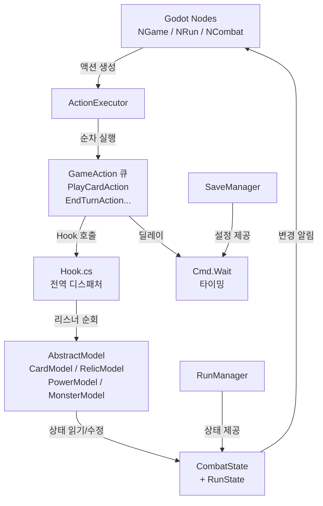
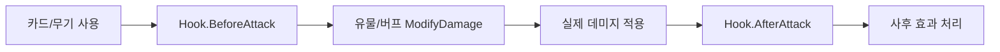

# STS2 전체 아키텍처 패턴

[[02-Project-Structure]] | [[00-INDEX]] | 다음: [[04-Model-System]]

---

## 핵심 아이디어: Model-Command-Hook 아키텍처

STS2의 아키텍처는 세 개의 레이어로 구성된다.

```
┌─────────────────────────────────────────────┐
│              PRESENTATION LAYER              │
│  Godot Nodes (NGame, NRun, NCombat, ...)    │
│  씬 파일(.tscn), 비주얼, 애니메이션, UI     │
└────────────────────┬────────────────────────┘
                     │ 이벤트/콜백
┌────────────────────▼────────────────────────┐
│               LOGIC LAYER                   │
│  GameAction (큐잉된 비동기 명령)            │
│  Hook (전역 이벤트 디스패처)                │
│  Cmd (타이밍 유틸리티)                      │
└────────────────────┬────────────────────────┘
                     │ 읽기/수정
┌────────────────────▼────────────────────────┐
│                DATA LAYER                   │
│  AbstractModel 서브클래스                   │
│  CardModel, RelicModel, PowerModel, ...     │
│  CombatState, RunState                      │
└─────────────────────────────────────────────┘
```

---

## 1. Canonical/Mutable 상태 분리

STS2의 가장 독특한 패턴. `AbstractModel`에 명시되어 있다:

```csharp
// src/Core/Models/AbstractModel.cs
public abstract class AbstractModel : IComparable<AbstractModel>
{
    public bool IsMutable { get; private set; }
    public bool IsCanonical => !IsMutable;

    public void AssertMutable()
    {
        if (!IsMutable)
            throw new CanonicalModelException(GetType());
    }

    public void AssertCanonical()
    {
        if (IsMutable)
            throw new MutableModelException(GetType());
    }

    public AbstractModel MutableClone()
    {
        AbstractModel clone = (AbstractModel)MemberwiseClone();
        clone.IsMutable = true;
        clone.DeepCloneFields();
        clone.AfterCloned();
        return clone;
    }
}
```

### Canonical vs Mutable 의미

| | Canonical (정규) | Mutable (가변) |
|-|-----------------|---------------|
| `IsMutable` | `false` | `true` |
| 역할 | 읽기 전용 원본 정의 | 런타임 실제 인스턴스 |
| 예시 | `Strike` 카드의 정의 | 플레이어 덱에 있는 `Strike` |
| 수정 시 | `CanonicalModelException` 예외 | 정상 수정 가능 |
| 생성 | `ModelDb` 초기화 시 | `MutableClone()` 호출 |

**실제 흐름:**
1. 게임 시작 시 모든 카드/유물/파워의 **Canonical 인스턴스** 등록 (`ModelDb`)
2. 런 시작 시 필요한 것들을 `MutableClone()` → **Mutable 인스턴스** 생성
3. 런 중 모든 수정은 Mutable 인스턴스에만 적용
4. 멀티플레이어 동기화 시 Canonical을 기준으로 델타만 전송

> [!note] 이 패턴의 장점
> - **안전성**: Canonical 원본이 실수로 수정되는 것 방지
> - **멀티플레이어**: 각 플레이어가 같은 Canonical을 공유, 차이점만 동기화
> - **메모리 효율**: 공통 데이터는 Canonical 하나만 유지

---

## 2. Hook 시스템 — Observer 패턴 구현

STS2에서 가장 중요한 패턴. 모든 게임 이벤트(카드 플레이, 데미지, 턴 종료 등)가 Hook을 통해 처리된다.

### Hook.cs 구조

```csharp
// src/Core/Hooks/Hook.cs
public static class Hook
{
    // 전역 이벤트 디스패처 — 모든 리스너를 순회하며 async 호출
    public static async Task AfterAttack(CombatState combatState, AttackCommand command)
    {
        foreach (AbstractModel model in combatState.IterateHookListeners())
        {
            await model.AfterAttack(command);
            model.InvokeExecutionFinished();
        }
    }

    public static async Task BeforeBlockGained(CombatState combatState, Creature creature,
        decimal amount, ValueProp props, CardModel? cardSource)
    {
        foreach (AbstractModel model in combatState.IterateHookListeners())
        {
            await model.BeforeBlockGained(creature, amount, props, cardSource);
            model.InvokeExecutionFinished();
        }
    }

    // ... 100개 이상의 Hook 메서드
}
```

### AbstractModel의 Hook 메서드들

모든 게임 오브젝트(`AbstractModel` 서브클래스)는 원하는 Hook을 오버라이드한다:

```csharp
// 기본 구현 — 아무것도 안 함 (virtual, Task.CompletedTask 반환)
public virtual Task AfterCardPlayed(PlayerChoiceContext context, CardPlay cardPlay)
    => Task.CompletedTask;

public virtual Task AfterDamageReceived(PlayerChoiceContext choiceContext, Creature target,
    DamageResult result, ValueProp props, Creature? dealer, CardModel? cardSource)
    => Task.CompletedTask;

// Modify 계열 — 값을 변환
public virtual decimal ModifyDamageAdditive(Creature? target, decimal amount,
    ValueProp props, Creature? dealer, CardModel? cardSource)
    => 0m;  // 기본: 추가 데미지 없음

public virtual decimal ModifyBlockMultiplicative(Creature target, decimal block,
    ValueProp props, CardModel? cardSource, CardPlay? cardPlay)
    => 1m;  // 기본: 배율 1.0 (변경 없음)

// Should 계열 — 조건 검사
public virtual bool ShouldDie(Creature creature) => true;
public virtual bool ShouldClearBlock(Creature creature) => true;
public virtual bool ShouldDraw(Player player, bool fromHandDraw) => true;
```

### Hook 리스너 순회 순서

`combatState.IterateHookListeners()`의 순서:

```
1. 전투 Modifier (CombatState.Modifiers)
2. 플레이어들 (Players)
   2a. 플레이어의 PowerModel들
   2b. 플레이어의 RelicModel들
   2c. 플레이어의 카드들 (Hand + 전체 덱)
3. 적들 (Enemies)
   3a. 적의 PowerModel들
```

> [!note] 순서가 중요한 이유
> 블록을 먼저 적용한 후 데미지를 계산하는 것처럼, Hook 실행 순서가 게임 결과에 직접 영향을 미친다. STS2는 `IterateHookListeners` 순서를 신중하게 정의한다.

### Hook의 세 가지 유형

```
Before/After 계열:  이벤트 발생 전/후 부작용 처리
                    (애니메이션, 상태 변경, 추가 효과)

Modify 계열:        값을 수정하고 반환
                    (데미지/블록/드로우 수 변조)

Should 계열:        bool 반환으로 동작 허가/차단
                    (사망 방지, 블록 클리어 방지)
```

---

## 3. GameAction 시스템

게임의 모든 "행동"은 `GameAction`으로 표현되고 순서대로 실행된다.

### GameAction 생명주기

```csharp
// src/Core/GameActions/GameAction.cs
public abstract class GameAction
{
    public GameActionState State { get; private set; }
    // None → WaitingForExecution → Executing → (GatheringPlayerChoice ↔ ReadyToResumeExecuting) → Finished
    //                                                                                             → Canceled

    public event Action<GameAction>? AfterFinished;
    public event Action<GameAction>? BeforeExecuted;

    public async Task Execute()
    {
        State = GameActionState.Executing;
        this.BeforeExecuted?.Invoke(this);
        _executionTask = TaskHelper.RunSafely(ExecuteAction());
        // ...플레이어 입력 대기 or 완료
    }

    protected abstract Task ExecuteAction(); // 서브클래스에서 구현
    public abstract INetAction ToNetAction(); // 멀티플레이어 직렬화
}
```

### PlayCardAction — 실제 구현 예시

```csharp
// src/Core/GameActions/PlayCardAction.cs
public sealed class PlayCardAction : GameAction
{
    public override GameActionType ActionType => GameActionType.CombatPlayPhaseOnly;

    protected override async Task ExecuteAction()
    {
        _card = NetCombatCard.ToCardModel();

        // 1. 카드가 아직 핸드에 있는지 확인
        if (pile.Type != PileType.Hand) { return; }

        // 2. 플레이 가능한지 확인
        if (!_card.CanPlay(out _, out _) || !_card.IsValidTarget(target))
        {
            Cancel(); return;
        }

        // 3. 에너지/별 소비
        (int energySpent, int starsSpent) = await _card.SpendResources();

        // 4. 카드 효과 실행 (Hook 포함)
        await _card.OnPlayWrapper(PlayerChoiceContext, target, isAutoPlay: false, resources);
    }

    public override INetAction ToNetAction() => new NetPlayCardAction { card = NetCombatCard, ... };
}
```

### ActionExecutor — 큐 실행기

```csharp
// src/Core/GameActions/ActionExecutor.cs
public class ActionExecutor
{
    private async Task ExecuteActions()
    {
        GameAction readyAction = _actionQueueSet.GetReadyAction();
        while (readyAction != null)
        {
            await WaitForUnpause();  // 일시정지 처리

            this.BeforeActionExecuted?.Invoke(readyAction);

            // Godot 메인 루프에 양보하며 실행 (프레임 블록 방지)
            readyAction.AfterFinished += AfterActionFinished;
            Task actionTask = readyAction.Execute();
            while (!actionTask.IsCompleted && !_actionCancelToken.IsCancellationRequested)
            {
                // 매 프레임 체크 — Godot SceneTree와 통합
                await Engine.GetMainLoop().ToSignal(Engine.GetMainLoop(),
                    SceneTree.SignalName.ProcessFrame);
            }

            // 승리 조건 체크
            await CombatManager.Instance.CheckWinCondition();

            readyAction = _actionQueueSet.GetReadyAction();
        }
    }
}
```

### Cmd.Wait — 타이밍 유틸리티

```csharp
// src/Core/Commands/Cmd.cs
public static class Cmd
{
    public static async Task Wait(float seconds, CancellationToken cancelToken = default,
        bool ignoreCombatEnd = false)
    {
        // 인스턴트 모드거나 전투 종료 중이면 스킵
        if (!NonInteractiveMode.IsActive && !(seconds <= 0f) &&
            SaveManager.Instance.PrefsSave.FastMode != FastModeType.Instant)
        {
            SceneTree sceneTree = (SceneTree)Engine.GetMainLoop();
            SceneTreeTimer timer = sceneTree.CreateTimer(seconds);
            await WaitInternal(timer, cancelToken);  // SceneTreeTimer를 Task로 변환
        }
    }
}
```

`SceneTreeTimer`를 `Task`로 변환하는 패턴 — Godot의 신호 기반 타이머를 C# async/await로 사용한다.

---

## 4. 시스템 간 의존성 다이어그램



---

## 5. 데이터 흐름: 카드 플레이 전체 흐름

플레이어가 카드를 드래그해서 플레이하는 순간부터 끝까지:

```
1. [UI] 플레이어가 카드 드래그 → NPlayerHand에서 감지
        ↓
2. [GameAction] PlayCardAction 생성 → ActionExecutor 큐에 추가
        ↓
3. [ActionExecutor] PlayCardAction.Execute() 호출
        ↓
4. [PlayCardAction] 유효성 검사 (핸드에 있는지, 타겟 유효한지)
        ↓
5. [PlayCardAction] card.SpendResources() → 에너지/별 차감
        ↓
6. [PlayCardAction] card.OnPlayWrapper() 호출
        ↓
7. [Hook] Hook.BeforeCardPlayed() → 모든 리스너에 전달
   │  예: 특정 유물이 "카드 플레이 전" 효과 발동
        ↓
8. [CardModel] 카드의 실제 효과 실행
   │  예: Strike → DamageCommand 실행
   │  DamageCommand → Hook.BeforeDamageReceived() 호출
   │  → 모든 리스너 ModifyDamageAdditive/Multiplicative 적용
   │  → 실제 HP 차감
   │  → Hook.AfterDamageReceived() 호출
        ↓
9. [Hook] Hook.AfterCardPlayed() → 모든 리스너에 전달
   │  예: 특정 파워가 "카드 플레이 후" 추가 효과 발동
        ↓
10. [Hook] Hook.AfterCardChangedPiles() → 카드가 핸드→버림더미
        ↓
11. [ActionExecutor] 다음 액션 처리 or 완료
        ↓
12. [UI] CombatState 변경 → Godot 노드들이 UI 업데이트
```

---

## 6. 핵심 디자인 패턴 요약

### Singleton 패턴

```csharp
// 모든 매니저 클래스가 이 패턴 사용
public class RunManager
{
    public static RunManager Instance { get; } = new RunManager();
    private RunManager() { }  // 외부 생성 방지
}

// 사용
RunManager.Instance.IsInProgress
CombatManager.Instance.CheckWinCondition()
SaveManager.Instance.PrefsSave.FastMode
```

### Command 패턴

```csharp
// GameAction이 Command 패턴 구현
public abstract class GameAction
{
    protected abstract Task ExecuteAction();  // 실행
    public void Cancel() { ... }              // 취소
    public abstract INetAction ToNetAction(); // 직렬화 (멀티플레이어용)
}
```

### Observer 패턴

```csharp
// Hook.cs + AbstractModel이 Observer 패턴 구현
// Hook = Subject (발행자)
// AbstractModel 서브클래스 = Observer (구독자)

// 발행
await Hook.AfterAttack(combatState, command);

// 구독 (RelicModel 예시)
public override async Task AfterAttack(AttackCommand command)
{
    // 공격 후 효과 처리
}
```

### State Machine 패턴

```csharp
// GameAction의 상태 머신
public enum GameActionState
{
    None,
    WaitingForExecution,
    Executing,
    GatheringPlayerChoice,  // 플레이어 입력 대기
    ReadyToResumeExecuting,
    Finished,
    Canceled
}
```

### Factory 패턴

```csharp
// src/Core/Factories/ — 카드/유물/포션 생성
// ModelDb가 Canonical 인스턴스의 레지스트리 역할
// MutableClone()으로 런타임 인스턴스 생성
AbstractModel clone = canonicalModel.MutableClone();
```

### Template Method 패턴

```csharp
// AbstractModel의 virtual 메서드들이 Template Method
// 기본 구현 제공, 서브클래스가 필요한 것만 오버라이드

// RelicModel — AfterAttack만 오버라이드하고 나머지는 기본값 사용
public class SomeBlade : RelicModel
{
    public override async Task AfterAttack(AttackCommand command)
    {
        // 공격 후 추가 데미지 로직
    }
    // 나머지 100개 Hook은 기본 구현(Task.CompletedTask) 사용
}
```

---

## 7. STS2 아키텍처의 강점과 한계

### 강점

**확장성 (Extensibility)**
- 새 카드/유물 추가 = 새 클래스 하나 작성
- 기존 코드 수정 없이 새 Hook 오버라이드만으로 효과 추가 가능
- 모딩 지원이 자연스럽게 따라옴

**테스트 용이성**
- `TestMode.IsOn` 체크로 프레임 대기/애니메이션 건너뜀
- `NonInteractiveMode`로 UI 없이 로직만 실행
- Canonical/Mutable 분리로 상태 격리 용이

**멀티플레이어 지원**
- `GameAction.ToNetAction()` — 모든 액션을 네트워크로 전송 가능
- Canonical 모델 공유로 동기화 부담 감소
- `PlayerChoiceContext`로 어느 플레이어의 선택인지 추적

**비동기 처리**
- `async/await`로 애니메이션과 로직이 자연스럽게 통합
- Godot 프레임을 블록하지 않으면서 순차 처리

### 한계

**복잡성**
- 신입 개발자가 이해하기 어려운 간접 레이어
- Hook 실행 순서 문제가 생기면 디버깅 어려움
- `IterateHookListeners` 순서가 게임에 영향을 주어 순서 변경 위험

**성능**
- 모든 Hook마다 모든 리스너를 순회: O(n) × Hook 수
- 카드/유물이 많을수록 Hook 실행 비용 증가
- `async/await` 오버헤드 (비록 미미하지만 누적)

**보일러플레이트**
- 100개+ Hook 메서드를 모두 `Task.CompletedTask`로 기본 구현
- 새 Hook 추가 시 `AbstractModel`, `Hook.cs`, 각 리스너 클래스 모두 수정 필요

---

## 좀슐랭에 적용한다면

### Hook 시스템 적용

```csharp
// 좀슐랭용 AbstractModel (간소화 버전)
public abstract class ZomblangModel
{
    public bool IsMutable { get; private set; }

    // 요리 관련 Hook
    public virtual Task AfterIngredientAdded(RecipeState recipe) => Task.CompletedTask;
    public virtual Task AfterDishCooked(DishModel dish) => Task.CompletedTask;

    // 전투 관련 Hook
    public virtual Task AfterZombieAttacked(ZombieModel zombie, AttackInfo attack) => Task.CompletedTask;
    public virtual decimal ModifyDamage(decimal amount, ZombieModel zombie) => amount;
    public virtual bool ShouldZombieDie(ZombieModel zombie) => true;
}

// 특정 유물 구현
public class ChefKnife : RelicModel  // RelicModel : ZomblangModel
{
    public override decimal ModifyDamage(decimal amount, ZombieModel zombie)
        => amount + 2m;  // 칼 유물: 모든 데미지 +2
}
```

### 아키텍처 간소화 권장

좀슐랭 초기에는 STS2의 전체 아키텍처를 그대로 따르기보다:

1. **Phase 1**: Canonical/Mutable 없이 시작 → 게임플레이 검증
2. **Phase 2**: Hook 시스템 도입 → 유물/버프 시너지 지원
3. **Phase 3**: 멀티플레이어 필요시 → GameAction 큐 + ToNetAction 추가

> [!note] 핵심 교훈
> STS2의 복잡한 아키텍처는 멀티플레이어, 모딩, 수백 개의 카드/유물 시너지 처리를 위한 것이다. 좀슐랭 초기에는 **Hook 시스템**만 채용해도 충분히 확장성 있는 구조를 만들 수 있다.



---

*관련 문서: [[04-Model-System]] | [[05-Hook-System]] | [[06-GameAction-System]] | [[15-Combat-Loop]]*
