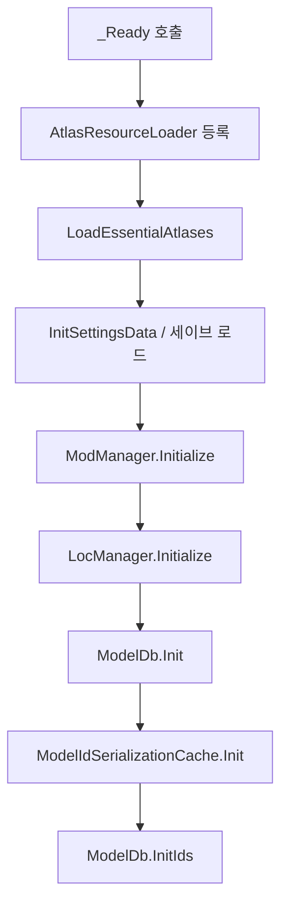
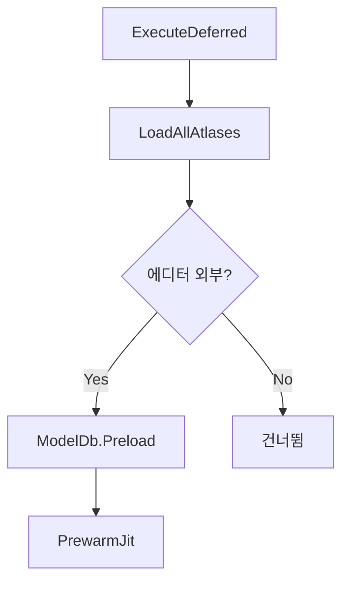
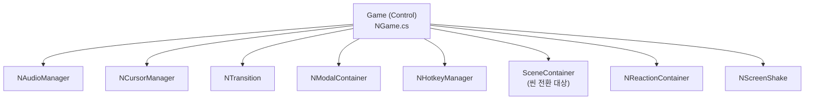
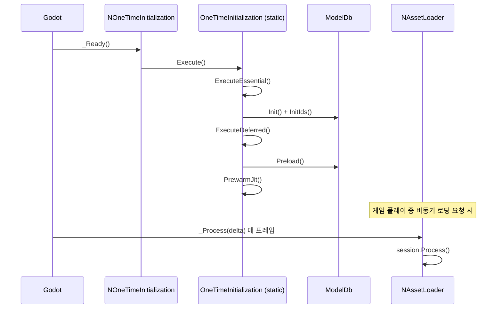

# 04 — 초기화 흐름 (Initialization Flow)

#sts2 #godot #initialization

STS2는 게임 시작 시 **2단계 초기화**를 수행한다. Essential(필수) 단계와 Deferred(지연) 단계로 나뉘며, 전자는 게임 실행에 반드시 필요한 최소 셋업, 후자는 에디터 밖 실행 시 수행하는 사전 로딩이다.

---

## 진입점: NOneTimeInitialization 노드

```csharp
// src/Core/Nodes/NOneTimeInitialization.cs
public partial class NOneTimeInitialization : Node
{
    public override void _Ready()
    {
        OneTimeInitialization.Execute();
    }
}
```

씬 파일 `scenes/one_time_initialization.tscn`은 매우 단순하다.

```
[gd_scene load_steps=2 format=3]
[ext_resource type="Script" path="res://src/Core/Nodes/NOneTimeInitialization.cs"]
[node name="OneTimeInitialization" type="Node"]
script = ExtResource("1_jx321")
```

> [!note] Autoload 패턴
> Godot에서 Autoload로 등록된 이 노드의 `_Ready()`가 호출되면 즉시 `OneTimeInitialization.Execute()`를 실행한다. C#의 `static` 클래스를 노드 래퍼로 호출하는 전형적 패턴이다.

---

## 2단계 초기화: OneTimeInitialization.cs

```csharp
// src/Core/Helpers/OneTimeInitialization.cs
public static class OneTimeInitialization
{
    private static bool _initialized;
    private static bool _deferredExecuted;
    private static AtlasResourceLoader? _atlasResourceLoader;

    public static void Execute()
    {
        ExecuteEssential();
        ExecuteDeferred();
    }

    public static void ExecuteEssential()
    {
        if (!_initialized)
        {
            _initialized = true;
            _atlasResourceLoader = new AtlasResourceLoader();
            ResourceLoader.AddResourceFormatLoader(_atlasResourceLoader, atFront: true);
            AtlasManager.LoadEssentialAtlases();
            SettingsReadResult = SaveManager.Instance.InitSettingsData();
            ModManager.Initialize(new ModManagerFileIo(), ...);
            LocManager.Initialize();
            ModelDb.Init();           // 모든 AbstractModel 서브타입 인스턴스화
            ModelIdSerializationCache.Init();
            ModelDb.InitIds();        // 직렬화용 정수 ID 배정
        }
    }

    public static void ExecuteDeferred()
    {
        if (!_deferredExecuted)
        {
            _deferredExecuted = true;
            AtlasManager.LoadAllAtlases();
            if (!OS.HasFeature("editor"))
            {
                ModelDb.Preload();    // 모든 카드/렐릭/파워 포트레이트 경로 캐싱
                PrewarmJit();         // 직렬화 메서드 JIT 사전 컴파일
            }
        }
    }
}
```

### Essential 단계 순서



### Deferred 단계 (에디터 외부 전용)



> [!note] PrewarmJit
> `RuntimeHelpers.PrepareMethod()`를 호출해 `IPacketSerializable`의 모든 서브타입에 대해 `Serialize/Deserialize` 메서드를 강제 JIT 컴파일한다. 첫 프레임 히치를 방지하기 위함이다.

---

## AssetLoader 큐 시스템: NAssetLoader

```csharp
// src/Core/Nodes/NAssetLoader.cs
public partial class NAssetLoader : Node
{
    private readonly ConcurrentQueue<AssetLoadingSession?> _sessions
        = new ConcurrentQueue<AssetLoadingSession>();

    private AssetLoadingSession? _currentSession;

    public Task<bool> LoadInTheBackground(AssetLoadingSession session)
    {
        _sessions.Enqueue(session);
        SetProcess(enable: true);   // _Process 활성화
        return session.Task;
    }

    public override void _Process(double delta)
    {
        if (_currentSession == null || _currentSession.IsCompleted)
        {
            if (_sessions.TryDequeue(out AssetLoadingSession result))
                _currentSession = result;
            else
                SetProcess(enable: false);  // 큐 비면 _Process 끄기
        }
        else
        {
            _currentSession.Process();
        }
    }
}
```

`AssetLoadingSession`은 배치 크기 128로 리소스를 병렬 요청(`ResourceLoader.LoadThreadedRequest`)하고 매 프레임 상태를 점검한다. VFX `.tscn` 씬은 별도 큐에서 **순차적으로** 로드한다(메인 스레드 제약).

```csharp
// src/Core/Assets/AssetLoadingSession.cs (핵심 로직)
public void Process()
{
    FinalizeLoading();       // Loaded 상태인 항목 캐시에 추가
    ProcessLoadingQueue();   // toLoad → loading (최대 128개 동시 요청)
    CheckLoadingStatus();    // loading 항목 상태 확인 → finalizing 이동
    if (toLoad==0 && loading==0 && finalizing==0)
        ProcessVfxQueue();   // VFX 씬 순차 처리
    if (모두 완료)
        _completionSource.TrySetResult(true);
}
```

---

## ModelDb 초기화

```csharp
// src/Core/Models/ModelDb.cs
public static void Init()
{
    Type[] allAbstractModelSubtypes = AllAbstractModelSubtypes;
    foreach (Type type in allAbstractModelSubtypes)
    {
        ModelId id = GetId(type);
        AbstractModel value = (AbstractModel)Activator.CreateInstance(type);
        _contentById[id] = value;   // Dictionary<ModelId, AbstractModel>
    }
}
```

- `AllAbstractModelSubtypes`는 소스 생성(`[GenerateSubtypes]` 어트리뷰트)된 `AbstractModelSubtypes.All` 배열과 모드 DLL의 서브타입을 합친다.
- `ModelId`는 `"category.entry"` 형식의 문자열 쌍 레코드 (예: `"card.strike-ironclad"`).
- `InitIds()`는 네트워크 직렬화용 정수 인덱스를 각 모델에 배정한다.
- `Preload()`는 모든 카드의 포트레이트 경로, 렐릭 아이콘 경로 등을 미리 평가해 lazy 프로퍼티를 캐싱한다.

---

## game.tscn — NGame 노드 구조

`scenes/game.tscn`은 31개 ext_resource를 참조하는 최상위 씬이다. 주요 자식 노드:

| 노드 스크립트 | 역할 |
|---|---|
| `NGame.cs` | 루트 Control 노드, 씬 전환 오케스트레이션 |
| `NAudioManager.cs` | 오디오 재생/BGM 관리 |
| `NCursorManager.cs` | 커서 텍스처 (기본/기울임/검사) |
| `NTransition.cs` | 화면 전환 애니메이션 |
| `NModalContainer.cs` | 모달 UI 레이어 |
| `NHotkeyManager.cs` | 키보드 단축키 관리 |
| `NInputManager.cs` | 입력 처리 |
| `NReactionContainer.cs` | 멀티플레이어 이모지 반응 |
| `NScreenShake.cs` | 화면 흔들림 VFX |



---

## 전체 시작 흐름 요약



---

## 좀슐랭에 적용한다면

좀비 쿠킹/헌팅/서바이벌 로그라이크에 이 패턴을 적용할 때:

**2단계 초기화 패턴 활용:**
```csharp
// ZomslangInitialization.cs (가상)
public static void ExecuteEssential()
{
    RecipeDb.Init();      // 레시피 데이터 (카드 역할)
    WeaponDb.Init();      // 무기 데이터 (렐릭 역할)
    ZombieDb.Init();      // 좀비 데이터 (몬스터 역할)
    LocManager.Initialize();
}

public static void ExecuteDeferred()
{
    RecipeDb.Preload();   // 모든 레시피 이미지 경로 캐싱
    WeaponDb.Preload();
}
```

**AssetLoader 큐 시스템**: 전투 진입 시 적 스프라이트, 공격 VFX를 백그라운드에서 미리 로드할 때 `NAssetLoader` 방식의 배치 큐가 효과적이다. `SetProcess(false)`로 유휴 시 CPU 낭비 없음.

**ModelId 패턴**: 모든 게임 오브젝트(레시피, 무기, 좀비 타입)를 `"category.entry"` 문자열 쌍으로 식별하면 세이브 파일 직렬화와 모딩 지원이 자연스럽게 따라온다.

> [!note] 핵심 교훈
> STS2는 `bool _initialized` 가드로 중복 초기화를 방지한다. Godot Autoload가 여러 번 `_Ready()`를 호출할 수 없지만, 테스트 환경이나 씬 재로드 시 안전망 역할을 한다.
