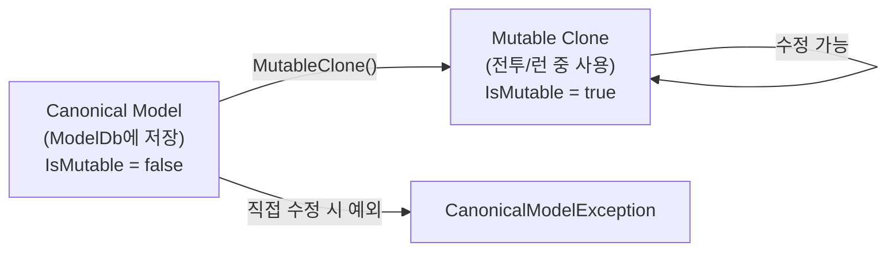

# 05 — Model 시스템 (Model System)

#sts2 #godot #model #data-architecture

STS2의 모든 게임 오브젝트(카드, 렐릭, 파워, 포션, 몬스터, 이벤트 등)는 `AbstractModel`을 상속한다. 이 시스템의 핵심은 **Canonical(원본) vs Mutable(변경 가능) 패턴**이다.

---

## AbstractModel — 베이스 클래스

```csharp
// src/Core/Models/AbstractModel.cs
[GenerateSubtypes(...)]
public abstract class AbstractModel : IComparable<AbstractModel>
{
    public ModelId Id { get; }
    public bool IsMutable { get; private set; }
    public bool IsCanonical => !IsMutable;

    public int CategorySortingId { get; private set; }
    public int EntrySortingId { get; private set; }

    public virtual bool PreviewOutsideOfCombat => false;
    public abstract bool ShouldReceiveCombatHooks { get; }

    public event Action<AbstractModel>? ExecutionFinished;
}
```

### 생성자에서 자동 등록

```csharp
protected AbstractModel()
{
    Type type = GetType();
    if (ModelDb.Contains(type))
        throw new DuplicateModelException(type);
    Id = ModelDb.GetId(type);
}
```

모든 `AbstractModel` 서브클래스는 인스턴스화 시점에 `ModelDb`에서 자신의 `ModelId`를 받는다. 중복 등록 시 즉시 예외를 던진다.

---

## Canonical vs Mutable 패턴

> [!note] 핵심 설계 원칙
> ModelDb에 저장된 인스턴스는 **Canonical(불변 원본)**이다. 전투 중 수정이 필요한 경우 반드시 `MutableClone()`으로 복제한 후 사용한다.

```csharp
public AbstractModel MutableClone()
{
    AbstractModel clone = (AbstractModel)MemberwiseClone();
    clone.IsMutable = true;
    clone.DeepCloneFields();
    clone.AfterCloned();
    return clone;
}

protected virtual void AfterCloned()
{
    this.ExecutionFinished = null;  // 이벤트 구독 초기화
}

public void AssertMutable()
{
    if (!IsMutable)
        throw new CanonicalModelException(GetType());
}

public void AssertCanonical()
{
    if (IsMutable)
        throw new MutableModelException(GetType());
}
```



`ClonePreservingMutability()`는 이미 Mutable이면 복제, Canonical이면 그대로 반환한다.

---

## ModelId 구조

```csharp
// src/Core/Models/ModelId.cs
public record ModelId : IComparable<ModelId>
{
    public string Category { get; }
    public string Entry { get; }

    // 직렬화 형식: "category.entry"
    public override string ToString() => Category + "." + Entry;
}
```

- **Category**: 베이스 클래스명을 슬러그화. `CardModel` → `"card"`, `RelicModel` → `"relic"` (`_MODEL` 접미사 제거)
- **Entry**: 구체 클래스명을 슬러그화. `StrikeIronclad` → `"strike-ironclad"`
- 예시: `card.strike-ironclad`, `relic.burning-blood`, `power.strength`

```csharp
// ModelId 생성 규칙
public static string GetCategory(Type type)
    => ModelId.SlugifyCategory(GetCategoryType(type).Name);  // 상속 체인 최상위

public static string GetEntry(Type type)
    => StringHelper.Slugify(type.Name);  // 구체 클래스명
```

---

## ModelDb — 레지스트리

```csharp
// src/Core/Models/ModelDb.cs
public static class ModelDb
{
    private static readonly Dictionary<ModelId, AbstractModel> _contentById
        = new Dictionary<ModelId, AbstractModel>(4096);

    // 타입별 편의 접근자
    public static T Card<T>() where T : CardModel => Get<T>();
    public static T Relic<T>() where T : RelicModel => Get<T>();
    public static T Power<T>() where T : PowerModel => Get<T>();
    public static T Monster<T>() where T : MonsterModel => Get<T>();
    public static T Potion<T>() where T : PotionModel => Get<T>();
    public static T Orb<T>() where T : OrbModel => Get<T>();
    public static T Act<T>() where T : ActModel => Get<T>();
    // ... 등
}
```

### 전체 캐릭터 목록

```csharp
public static IEnumerable<CharacterModel> AllCharacters => new CharacterModel[5]
{
    Character<Ironclad>(),
    Character<Silent>(),
    Character<Regent>(),
    Character<Necrobinder>(),
    Character<Defect>()
};
```

### 공유 카드 풀

```csharp
public static IEnumerable<CardPoolModel> AllSharedCardPools => new CardPoolModel[7]
{
    CardPool<ColorlessCardPool>(),
    CardPool<CurseCardPool>(),
    CardPool<DeprecatedCardPool>(),
    CardPool<EventCardPool>(),
    CardPool<QuestCardPool>(),
    CardPool<StatusCardPool>(),
    CardPool<TokenCardPool>()
};
```

### Acts (4개)

```csharp
public static IEnumerable<ActModel> Acts => new ActModel[4]
{
    Act<Overgrowth>(),
    Act<Hive>(),
    Act<Glory>(),
    Act<Underdocks>()
};
```

### Orbs (4개, Defect 전용)

```csharp
public static IEnumerable<OrbModel> Orbs => new OrbModel[4]
{
    Orb<LightningOrb>(), Orb<FrostOrb>(), Orb<DarkOrb>(), Orb<PlasmaOrb>()
};
```

---

## 모델 타입 전체 목록

```mermaid
graph TD
    AM["AbstractModel"]
    AM --> Card["CardModel\n카드 (Attack/Skill/Power/Curse/Status/Quest)"]
    AM --> Relic["RelicModel\n렐릭 (영구 아이템)"]
    AM --> Power["PowerModel\n파워 (버프/디버프 스택)"]
    AM --> Potion["PotionModel\n포션 (일회용)"]
    AM --> Monster["MonsterModel\n적 유닛"]
    AM --> Encounter["EncounterModel\n전투 조합"]
    AM --> Event["EventModel\n이벤트"]
    AM --> AncientEvent["AncientEventModel\n고대 이벤트"]
    AM --> Act["ActModel\n스테이지"]
    AM --> Orb["OrbModel\n오브 (Defect 전용)"]
    AM --> Character["CharacterModel\n플레이어 캐릭터"]
    AM --> CardPool["CardPoolModel\n카드 풀"]
    AM --> RelicPool["RelicPoolModel\n렐릭 풀"]
    AM --> PotionPool["PotionPoolModel\n포션 풀"]
    AM --> Achievement["AchievementModel\n업적"]
    AM --> Modifier["ModifierModel\n런 변형자"]
    AM --> Singleton["SingletonModel\n싱글턴 데이터"]
    AM --> Affliction["AfflictionModel\n카드 부착 저주"]
    AM --> Enchantment["EnchantmentModel\n카드 부착 강화"]
```



---

## Hook 메서드 (virtual) — AbstractModel의 이벤트 시스템

`AbstractModel`은 수십 개의 `virtual Task` 메서드(훅)를 정의한다. 기본 구현은 모두 `Task.CompletedTask` 반환이며, 서브클래스가 필요한 것만 오버라이드한다.

### 훅 카테고리

| 접두사 | 의미 | 예시 |
|---|---|---|
| `Before*` | 이벤트 직전 | `BeforeAttack`, `BeforeCombatStart`, `BeforeDamageReceived` |
| `After*` | 이벤트 직후 | `AfterAttack`, `AfterCardPlayed`, `AfterDamageReceived` |
| `After*Late` | 이벤트 후 늦게 | `AfterCardPlayedLate`, `AfterDamageReceivedLate` |
| `After*Early` | 이벤트 전 일찍 | `AfterPlayerTurnStartEarly`, `AfterCardDrawnEarly` |

```csharp
// 예시 훅들
public virtual Task BeforeCombatStart() => Task.CompletedTask;
public virtual Task AfterCombatEnd(CombatRoom room) => Task.CompletedTask;
public virtual Task AfterCardPlayed(PlayerChoiceContext ctx, CardPlay play) => Task.CompletedTask;
public virtual Task AfterDamageReceived(...) => Task.CompletedTask;
public virtual Task BeforeTurnEnd(PlayerChoiceContext ctx, CombatSide side) => Task.CompletedTask;
```

---

## Modify* / Should* 패턴

훅 외에 동기 값 수정 메서드와 조건 판단 메서드가 있다.

### Modify* — 값 수정

```csharp
// 반환값으로 수정된 값을 전달 (합산/곱산 방식)
public virtual decimal ModifyDamageAdditive(...) => 0m;         // 더하기
public virtual decimal ModifyDamageMultiplicative(...) => 1m;   // 곱하기
public virtual decimal ModifyBlockAdditive(...) => 0m;
public virtual decimal ModifyBlockMultiplicative(...) => 1m;
public virtual decimal ModifyHandDraw(Player player, decimal count) => count;
public virtual decimal ModifyMaxEnergy(Player player, decimal amount) => amount;
public virtual int ModifyAttackHitCount(AttackCommand attack, int hitCount) => hitCount;
public virtual int ModifyCardPlayCount(CardModel card, Creature? target, int count) => count;
```

### Should* — 조건 판단

```csharp
// bool 반환: 기본 true(허용), 서브클래스에서 false로 막음
public virtual bool ShouldDie(Creature creature) => true;
public virtual bool ShouldClearBlock(Creature creature) => true;
public virtual bool ShouldDraw(Player player, bool fromHandDraw) => true;
public virtual bool ShouldFlush(Player player) => true;
public virtual bool ShouldGainGold(decimal amount, Player player) => true;
public virtual bool ShouldTakeExtraTurn(Player player) => false;  // 기본 false
public virtual bool ShouldStopCombatFromEnding() => false;        // 기본 false
```

### TryModify* — out 패턴 수정

```csharp
// true 반환 시 out 값 사용, false 반환 시 원본 유지
public virtual bool TryModifyEnergyCostInCombat(
    CardModel card, decimal originalCost, out decimal modifiedCost)
{
    modifiedCost = originalCost;
    return false;
}
```

---

## 모델별 주요 속성

### CardModel

```csharp
public abstract class CardModel : AbstractModel
{
    public virtual CardType Type { get; }      // Attack, Skill, Power, Curse, Status, Quest
    public virtual CardRarity Rarity { get; }  // Basic, Common, Uncommon, Rare, Ancient, Event...
    public virtual TargetType TargetType { get; }
    public CardEnergyCost EnergyCost { get; }  // 에너지 비용 (X 비용 포함)
    public virtual int CanonicalStarCost => -1; // 별 비용 (-1 = 없음)
    public IReadOnlySet<CardKeyword> Keywords { get; }  // Retain, Exhaust, Ethereal, Sly...
    public virtual IEnumerable<CardTag> Tags { get; }   // Strike, Defend 태그
    public Player Owner { get; set; }           // 소유 플레이어 (Mutable 전용)
    public int CurrentUpgradeLevel { get; }
    public virtual int MaxUpgradeLevel => 1;
    public bool IsUpgraded => CurrentUpgradeLevel > 0;
    public bool IsUpgradable { get; }
    public DynamicVarSet DynamicVars { get; }  // 데미지/블록 수치 등 동적 변수
}
```

### RelicModel

```csharp
public abstract class RelicModel : AbstractModel
{
    public virtual LocString Title { get; }
    public LocString Description { get; }
    public LocString Flavor { get; }      // 플레이버 텍스트
    public string IconPath { get; }
    public Player Owner { get; }
    public bool IsWax { get; }            // 왁스 렐릭 (약화 상태)
    public bool IsMelted { get; }         // 녹은 상태 (비활성)
    public DynamicVarSet DynamicVars { get; }
}
```

### PowerModel

```csharp
public abstract class PowerModel : AbstractModel
{
    public int Amount { get; set; }       // 스택 수
    public int AmountOnTurnStart { get; } // 턴 시작 시 스택
    public Creature Owner { get; }        // 적용된 크리처
    public string PackedIconPath { get; } // 아이콘 경로
    public virtual LocString Title { get; }
    public virtual LocString Description { get; }
    // SmartDescription: 조건부 설명 (있으면 사용)
    // RemoteDescription: 멀티플레이어 원격 플레이어 시점 설명
}
```

---

## 실제 모델 구현 예시 — Abrasive (카드)

```csharp
// src/Core/Models/Cards/Abrasive.cs
public sealed class Abrasive : CardModel
{
    public override IEnumerable<CardKeyword> CanonicalKeywords
        => new[] { CardKeyword.Sly };

    protected override IEnumerable<DynamicVar> CanonicalVars => new DynamicVar[]
    {
        new PowerVar<ThornsPower>(4m),
        new PowerVar<DexterityPower>(1m)
    };

    // base(에너지비용, 카드타입, 희귀도, 타겟타입)
    public Abrasive() : base(3, CardType.Power, CardRarity.Rare, TargetType.Self) {}

    protected override async Task OnPlay(PlayerChoiceContext ctx, CardPlay cardPlay)
    {
        await CreatureCmd.TriggerAnim(Owner.Creature, "Cast", ...);
        await PowerCmd.Apply<DexterityPower>(Owner.Creature, DynamicVars.Dexterity.BaseValue, ...);
        await PowerCmd.Apply<ThornsPower>(Owner.Creature, DynamicVars["ThornsPower"].BaseValue, ...);
    }

    protected override void OnUpgrade()
    {
        DynamicVars["ThornsPower"].UpgradeValueBy(2m);
    }
}
```

---

## 좀슐랭에 적용한다면

### 모델 계층 설계

```csharp
// 좀슐랭 모델 계층 (가상)
public abstract class RecipeModel : AbstractModel  // 카드 역할
{
    public virtual CookingType Type { get; }        // Fry, Boil, Raw, Ferment
    public virtual IngredientRarity Rarity { get; }
    public virtual int SatietyPoints { get; }       // 포만감 (에너지 역할)
    public DynamicVarSet DynamicVars { get; }
}

public abstract class WeaponModel : AbstractModel  // 렐릭 역할
{
    public virtual WeaponType Type { get; }         // Melee, Ranged, Trap
    public virtual int Durability { get; }
}

public abstract class ZombieModel : AbstractModel  // 몬스터 역할
{
    public abstract ZombieVariant Variant { get; }  // Walker, Runner, Bloater
}
```

### Canonical/Mutable 패턴 활용

레시피(RecipeModel)를 매 요리 시도마다 복제(`MutableClone()`)해 재료 소모 상태, 임시 수치 변경을 추적한다. 원본 레시피 데이터는 항상 보존된다.

### Hook 패턴 활용

```csharp
// 특수 무기가 요리 데미지에 개입하는 예시
public class FlameBladeWeapon : WeaponModel
{
    public override decimal ModifyDamageAdditive(...) => 5m;  // 불 속성 +5 데미지
    public override Task AfterCardPlayed(...) // 요리 후 부가 효과
    { ... }
}
```

> [!note] 핵심 교훈
> `Should*` 메서드들은 기본값이 `true`(허용)이고, 특정 조건에서만 `false`를 반환하도록 오버라이드한다. `ShouldTakeExtraTurn`, `ShouldStopCombatFromEnding` 등 예외적 상황은 기본 `false`다. 이 패턴은 "기본은 허용, 특수 케이스만 막는" 화이트리스트 방식이다.
