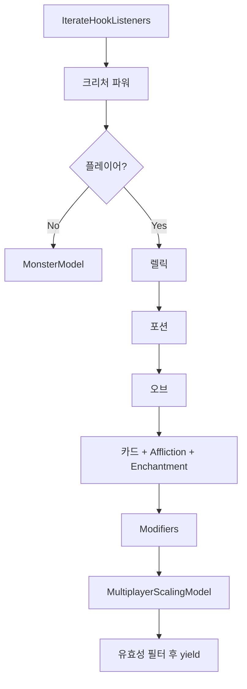
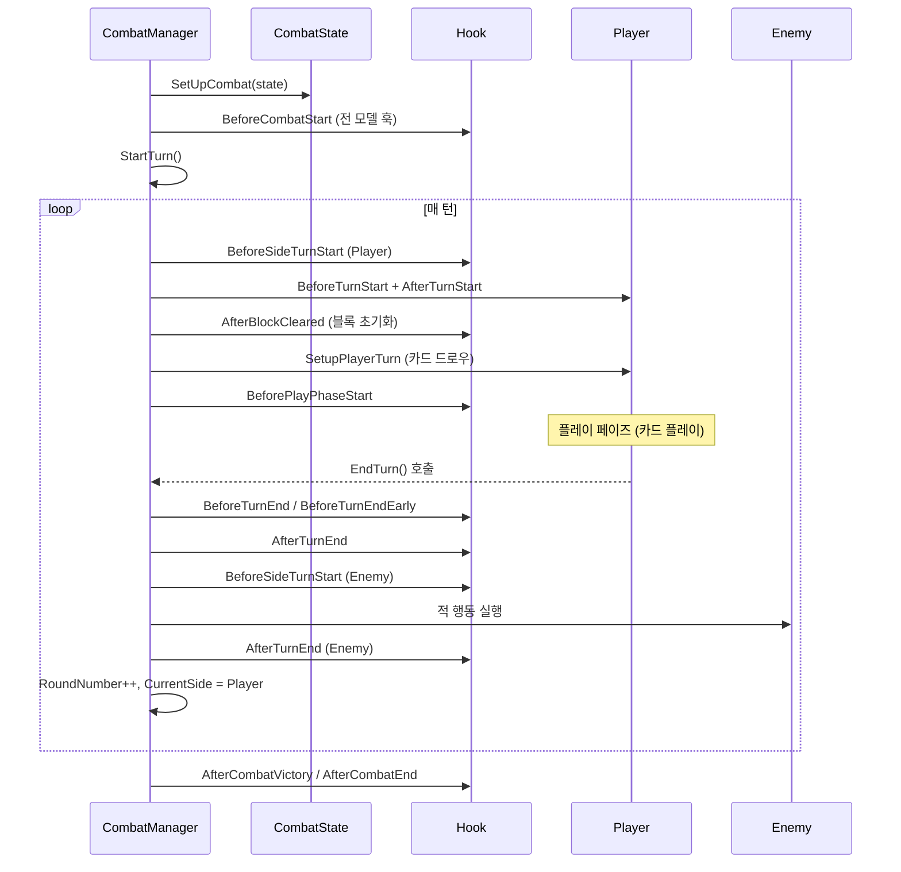

# 06 — 전투 시스템 (Combat System)

#sts2 #godot #combat #turn-management

STS2의 전투는 `CombatManager`(싱글톤), `CombatState`(상태 컨테이너), `CombatHistory`(기록)의 세 축으로 구성된다. 비동기 `async/await` 기반으로 턴과 액션이 순차 실행된다.

---

## CombatSide — 전투 진영

```csharp
// src/Core/Combat/CombatSide.cs
public enum CombatSide
{
    None,
    Player,
    Enemy
}
```

---

## CombatManager — 싱글톤

```csharp
// src/Core/Combat/CombatManager.cs
public class CombatManager
{
    public static CombatManager Instance { get; } = new CombatManager();

    // 상태 플래그
    public bool IsInProgress { get; private set; }
    public bool IsPlayPhase { get; private set; }
    public bool IsEnemyTurnStarted { get; private set; }
    public bool EndingPlayerTurnPhaseOne { get; private set; }
    public bool EndingPlayerTurnPhaseTwo { get; private set; }
    public bool IsPaused { get; private set; }
    public bool IsAboutToLose => _pendingLoss != null;
    public bool PlayerActionsDisabled { get; private set; }

    // 하위 시스템
    public CombatHistory History { get; }
    public CombatStateTracker StateTracker { get; }

    // 이벤트
    public event Action<CombatState>? CombatSetUp;
    public event Action<CombatRoom>? CombatEnded;
    public event Action<CombatRoom>? CombatWon;
    public event Action<CombatState>? TurnStarted;
    public event Action<CombatState>? TurnEnded;
    public event Action<Player, bool>? PlayerEndedTurn;
    public event Action<CombatState>? AboutToSwitchToEnemyTurn;
    public event Action<CombatState>? PlayerActionsDisabledChanged;

    private CombatManager()
    {
        History = new CombatHistory();
        StateTracker = new CombatStateTracker(this);
    }
}
```

`IsEnding` 프로퍼티는 살아있는 주요 적(`IsPrimaryEnemy`)이 없고 `ShouldStopCombatFromEnding()` 훅도 없으면 `true`를 반환한다.

---

## CombatState — 상태 컨테이너

```csharp
// src/Core/Combat/CombatState.cs
public class CombatState : ICardScope
{
    private readonly List<Creature> _allies = new List<Creature>();
    private readonly List<Creature> _enemies = new List<Creature>();
    private uint _nextCreatureId;

    public IRunState RunState { get; }
    public IReadOnlyList<Creature> Allies => _allies;
    public IReadOnlyList<Creature> Enemies => _enemies;
    public IReadOnlyList<Creature> Creatures => _allies.Concat(_enemies).ToList();
    public IReadOnlyList<Player> Players { get; }
    public IReadOnlyList<ModifierModel> Modifiers { get; }

    public int RoundNumber { get; set; }
    public CombatSide CurrentSide { get; set; }
    public EncounterModel? Encounter { get; }

    public CombatState(EncounterModel? encounter = null, ...)
    {
        RoundNumber = 1;
        CurrentSide = CombatSide.Player;  // 플레이어 선공
    }
}
```

### 크리처 생성

```csharp
public Creature CreateCreature(MonsterModel monster, CombatSide side, string? slot)
{
    monster.AssertMutable();
    monster.RunRng = RunState.Rng;
    Creature creature = new Creature(monster, side, slot);

    if (side == CombatSide.Enemy)
    {
        // 멀티플레이어 인원수에 따른 HP 스케일링
        creature.SetUniqueMonsterHpValue(creaturesOnSide, RunState.Rng.Niche);
        creature.ScaleMonsterHpForMultiplayer(Encounter, Players.Count, RunState.CurrentActIndex);
    }

    AttachCreature(creature);  // CombatId 배정
    monster.Rng = new Rng(seed_based_on_coord_and_id);
    return creature;
}
```

### 카드 생성

```csharp
public CardModel CreateCard(CardModel canonicalCard, Player owner)
{
    CardModel mutable = canonicalCard.ToMutable();  // Canonical → Mutable 복제
    AddCard(mutable, owner);
    mutable.AfterCreated();
    return mutable;
}
```

---

## IterateHookListeners — 훅 순회

전투 중 이벤트 발생 시 훅을 받을 모델 목록을 순서대로 생성한다. 이 순서가 효과 적용 우선순위를 결정한다.

```csharp
public IEnumerable<AbstractModel> IterateHookListeners()
{
    List<AbstractModel> list = new List<AbstractModel>(Players.Count * 50);

    // 1. 모든 크리처 순회 (아군 → 적군)
    for (int i = 0; i < _allies.Count + _enemies.Count; i++)
    {
        Creature creature = (i < _allies.Count)
            ? _allies[i]
            : _enemies[i - _allies.Count];

        // 2. 파워 (버프/디버프)
        list.AddRange(creature.Powers);

        if (creature.Player == null)
        {
            // 3a. 몬스터 모델 직접 추가
            list.Add(creature.Monster);
        }
        else if (player.IsActiveForHooks)
        {
            // 3b. 플레이어: 렐릭 (녹은 것 제외)
            foreach (var relic in player.Relics)
                if (!relic.IsMelted) list.Add(relic);

            // 4. 포션 슬롯
            foreach (var potion in player.PotionSlots)
                if (potion != null) list.Add(potion);

            // 5. 오브 큐
            list.AddRange(player.PlayerCombatState.OrbQueue.Orbs);

            // 6. 모든 카드 파일 (덱 + 손패 + 버린패 + 소멸패)
            foreach (var pile in player.PlayerCombatState.AllPiles)
                foreach (var card in pile.Cards)
                {
                    list.Add(card);
                    if (card.Affliction != null) list.Add(card.Affliction);
                    if (card.Enchantment != null) list.Add(card.Enchantment);
                }
        }
    }

    // 7. 런 변형자 (Modifiers)
    foreach (var mod in Modifiers) list.Add(mod);

    // 8. 멀티플레이어 스케일링 모델
    if (MultiplayerScalingModel != null) list.Add(MultiplayerScalingModel);

    // 9. 유효한 것만 yield
    foreach (var item in list)
        if (Contains(item)) yield return item;
}
```



---

## Hook 정적 클래스 — 훅 발동

`Hook.cs`는 `CombatState.IterateHookListeners()`를 순회하며 모든 모델의 가상 메서드를 호출한다.

```csharp
// src/Core/Hooks/Hook.cs
public static async Task AfterAttack(CombatState combatState, AttackCommand command)
{
    foreach (AbstractModel model in combatState.IterateHookListeners())
    {
        await model.AfterAttack(command);
        model.InvokeExecutionFinished();  // UI 업데이트 신호
    }
}

public static async Task BeforeCombatStart(IRunState runState, CombatState combatState)
{
    // RunState 훅 (렐릭 등 런 전역)
    foreach (AbstractModel model in runState.IterateHookListeners(null))
    {
        await model.BeforeCombatStart();
        model.InvokeExecutionFinished();
    }
}
```

---

## 전투 생명주기

### 1단계: SetUpCombat

```csharp
public void SetUpCombat(CombatState state)
{
    _state = state;
    _state.MultiplayerScalingModel?.OnCombatEntered(_state);
    StateTracker.SetState(state);
    _playersTakingExtraTurn.Clear();

    // 각 플레이어 전투 상태 초기화
    foreach (Player player in state.Players)
        player.ResetCombatState();

    // 덱 섞기 및 전투 초기 카드 설정
    foreach (Player player in state.Players)
        player.PopulateCombatState(player.RunState.Rng.Shuffle, state);

    // 네트워크 카드 DB 초기화
    NetCombatCardDb.Instance.StartCombat(state.Players);

    // 크리처 추가
    foreach (Creature creature in state.Creatures)
        AddCreature(creature);

    CombatSetUp?.Invoke(state);
}
```

### 2단계: AfterCombatRoomLoaded → StartCombatInternal

```csharp
public async Task StartCombatInternal()
{
    // BGM 재생
    if (_state.Encounter.HasBgm)
        NRunMusicController.Instance?.PlayCustomMusic(_state.Encounter.CustomBgm);

    // 크리처 입장 처리
    foreach (Creature creature in _state.Creatures)
        await AfterCreatureAdded(creature);

    IsInProgress = true;

    // BeforeCombatStart 훅 (모든 모델)
    await Hook.BeforeCombatStart(_state.RunState, _state);

    await Cmd.CustomScaledWait(0.5f, 1f);  // 연출 대기

    await StartTurn();  // 첫 턴 시작
}
```

### 3단계: StartTurn — 턴 루프

```csharp
private async Task StartTurn(Func<Task>? actionDuringEnemyTurn = null)
{
    if (!IsInProgress) return;

    // 크리처 턴 시작 처리
    foreach (Creature c in creaturesStartingTurn)
        c.BeforeTurnStart(RoundNumber, CurrentSide);

    // BeforeSideTurnStart 훅
    await Hook.BeforeSideTurnStart(_state, _state.CurrentSide);

    if (CurrentSide == CombatSide.Player)
    {
        PlayerActionsDisabled = false;
        _playersReadyToEndTurn.Clear();

        // 적 다음 행동 준비 (추가 턴 아닐 때)
        if (!isExtraPlayerTurn)
            foreach (Creature enemy in _state.Enemies)
                enemy.PrepareForNextTurn(_state.PlayerCreatures);
    }

    await Cmd.CustomScaledWait(0.5f, 0.8f);  // 배너 표시 대기

    // AfterTurnStart 처리 (블록 초기화 포함)
    foreach (Creature c in creaturesStartingTurn)
        await c.AfterTurnStart(RoundNumber, CurrentSide);

    // 블록 초기화 훅
    foreach (Creature c in creaturesStartingTurn)
        await Hook.AfterBlockCleared(_state, c);

    // 플레이어 턴: 카드 드로우, BeforePlayPhaseStart 훅
    foreach (Player p in playersStartingTurn)
    {
        var ctx = new HookPlayerChoiceContext(p, ...);
        await SetupPlayerTurn(p, ctx);
    }

    await Hook.AfterSideTurnStart(_state, _state.CurrentSide);

    if (CurrentSide == CombatSide.Player)
    {
        // 오브 턴 시작 처리
        foreach (Player p in playersStartingTurn)
            await p.PlayerCombatState.OrbQueue.AfterTurnStart(ctx);

        // BeforePlayPhaseStart 훅
        foreach (Player p in _state.Players)
            await Hook.BeforePlayPhaseStart(_state, p);

        await CheckWinCondition();
    }
}
```

### 전체 전투 흐름



---

## CombatHistory — 기록 시스템

```csharp
// src/Core/Combat/History/CombatHistory.cs
public class CombatHistory
{
    private readonly List<CombatHistoryEntry> _entries = new List<CombatHistoryEntry>();

    public IEnumerable<CombatHistoryEntry> Entries => _entries;
    public IEnumerable<CardPlayStartedEntry> CardPlaysStarted => Entries.OfType<CardPlayStartedEntry>();
    public IEnumerable<CardPlayFinishedEntry> CardPlaysFinished => Entries.OfType<CardPlayFinishedEntry>();

    public event Action? Changed;

    // 기록 메서드들
    public void CardPlayStarted(CombatState state, CardPlay cardPlay)
        => Add(new CardPlayStartedEntry(cardPlay, state.RoundNumber, state.CurrentSide, this));

    public void DamageReceived(CombatState state, Creature receiver, Creature? dealer,
        DamageResult result, CardModel? cardSource)
        => Add(new DamageReceivedEntry(result, receiver, dealer, cardSource, ...));

    public void BlockGained(CombatState state, Creature receiver, int amount, ...)
        => Add(new BlockGainedEntry(amount, props, cardPlay, receiver, ...));
}
```

### History Entry 타입 목록

`src/Core/Combat/History/Entries/` 에 정의된 모든 엔트리:

| 엔트리 클래스 | 기록 내용 |
|---|---|
| `CardPlayStartedEntry` | 카드 플레이 시작 |
| `CardPlayFinishedEntry` | 카드 플레이 완료 |
| `CardDrawnEntry` | 카드 드로우 (손패 드로우 여부 포함) |
| `CardDiscardedEntry` | 카드 버림 |
| `CardExhaustedEntry` | 카드 소멸 |
| `CardGeneratedEntry` | 카드 생성 (플레이어/시스템 생성 구분) |
| `CardAfflictedEntry` | 카드에 저주 부착 |
| `CreatureAttackedEntry` | 크리처 공격 (다중 히트 결과 포함) |
| `DamageReceivedEntry` | 피해 수신 (딜러, 소스 카드 포함) |
| `BlockGainedEntry` | 블록 획득 |
| `EnergySpentEntry` | 에너지 소비 |
| `MonsterPerformedMoveEntry` | 몬스터 행동 실행 |
| `OrbChanneledEntry` | 오브 채널링 |
| `PotionUsedEntry` | 포션 사용 |
| `PowerReceivedEntry` | 파워 적용 |

모든 엔트리는 `RoundNumber`와 `CombatSide`를 함께 기록한다.

---

## CombatStateTracker

```csharp
// 전투 상태 변화 추적 (체크섬 기반 동기화)
public class CombatStateTracker
{
    // 멀티플레이어에서 게임 상태 불일치를 감지하기 위한 체크섬 생성
}
```

---

## 전투 상태 변수 정리

| 변수 | 타입 | 의미 |
|---|---|---|
| `IsInProgress` | bool | 전투 진행 중 |
| `IsPlayPhase` | bool | 플레이어 카드 플레이 가능 구간 |
| `IsEnemyTurnStarted` | bool | 적 턴 시작됨 |
| `EndingPlayerTurnPhaseOne` | bool | 플레이어 턴 종료 1단계 |
| `EndingPlayerTurnPhaseTwo` | bool | 플레이어 턴 종료 2단계 |
| `IsAboutToLose` | bool | 패배 직전 (`PendingLossState` 존재) |
| `IsEnding` | bool | 전투 종료 조건 충족 |
| `PlayerActionsDisabled` | bool | UI 입력 잠금 상태 |
| `RoundNumber` | int | 현재 라운드 번호 (1 시작) |
| `CurrentSide` | CombatSide | 현재 턴의 진영 |

---

## 좀슐랭에 적용한다면

### 전투 매니저 패턴 활용

```csharp
// ZomslangCombatManager.cs (가상)
public class HuntingManager  // CombatManager 역할
{
    public static HuntingManager Instance { get; } = new HuntingManager();

    public HuntingState? CurrentHunt { get; private set; }
    public bool IsInProgress { get; private set; }

    public event Action<HuntingState>? HuntSetUp;
    public event Action? HuntEnded;
}
```

### IterateHookListeners 순서 설계

좀슐랭에서도 동일한 순서를 권장한다:
1. 플레이어 파워(독소 내성, 체력 버프 등)
2. 무기(WeaponModel — 렐릭 역할)
3. 장착 레시피 카드들
4. 런 변형자(Modifier)

### async/await 전투 흐름

STS2처럼 전투 액션마다 `await`을 사용하면:
- VFX 애니메이션이 끝날 때까지 대기
- 연쇄 효과(카드 플레이 → 파워 적용 → 추가 카드 생성)가 순서 보장
- 멀티플레이어 동기화 포인트 명확화

```csharp
protected override async Task OnHunt(HuntContext ctx, HuntAction action)
{
    await CreatureCmd.TriggerAnim(Owner.Creature, "Attack", delay);
    await DamageCmd.Attack(DynamicVars.Damage.BaseValue)
        .FromCard(this)
        .Targeting(action.Target)
        .Execute(ctx);
}
```

> [!note] 핵심 교훈
> `CombatHistory`는 단순 로그가 아니라 도전 과제(Achievement) 판정, 멀티플레이어 리플레이, 통계 계산에 사용된다. 모든 중요한 게임 이벤트는 반드시 기록한다. `RoundNumber + CombatSide` 조합으로 언제 어느 진영의 턴에 발생했는지를 항상 추적한다.
