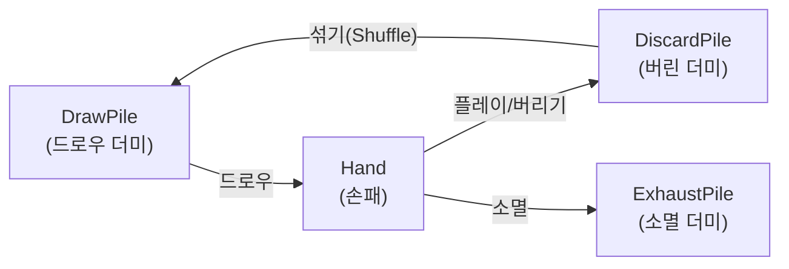
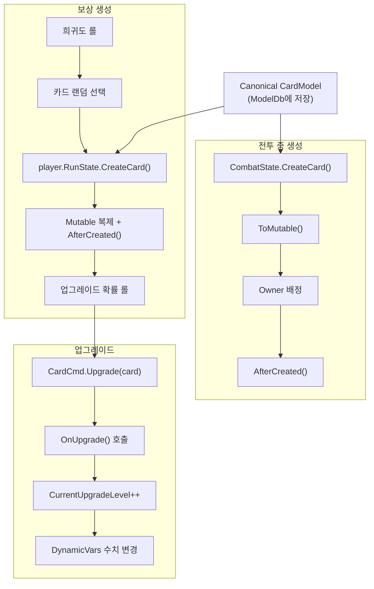
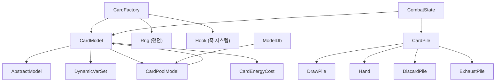

# 07 — 카드 시스템 (Card System)

#sts2 #godot #card #card-factory

STS2의 카드는 `CardModel`(데이터) + `NCard`(노드/비주얼)의 분리 구조다. `CardModel`은 `AbstractModel`을 상속해 Canonical/Mutable 패턴을 따르며, `CardFactory`가 보상/상점/전투 생성을 담당한다.

---

## CardModel — 핵심 속성

```csharp
// src/Core/Models/CardModel.cs (핵심 발췌)
public abstract class CardModel : AbstractModel
{
    // --- 분류 ---
    public virtual CardType Type { get; }       // Attack, Skill, Power, Curse, Status, Quest, None
    public virtual CardRarity Rarity { get; }   // Basic, Common, Uncommon, Rare, Ancient,
                                                // Event, Quest, Status, Curse, Token, Deprecated
    public virtual TargetType TargetType { get; }

    // --- 비용 ---
    public CardEnergyCost EnergyCost { get; }        // 에너지 비용 (X 비용 포함)
    protected virtual int CanonicalEnergyCost { get; }
    protected virtual bool HasEnergyCostX => false;
    public virtual int CanonicalStarCost => -1;       // 별 비용 (-1 = 없음)

    // --- 업그레이드 ---
    public int CurrentUpgradeLevel { get; }
    public virtual int MaxUpgradeLevel => 1;
    public bool IsUpgraded => CurrentUpgradeLevel > 0;
    public bool IsUpgradable { get; }

    // --- 키워드 & 태그 ---
    public virtual IEnumerable<CardKeyword> CanonicalKeywords => Array.Empty<CardKeyword>();
    public IReadOnlySet<CardKeyword> Keywords { get; }
    protected virtual HashSet<CardTag> CanonicalTags => new HashSet<CardTag>();

    // --- 동적 수치 ---
    public DynamicVarSet DynamicVars { get; }         // 데미지, 블록, 파워 수치 등
    protected virtual IEnumerable<DynamicVar> CanonicalVars => Array.Empty<DynamicVar>();

    // --- 소유/상태 ---
    public Player Owner { get; set; }              // Mutable 전용
    public CardPile? Pile { get; }                 // 현재 속한 파일
    public virtual CardPoolModel Pool { get; }     // 속한 카드 풀
    public virtual CardMultiplayerConstraint MultiplayerConstraint => CardMultiplayerConstraint.None;

    // --- 기타 ---
    public bool ExhaustOnNextPlay { get; set; }
    public bool ShouldRetainThisTurn { get; }      // Retain 키워드 또는 임시 리테인
}
```

### CardType 열거형

| 값 | 의미 |
|---|---|
| `Attack` | 공격 카드 (빨간 프레임) |
| `Skill` | 스킬 카드 (녹색 프레임) |
| `Power` | 파워 카드 (파란 프레임, 영구 효과) |
| `Curse` | 저주 카드 (어두운 프레임) |
| `Status` | 상태 카드 (회색, 전투 중 생성) |
| `Quest` | 퀘스트 카드 |
| `None` | 미분류 |

### CardRarity 열거형과 배너 색상

```csharp
private string BannerMaterialPath => Rarity switch
{
    CardRarity.Uncommon => "res://materials/cards/banners/card_banner_uncommon_mat.tres",
    CardRarity.Rare     => "res://materials/cards/banners/card_banner_rare_mat.tres",
    CardRarity.Curse    => "res://materials/cards/banners/card_banner_curse_mat.tres",
    CardRarity.Status   => "res://materials/cards/banners/card_banner_status_mat.tres",
    CardRarity.Event    => "res://materials/cards/banners/card_banner_event_mat.tres",
    CardRarity.Quest    => "res://materials/cards/banners/card_banner_quest_mat.tres",
    CardRarity.Ancient  => "res://materials/cards/banners/card_banner_ancient_mat.tres",
    _                   => "res://materials/cards/banners/card_banner_common_mat.tres",
};
```

### CardKeyword 종류 (일부)

`Retain`, `Exhaust`, `Ethereal`, `Sly`, `Innate`, `Unplayable`, `X-Cost` 등. 키워드는 `CanonicalKeywords`로 선언하고, `Keywords` 프로퍼티가 `HashSet`으로 초기화한다.

---

## 카드 비주얼 리소스 경로 규칙

```csharp
// 포트레이트 경로 (atlas sprite)
public virtual string PortraitPath =>
    ImageHelper.GetImagePath(
        $"atlases/card_atlas.sprites/{Pool.Title.ToLowerInvariant()}" +
        $"/{base.Id.Entry.ToLowerInvariant()}.tres");

// 프레임 (카드 타입별)
// "atlases/ui_atlas.sprites/card/card_frame_{type}_s.tres"
// 예: card_frame_attack_s.tres, card_frame_skill_s.tres

// 포트레이트 테두리
// "atlases/ui_atlas.sprites/card/card_portrait_border_{type}_s.tres"
```

---

## 구체 카드 구현 예시

### StrikeIronclad — 기본 공격 카드

```csharp
// src/Core/Models/Cards/StrikeIronclad.cs
public sealed class StrikeIronclad : CardModel
{
    protected override HashSet<CardTag> CanonicalTags
        => new HashSet<CardTag> { CardTag.Strike };

    protected override IEnumerable<DynamicVar> CanonicalVars
        => new[] { new DamageVar(6m, ValueProp.Move) };  // 기본 데미지 6

    // base(에너지비용, 타입, 희귀도, 타겟)
    public StrikeIronclad()
        : base(1, CardType.Attack, CardRarity.Basic, TargetType.AnyEnemy) {}

    protected override async Task OnPlay(PlayerChoiceContext ctx, CardPlay cardPlay)
    {
        ArgumentNullException.ThrowIfNull(cardPlay.Target, "cardPlay.Target");
        await DamageCmd.Attack(DynamicVars.Damage.BaseValue)
            .FromCard(this)
            .Targeting(cardPlay.Target)
            .WithHitFx("vfx/vfx_attack_slash")
            .Execute(ctx);
    }

    protected override void OnUpgrade()
    {
        DynamicVars.Damage.UpgradeValueBy(3m);  // 업그레이드: +3 (6→9)
    }
}
```

### DefendIronclad — 기본 방어 카드

```csharp
// src/Core/Models/Cards/DefendIronclad.cs
public sealed class DefendIronclad : CardModel
{
    public override bool GainsBlock => true;

    protected override HashSet<CardTag> CanonicalTags
        => new HashSet<CardTag> { CardTag.Defend };

    protected override IEnumerable<DynamicVar> CanonicalVars
        => new[] { new BlockVar(5m, ValueProp.Move) };  // 기본 블록 5

    public DefendIronclad()
        : base(1, CardType.Skill, CardRarity.Basic, TargetType.Self) {}

    protected override async Task OnPlay(PlayerChoiceContext ctx, CardPlay cardPlay)
    {
        await CreatureCmd.GainBlock(Owner.Creature, DynamicVars.Block, cardPlay);
    }

    protected override void OnUpgrade()
    {
        DynamicVars.Block.UpgradeValueBy(3m);  // 업그레이드: +3 (5→8)
    }
}
```

### Abrasive — 복합 파워 카드

```csharp
// src/Core/Models/Cards/Abrasive.cs
public sealed class Abrasive : CardModel
{
    public override IEnumerable<CardKeyword> CanonicalKeywords
        => new[] { CardKeyword.Sly };  // 에너지 없이 플레이 가능

    protected override IEnumerable<DynamicVar> CanonicalVars => new DynamicVar[]
    {
        new PowerVar<ThornsPower>(4m),    // 가시 4
        new PowerVar<DexterityPower>(1m)  // 민첩 1
    };

    // 에너지 비용 3, 파워 타입, Rare
    public Abrasive() : base(3, CardType.Power, CardRarity.Rare, TargetType.Self) {}

    protected override async Task OnPlay(PlayerChoiceContext ctx, CardPlay cardPlay)
    {
        await CreatureCmd.TriggerAnim(Owner.Creature, "Cast", Owner.Character.CastAnimDelay);
        await PowerCmd.Apply<DexterityPower>(Owner.Creature, DynamicVars.Dexterity.BaseValue, ...);
        await PowerCmd.Apply<ThornsPower>(Owner.Creature, DynamicVars["ThornsPower"].BaseValue, ...);
    }

    protected override void OnUpgrade()
    {
        DynamicVars["ThornsPower"].UpgradeValueBy(2m);  // 가시 4→6
    }
}
```

---

## 카드 파일(Pile) 시스템



`PileType` 열거형: `Draw`, `Hand`, `Discard`, `Exhaust` 등.  
`CardPilePosition`: 파일 내 위치 (맨 위/맨 아래 등).

---

## 카드 풀 시스템

```csharp
// ModelDb에서 카드 풀 구성
public static IEnumerable<CardPoolModel> AllSharedCardPools => new CardPoolModel[7]
{
    CardPool<ColorlessCardPool>(),   // 무색 카드
    CardPool<CurseCardPool>(),       // 저주 카드
    CardPool<DeprecatedCardPool>(),  // 구버전 카드
    CardPool<EventCardPool>(),       // 이벤트 전용 카드
    CardPool<QuestCardPool>(),       // 퀘스트 카드
    CardPool<StatusCardPool>(),      // 상태 카드 (전투 중 생성)
    CardPool<TokenCardPool>()        // 토큰 카드
};

// 캐릭터별 카드 풀 (Ironclad, Silent, Regent, Necrobinder, Defect)
public static IEnumerable<CardPoolModel> AllCharacterCardPools
    => AllCharacters.Select(c => c.CardPool);
```

카드는 자신의 `Pool` 프로퍼티에서 소속 풀을 지연 탐색한다:

```csharp
public virtual CardPoolModel Pool
{
    get
    {
        if (_pool != null) return _pool;
        _pool = ModelDb.AllCardPools
            .FirstOrDefault(pool => pool.AllCardIds.Contains(Id));
        if (_pool != null) return _pool;
        // MockCardPool 폴백 (테스트용)
        throw new InvalidProgramException($"Card {this} is not in any card pool!");
    }
}
```

---

## CardFactory — 카드 생성

```csharp
// src/Core/Factories/CardFactory.cs
public static class CardFactory
```

### 보상용 카드 생성

```csharp
public static IEnumerable<CardCreationResult> CreateForReward(
    Player player, int cardCount, CardCreationOptions options)
{
    List<CardModel> blacklist = new List<CardModel>();  // 중복 방지
    List<CardCreationResult> results = new List<CardCreationResult>();

    for (int i = 0; i < cardCount; i++)
    {
        // 1. Modify 훅으로 옵션 수정
        options = Hook.ModifyCardRewardCreationOptions(player.RunState, player, options);

        // 2. 가능한 카드 목록 필터링 (멀티플레이어 제약 포함)
        IEnumerable<CardModel> candidates = options.GetPossibleCards(player)
            .Except(blacklist);
        candidates = FilterForPlayerCount(runState, candidates);

        // 3. 희귀도 롤
        CardRarity rarity = RollForRarity(player, options.RarityOdds, ...);
        IEnumerable<CardModel> items = candidates.Where(c => c.Rarity == rarity);

        // 4. 무작위 선택 및 Mutable 복제
        CardModel card = rng.NextItem(items);
        CardModel mutable = player.RunState.CreateCard(card, player);

        blacklist.Add(mutable.CanonicalInstance);
        results.Add(new CardCreationResult(mutable));

        // 5. 업그레이드 롤 (NoUpgradeRoll 플래그 없으면)
        if (!options.Flags.HasFlag(CardCreationFlags.NoUpgradeRoll))
            RollForUpgrade(player, mutable, 0m, rng);
    }

    // 6. TryModifyCardRewardOptions 훅
    if (Hook.TryModifyCardRewardOptions(player.RunState, player, results, options, out var modifiers))
        await Hook.AfterModifyingCardRewardOptions(player.RunState, modifiers);

    return results;
}
```

### 업그레이드 확률 롤

```csharp
private static void RollForUpgrade(Player player, CardModel card, decimal baseChance, Rng rng)
{
    decimal roll = (decimal)rng.NextFloat();

    if (card.IsUpgradable)
    {
        decimal odds = baseChance;

        // Rare 카드는 Act 진행에 따른 확률 증가 없음
        if (card.Rarity != CardRarity.Rare)
        {
            // AscensionLevel.Scarcity: 0.125, 그 외: 0.25 (Act당)
            odds += (decimal)player.RunState.CurrentActIndex * UpgradedCardOddScaling;
        }

        // ModifyCardRewardUpgradeOdds 훅 적용
        odds = Hook.ModifyCardRewardUpgradeOdds(player.RunState, player, card, odds);

        if (roll <= odds)
            CardCmd.Upgrade(card);
    }
}
```

### 상점용 카드 생성

```csharp
public static CardCreationResult CreateForMerchant(
    Player player, IEnumerable<CardModel> options, CardType type)
{
    // Basic 카드 제외
    options = options.Where(c => c.Rarity != CardRarity.Basic);
    options = FilterForPlayerCount(player.RunState, options);

    // 희귀도 롤 (상점 확률, 미래 확률 변경 없음)
    CardRarity rarity = Hook.ModifyMerchantCardRarity(player.RunState, player,
        player.PlayerOdds.CardRarity.RollWithoutChangingFutureOdds(CardRarityOddsType.Shop));

    // 해당 희귀도+타입 카드가 없으면 다음 희귀도로 상승
    List<CardModel> filtered = options.Where(c => c.Rarity == rarity && c.Type == type).ToList();
    while (filtered.Count == 0)
    {
        rarity = rarity.GetNextHighestRarity();
        filtered = options.Where(c => c.Rarity == rarity && c.Type == type).ToList();
    }

    CardModel card = player.RunState.CreateCard(player.PlayerRng.Shops.NextItem(filtered), player);
    RollForUpgrade(player, card, -999999999m);  // 상점은 업그레이드 확률 사실상 0
    return new CardCreationResult(card);
}
```

### 변환(Transform)용 카드 생성

```csharp
public static CardModel CreateRandomCardForTransform(CardModel original, bool isInCombat, Rng rng)
{
    // 동일 풀에서 선택 (Quest/Event/Ancient는 무색 풀로)
    CardPoolModel pool = (original.Type == CardType.Quest || ...)
        ? ModelDb.CardPool<ColorlessCardPool>()
        : original.Pool;

    IEnumerable<CardModel> options = pool.GetUnlockedCards(
        original.Owner.UnlockState,
        original.RunState.CardMultiplayerConstraint);

    // 필터: 동일 희귀도, 원본 제외, 전투 중이면 CanBeGeneratedInCombat
    CardModel[] filtered = GetFilteredTransformationOptions(original, options, isInCombat);
    return original.CardScope.CreateCard(rng.NextItem(filtered), original.Owner);
}
```

---

## 카드 생성/업그레이드 전체 흐름



---

## 카드 선택 UI: CardSelectorPrefs

```csharp
// src/Core/CardSelection/CardSelectorPrefs.cs
// 카드 선택 화면의 설정 (선택 개수, 조건, 프롬프트 등)
```

카드 선택 씬들은 `scenes/cards/` 아래에 위치한다.

---

## DynamicVar 시스템

카드의 수치(데미지, 블록, 파워량)는 `DynamicVar`로 선언한다. 업그레이드 시 수치를 직접 수정할 수 있고, 파워/렐릭의 `Modify*` 훅이 최종 값을 계산한다.

```csharp
// 선언 방식
protected override IEnumerable<DynamicVar> CanonicalVars => new DynamicVar[]
{
    new DamageVar(6m, ValueProp.Move),      // 이름: "Damage", 기본값: 6
    new BlockVar(5m, ValueProp.Move),       // 이름: "Block", 기본값: 5
    new PowerVar<StrengthPower>(2m),        // 이름: "StrengthPower", 기본값: 2
    new DynamicVar("CustomName", 1m),       // 커스텀 이름
};

// 업그레이드
protected override void OnUpgrade()
{
    DynamicVars.Damage.UpgradeValueBy(3m);          // Damage += 3
    DynamicVars["ThornsPower"].UpgradeValueBy(2m);  // 커스텀 이름으로 접근
}

// 사용
await DamageCmd.Attack(DynamicVars.Damage.BaseValue)...;
await CreatureCmd.GainBlock(creature, DynamicVars.Block, cardPlay);
await PowerCmd.Apply<StrengthPower>(creature, DynamicVars.Strength.BaseValue, ...);
```

---

## 카드 시스템 전체 구조



---

## 좀슐랭에 적용한다면

### 레시피 카드 시스템

```csharp
// ZomslangRecipeModel.cs (가상)
public abstract class RecipeModel : AbstractModel
{
    public virtual CookingType Type { get; }    // Fry, Boil, Raw, Marinate
    public virtual IngredientRarity Rarity { get; }
    public virtual int SatietyCost { get; }     // 재료 소모 비용

    public DynamicVarSet DynamicVars { get; }  // SatiationVar, ToxicityVar 등
}

// 구체 레시피 예시
public sealed class ZombieBurger : RecipeModel
{
    protected override IEnumerable<DynamicVar> CanonicalVars => new DynamicVar[]
    {
        new SatiationVar(30m),   // 포만감 +30
        new ToxicityVar(5m)      // 독소 +5 (위험도)
    };

    public ZombieBurger() : base(2, CookingType.Fry, IngredientRarity.Common, TargetType.Self) {}

    protected override async Task OnCook(CookContext ctx, CookAction action)
    {
        await CreatureCmd.TriggerAnim(Owner.Creature, "Cook", delay);
        await SatiationCmd.Gain(Owner.Creature, DynamicVars.Satiation.BaseValue, this);
        await ToxicityCmd.Apply(Owner.Creature, DynamicVars.Toxicity.BaseValue, this);
    }

    protected override void OnUpgrade()
    {
        DynamicVars.Satiation.UpgradeValueBy(10m); // 포만감 30→40
        DynamicVars.Toxicity.UpgradeValueBy(-2m);  // 독소 5→3 (개선)
    }
}
```

### 카드 풀 구조 예시

```csharp
// 생존자 직업별 레시피 풀
AllCharacterCardPools = AllCharacters.Select(c => c.RecipePool);
// Hunter: 고기 요리 레시피
// Chef: 복합 요리 레시피
// Alchemist: 발효/독소 레시피

// 공유 풀
SharedRecipePools = new[]
{
    RecipePool<BasicRecipePool>(),   // 기본 레시피 (Strike/Defend 역할)
    RecipePool<CursedRecipePool>(),  // 저주받은 레시피
    RecipePool<EventRecipePool>(),   // 이벤트 레시피
};
```

### 업그레이드 확률 롤

STS2와 동일한 `RollForUpgrade` 로직을 적용: Act 진행도에 따라 업그레이드 레시피 등장 확률이 높아진다. `Rare`(전설) 레시피는 업그레이드 확률 고정.

> [!note] 핵심 교훈
> `DynamicVar`는 단순 `int`/`float` 필드 대신 사용한다. 수치가 업그레이드로 바뀌고, 훅으로 수정되고, UI에 표시되는 세 가지 역할을 모두 처리하기 때문이다. 카드에 `DamageVar(6m)` 하나를 선언하면 `StrikeIronclad`의 기본 데미지 6이 설정되고, `OnUpgrade()`에서 `UpgradeValueBy(3m)`만 호출하면 9로 증가한다. 별도의 `upgradedDamage` 필드가 필요 없다.
