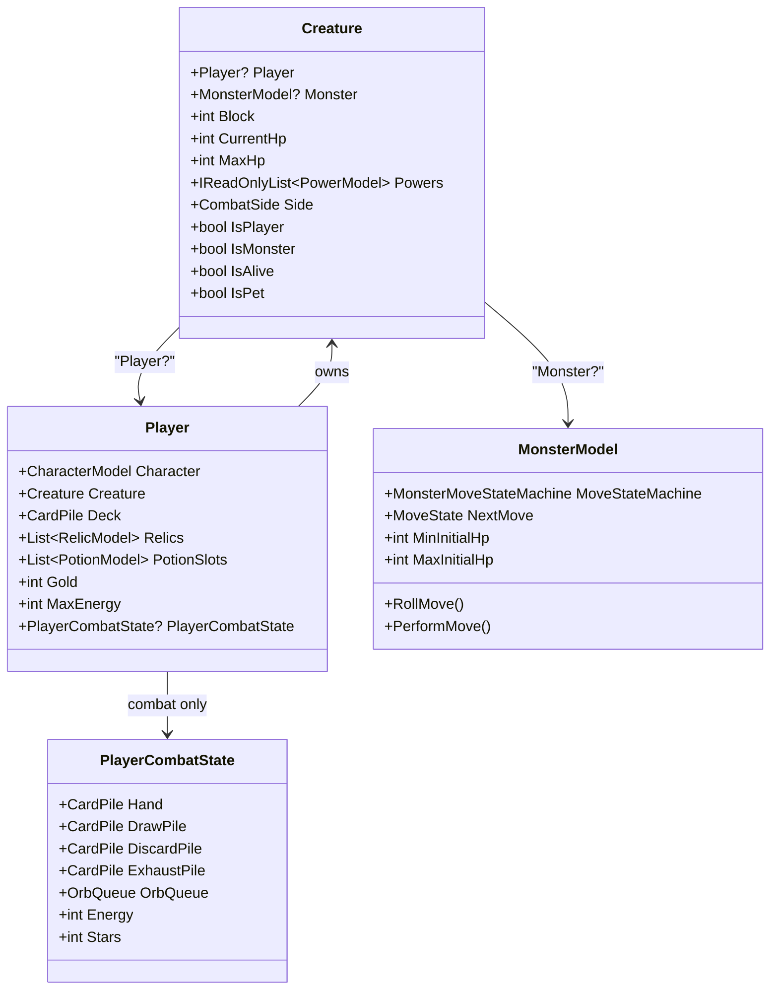

# 08. 엔티티 시스템 (Entity System)

#sts2 #godot #entity #architecture

## 개요

STS2의 엔티티 시스템은 **Creature 래퍼 패턴**을 중심으로 설계되어 있다. Player와 Monster 두 종류의 전투 참여자를 `Creature` 하나로 통합해 다루며, 전투 로직이 "Player인지 Monster인지" 분기하지 않고 동일한 인터페이스로 처리할 수 있게 한다.



---

## Creature 래퍼

`Creature`는 Player와 Monster 중 하나를 감싸는 통합 래퍼다. 생성자가 두 개인 것으로 명확히 구분된다.

```csharp
// Monster용 생성자
public Creature(MonsterModel monster, CombatSide side, string? slotName)
{
    Monster = monster;
    Monster.Creature = this;  // 역참조 연결
    _maxHp = monster.MaxInitialHp;
    _currentHp = monster.MaxInitialHp;
    Side = side;
}

// Player용 생성자
public Creature(Player player, int currentHp, int maxHp)
{
    Player = player;
    _currentHp = currentHp;
    _maxHp = maxHp;
    Side = CombatSide.Player;
}
```

### HP/Block 프로퍼티 패턴

값이 변경될 때마다 이벤트를 발생시키는 패턴을 일관되게 사용한다.

```csharp
public int Block
{
    get => _block;
    private set
    {
        if (value < 0) throw new ArgumentException("Block must be positive");
        if (_block != value)
        {
            int block = _block;
            _block = value;
            this.BlockChanged?.Invoke(block, _block);  // (old, new)
        }
    }
}

// 이벤트들
public event Action<int, int>? BlockChanged;
public event Action<int, int>? CurrentHpChanged;
public event Action<int, int>? MaxHpChanged;
public event Action<PowerModel>? PowerApplied;
public event Action<Creature>? Died;
public event Action<Creature>? Revived;
```

### IsHittable / IsEnemy / IsPet

```csharp
public bool IsHittable
{
    get
    {
        if (IsDead) return false;
        if (!Hook.ShouldAllowHitting(CombatState, this)) return false;
        return true;
    }
}

public bool IsPrimaryEnemy => Side == CombatSide.Enemy && !IsSecondaryEnemy;
public bool IsSecondaryEnemy => Side == CombatSide.Enemy &&
    Powers.Any(p => p.OwnerIsSecondaryEnemy);
public bool IsPet => PetOwner != null;
```

### 데미지/블록 Internal 메서드

커맨드 레이어에서만 호출하는 저수준 메서드들. `*Internal` 접미사가 규칙.

```csharp
public decimal DamageBlockInternal(decimal amount, ValueProp props)
{
    decimal num = (props.HasFlag(ValueProp.Unblockable) ? 0m : Math.Min(Block, amount));
    Block -= (int)num;
    return num;  // 블록이 흡수한 양 반환
}

public DamageResult LoseHpInternal(decimal amount, ValueProp props)
{
    bool flag = CurrentHp > 0 && amount >= (decimal)CurrentHp;
    int currentHp = CurrentHp;
    CurrentHp = Math.Max(CurrentHp - (int)amount, 0);
    return new DamageResult(this, props)
    {
        UnblockedDamage = currentHp - CurrentHp,
        WasTargetKilled = flag,
        OverkillDamage = flag ? (int)(-(decimal)currentHp - amount)) : 0
    };
}

public void GainBlockInternal(decimal amount)
{
    Block = Math.Min(Block + (int)amount, 999);  // 블록 상한 999
}
```

---

## Player 구조

`Player`는 런 전체에 걸쳐 유지되는 영구 데이터를 보관한다. 전투 중 상태는 별도의 `PlayerCombatState`로 분리.

### 핵심 필드

```csharp
public class Player
{
    public const int initialMaxPotionSlotCount = 3;

    public CharacterModel Character { get; }   // 캐릭터 타입 (불변)
    public Creature Creature { get; }           // 전투용 래퍼
    public ulong NetId { get; }                 // 멀티플레이어 식별자

    // 런 영구 데이터
    public CardPile Deck { get; }
    public IReadOnlyList<RelicModel> Relics => _relics;
    public IEnumerable<PotionModel> Potions => _potionSlots.Where(p => p != null);
    public int Gold { get; set; }
    public int MaxEnergy { get; set; }
    public int BaseOrbSlotCount { get; set; }

    // 전투 중에만 존재
    public PlayerCombatState? PlayerCombatState { get; private set; }

    // RNG / 확률 시스템
    public PlayerRngSet PlayerRng { get; private set; }
    public PlayerOddsSet PlayerOdds { get; private set; }

    // 발견 기록 (도감)
    public List<ModelId> DiscoveredCards { get; set; }
    public List<ModelId> DiscoveredRelics { get; set; }
    public List<ModelId> DiscoveredEnemies { get; set; }
}
```

### 생성 패턴

팩토리 메서드 패턴으로 생성. 생성자는 `private`.

```csharp
// 새 런 시작 시
public static Player CreateForNewRun(CharacterModel character, UnlockState unlockState, ulong netId)
{
    Player player = new Player(character, netId,
        character.StartingHp, character.StartingHp,
        character.MaxEnergy, character.StartingGold,
        3,  // potionSlotCount
        character.BaseOrbSlotCount,
        new RelicGrabBag(), unlockState);
    player.PopulateStartingInventory();  // 시작 덱/유물/포션 채우기
    return player;
}

// 세이브 로드 시
public static Player FromSerializable(SerializablePlayer save) { ... }
```

### 전투 시작/종료

```csharp
// 전투 시작 직전 호출 — PlayerCombatState 새로 생성
public void ResetCombatState()
{
    PlayerCombatState = new PlayerCombatState(this);
}

// 덱을 DrawPile로 복사 + 셔플
public void PopulateCombatState(Rng rng, CombatState state)
{
    foreach (CardModel item in Deck.Cards.ToList())
    {
        CardModel cardModel = state.CloneCard(item);
        cardModel.DeckVersion = item;   // 원본 참조 유지
        PlayerCombatState.DrawPile.AddInternal(cardModel);
    }
    PlayerCombatState.DrawPile.RandomizeOrderInternal(this, rng, state);
}

// 전투 종료 시
public void AfterCombatEnd()
{
    Creature.RemoveAllPowersInternalExcept();
    PlayerCombatState?.AfterCombatEnd();
    Creature.LoseBlockInternal(Creature.Block);  // 블록 초기화
}
```

---

## PlayerCombatState — 전투 중 상태

전투 중에만 존재하는 상태 컨테이너. 전투가 끝나면 정리된다.

```csharp
public class PlayerCombatState
{
    // 5개 카드 파일
    public CardPile Hand    { get; } = new CardPile(PileType.Hand);
    public CardPile DrawPile { get; } = new CardPile(PileType.Draw);
    public CardPile DiscardPile { get; } = new CardPile(PileType.Discard);
    public CardPile ExhaustPile { get; } = new CardPile(PileType.Exhaust);
    public CardPile PlayPile { get; } = new CardPile(PileType.Play);

    // 에너지 (변경 시 이벤트)
    public int Energy { get; set; }
    public int MaxEnergy => (int)Hook.ModifyMaxEnergy(
        _player.Creature.CombatState, _player, _player.MaxEnergy);

    // 별 (Stars — STS2 신규 자원)
    public int Stars { get; set; }

    // 오브 시스템
    public OrbQueue OrbQueue { get; }

    // 펫 (Osty 등)
    public IReadOnlyList<Creature> Pets => _pets;
}
```

### 에너지 관리

```csharp
public void ResetEnergy()        => Energy = MaxEnergy;
public void AddMaxEnergyToCurrent() => Energy += MaxEnergy;
public void LoseEnergy(decimal amount) =>
    Energy = (int)Math.Max((decimal)Energy - amount, 0m);
public void GainEnergy(decimal amount) =>
    Energy = (int)Math.Max((decimal)Energy + amount, 0m);
```

### 카드 플레이 가능 여부 판정

```csharp
public bool HasEnoughResourcesFor(CardModel card, out UnplayableReason reason)
{
    int energyCost = Math.Max(0, card.EnergyCost.GetWithModifiers(CostModifiers.All));
    int starCost = Math.Max(0, card.GetStarCostWithModifiers());

    // 훅: 에너지 부족분을 Stars로 대체 가능한지
    if (energyCost > Energy && Hook.ShouldPayExcessEnergyCostWithStars(...))
    {
        starCost += (energyCost - Energy) * 2;
        energyCost = Energy;
    }

    reason = UnplayableReason.None;
    if (energyCost > Energy) reason |= UnplayableReason.EnergyCostTooHigh;
    if (starCost > Stars)    reason |= UnplayableReason.StarCostTooHigh;
    return reason == UnplayableReason.None;
}
```

---

## MonsterModel — 몬스터 AI

`MonsterModel`은 `AbstractModel`을 상속하며, 구체 몬스터 클래스가 이를 다시 상속한다.

```csharp
public abstract class MonsterModel : AbstractModel
{
    public abstract int MinInitialHp { get; }
    public abstract int MaxInitialHp { get; }

    public MonsterMoveStateMachine? MoveStateMachine { get; private set; }
    public MoveState NextMove { get; private set; } = new MoveState();

    // 공격 의도 여부
    public bool IntendsToAttack => NextMove.Intents.Any(i =>
        i.IntentType == IntentType.Attack || i.IntentType == IntentType.DeathBlow);

    // 반드시 서브클래스에서 구현 — 이 몬스터의 전체 행동 트리 정의
    protected abstract MonsterMoveStateMachine GenerateMoveStateMachine();
}
```

### 전투 흐름

```csharp
// 전투 시작 시 호출
public void SetUpForCombat()
{
    MoveStateMachine = GenerateMoveStateMachine();
    SpawnedThisTurn = true;  // 이 턴엔 행동 건너뜀
}

// 다음 행동 결정 (Rng 사용)
public void RollMove(IEnumerable<Creature> targets)
{
    NextMove = MoveStateMachine.RollMove(targets, Creature, RunRng.MonsterAi);
}

// 실제 행동 실행 (async)
public async Task PerformMove() { ... }
```

### 스턴 처리

```csharp
// Creature.StunInternal → Monster.SetMoveImmediate
public void StunInternal(Func<IReadOnlyList<Creature>, Task> stunMove, string? nextMoveId)
{
    MoveState state = new MoveState("STUNNED", stunMove, new StunIntent())
    {
        FollowUpStateId = nextMoveId,          // 스턴 이후 복귀할 상태
        MustPerformOnceBeforeTransitioning = true
    };
    Monster.SetMoveImmediate(state);
}
```

---

## 멀티플레이어 HP 스케일링

```csharp
public static decimal ScaleHpForMultiplayer(decimal hp, EncounterModel? encounter,
    int playerCount, int actIndex)
{
    if (playerCount == 1) return hp;
    return hp * (decimal)playerCount
        * MultiplayerScalingModel.GetMultiplayerScaling(encounter, actIndex);
}
```

---

> [!note] Canonical vs Mutable 패턴
> STS2의 모든 Model은 **Canonical(읽기전용 원본)** 과 **Mutable(전투용 복사본)** 두 상태가 있다.
> `MonsterModel.ToMutable()` 호출 시 딥카피가 생성되고, `AssertMutable()` / `AssertCanonical()` 으로 잘못된 접근을 차단한다.
> Canonical 인스턴스는 `ModelDb`에서 싱글턴으로 관리된다.

---

## 좀슐랭에 적용한다면

좀비 요리/생존 로그라이크에서 이 구조를 이렇게 활용할 수 있다.

| STS2 개념 | 좀슐랭 적용 |
|-----------|-------------|
| `Creature` 래퍼 | `CombatUnit` — 플레이어(쉐프)와 좀비를 동일하게 처리 |
| `PlayerCombatState` | `KitchenState` — 조리 에너지, 재료 파일, 오더 큐 |
| `Stars` 자원 | `Aroma` 자원 — 좋은 요리를 만들면 쌓이는 보조 자원 |
| `MonsterModel.GenerateMoveStateMachine()` | `ZombieAI.GenerateBehaviorTree()` — 좀비 타입별 행동 패턴 정의 |
| `MinInitialHp / MaxInitialHp` | 좀비 HP 범위 (같은 종류도 HP 분산) |
| `IsPet` / `PetOwner` | 길들인 좀비 동반자 시스템 |
| `DiscoveredEnemies` | 요리법 도감 — 어떤 좀비를 요리했는지 기록 |

```csharp
// 좀슐랭 예시 구조
public class CombatUnit  // Creature 역할
{
    public ChefModel? Chef { get; }
    public ZombieModel? Zombie { get; }
    public int Block { get; private set; }
    public int CurrentHp { get; private set; }

    public bool IsChef => Chef != null;
    public bool IsZombie => Zombie != null;
}

public class KitchenState  // PlayerCombatState 역할
{
    public CardPile RecipeHand { get; }    // Hand
    public CardPile IngredientDraw { get; } // DrawPile
    public int CookingEnergy { get; set; }
    public int Aroma { get; set; }          // Stars에 해당
    public OvenQueue OvenQueue { get; }    // OrbQueue에 해당
}
```
