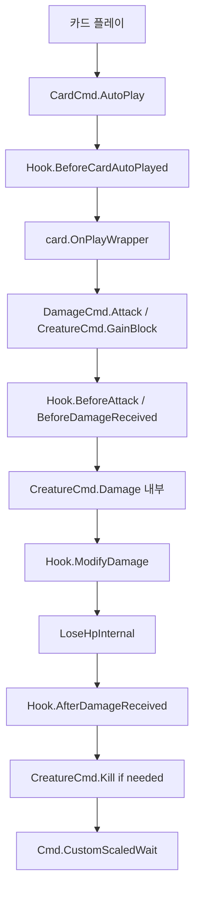

# 09. 커맨드 패턴 (Command Pattern)

#sts2 #godot #command #async #pattern

## 개요

STS2는 모든 게임 액션을 **정적 클래스 커맨드(Cmd.*)** 패턴으로 구현한다. 각 커맨드는 `async Task`를 반환하며, `FastMode` 설정에 따라 애니메이션/대기 시간을 자동으로 스케일한다. 커맨드는 직접 UI나 게임 상태를 변경하고, 훅을 호출하며, VFX/SFX를 트리거한다.



---

## Cmd — 기반 대기 유틸리티

`Cmd.cs`는 타이밍 시스템의 핵심이다. 단 두 개의 메서드만 가진 작은 클래스.

```csharp
public static class Cmd
{
    // FastMode에 따라 자동으로 대기 시간 조정
    public static async Task Wait(float seconds, bool ignoreCombatEnd = false)
    {
        if (!NonInteractiveMode.IsActive
            && !(seconds <= 0f)
            && SaveManager.Instance.PrefsSave.FastMode != FastModeType.Instant
            && (ignoreCombatEnd || !CombatManager.Instance.IsEnding))
        {
            SceneTree sceneTree = (SceneTree)Engine.GetMainLoop();
            SceneTreeTimer timer = sceneTree.CreateTimer(seconds);
            await WaitInternal(timer, cancelToken);
        }
    }

    // Normal/Fast/Instant 세 모드에 맞게 두 가지 시간 값 중 선택
    public static async Task CustomScaledWait(
        float fastSeconds, float standardSeconds,
        bool ignoreCombatEnd = false,
        CancellationToken cancellationToken = default)
    {
        switch (SaveManager.Instance.PrefsSave.FastMode)
        {
            case FastModeType.Fast:
                await Wait(fastSeconds, ...);
                break;
            case FastModeType.Normal:
                await Wait(standardSeconds, ...);
                break;
            case FastModeType.Instant:
                break;  // 즉시 반환, 대기 없음
        }
    }
}
```

### FastModeType 스케일링

| FastModeType | 동작 |
|---|---|
| `Normal` | `standardSeconds` 사용 (기본 게임 속도) |
| `Fast` | `fastSeconds` 사용 (절반 이하) |
| `Instant` | 대기 없음, 즉시 진행 |

모든 커맨드가 `Cmd.CustomScaledWait(0.1f, 0.2f)` 같은 방식으로 호출하므로, 플레이어가 설정 하나로 전체 게임 속도를 바꿀 수 있다.

---

## 커맨드 모듈 분류

| 파일 | 역할 |
|---|---|
| `Cmd.cs` | Wait / CustomScaledWait |
| `CardCmd.cs` | AutoPlay, Discard, Exhaust, Upgrade, Transform, Enchant, Afflict |
| `CardPileCmd.cs` | Draw, Add (파일 간 이동) |
| `CardSelectCmd.cs` | 카드 선택 UI |
| `CreatureCmd.cs` | Damage, Kill, GainBlock, Heal, Add (소환), Stun, TriggerAnim |
| `DamageCmd.cs` | AttackCommand 팩토리 (Attack 빌더 시작점) |
| `PowerCmd.cs` | 파워 부여/제거 |
| `PlayerCmd.cs` | 에너지, 턴 종료 |
| `OrbCmd.cs` | 오브 채널링/소환 |
| `RelicCmd.cs` | 유물 획득/제거 |
| `PotionCmd.cs` | 포션 사용/획득 |
| `RewardsCmd.cs` | 보상 화면 |
| `MapCmd.cs` | 맵 이동 |
| `SfxCmd.cs` | 사운드 재생 |
| `VfxCmd.cs` | 비주얼 이펙트 재생 |
| `TalkCmd.cs` | 대화/생각풍선 |
| `ThinkCmd.cs` | 몬스터 생각풍선 |
| `ForgeCmd.cs` | 단조 (카드 강화) |
| `OstyCmd.cs` | Osty(동반자) 전용 액션 |

---

## DamageCmd + AttackCommand — 공격 빌더 패턴

공격은 플루언트 빌더(fluent builder)로 구성한다.

```csharp
// DamageCmd.cs — 진입점 (팩토리)
public static class DamageCmd
{
    public static AttackCommand Attack(decimal damagePerHit)
        => new AttackCommand(damagePerHit);

    public static AttackCommand Attack(CalculatedDamageVar calculatedDamageVar)
        => new AttackCommand(calculatedDamageVar);
}
```

### AttackCommand 빌더 체인

```csharp
// 실제 카드에서의 사용 예시 (빌더 체인)
await DamageCmd
    .Attack(damage)           // 데미지 값 설정
    .FromCard(card)           // 공격자 = 카드 소유자, 애니메이션 설정
    .Targeting(target)        // 단일 타겟
    .WithHitFx("vfx/slash", "event:/sfx/hit")
    .Execute(choiceContext);

// 몬스터 공격 (전체 플레이어 대상)
await DamageCmd
    .Attack(15)
    .FromMonster(monster)         // TargetingAllOpponents 자동 호출
    .WithHitCount(3)              // 3회 타격
    .Execute(null);

// 랜덤 타겟팅
await DamageCmd
    .Attack(damage)
    .FromCard(card)
    .TargetingRandomOpponents(combatState, allowDuplicates: true)
    .WithHitCount(hitCount)
    .Execute(choiceContext);
```

### AttackCommand.Execute 핵심 흐름

```csharp
public async Task<AttackCommand> Execute(PlayerChoiceContext? choiceContext)
{
    if (Attacker.IsDead || CombatManager.Instance.IsOverOrEnding) return this;

    await Hook.BeforeAttack(combatState, this);  // 훅 호출

    decimal attackCount = Hook.ModifyAttackHitCount(combatState, this, _hitCount);

    for (int i = 0; (decimal)i < attackCount; i++)
    {
        if (Attacker.IsDead) break;

        // 1. 애니메이션
        if (_attackerAnimName != null && _shouldPlayAnimation)
            await CreatureCmd.TriggerAnim(Attacker, _attackerAnimName, _attackerAnimDelay);

        // 2. VFX/SFX
        if (HitSfx != null) SfxCmd.Play(HitSfx);
        if (HitVfx != null) VfxCmd.PlayOnCreatureCenter(singleTarget, HitVfx);

        // 3. 실제 데미지 적용
        AddResultsInternal(await CreatureCmd.Damage(
            choiceContext ?? new BlockingPlayerChoiceContext(),
            targets,
            _calculatedDamageVar?.Calculate(target) ?? _damagePerHit,
            DamageProps,
            Attacker,
            ModelSource as CardModel));
    }

    CombatManager.Instance.History.CreatureAttacked(combatState, Attacker, _results);
    await Hook.AfterAttack(combatState, this);  // 훅 호출
    return this;
}
```

---

## AttackContext — using 패턴

카드 하나가 여러 개별 공격을 묶어서 처리할 때 사용. `IAsyncDisposable`을 구현해서 `await using` 구문으로 자동 정리.

```csharp
public sealed class AttackContext : IAsyncDisposable
{
    public static async Task<AttackContext> CreateAsync(
        CombatState combatState, CardModel cardSource)
    {
        AttackContext context = new AttackContext(combatState, cardSource);
        await Hook.BeforeAttack(combatState, context._attackCommand);  // 시작 훅
        return context;
    }

    public void AddHit(IEnumerable<DamageResult> results)
    {
        _attackCommand.IncrementHitsInternal();
        _attackCommand.AddResultsInternal(results);
    }

    public async ValueTask DisposeAsync()
    {
        await Hook.AfterAttack(_combatState, _attackCommand);  // 종료 훅
    }
}

// 카드에서의 사용
await using AttackContext ctx = await AttackCommand.CreateContextAsync(combatState, card);
for (int i = 0; i < hitCount; i++)
{
    var results = await CreatureCmd.Damage(...);
    ctx.AddHit(results);
}
// DisposeAsync에서 AfterAttack 훅 자동 호출
```

---

## CreatureCmd.Damage — 데미지 전체 파이프라인

```csharp
public static async Task<IEnumerable<DamageResult>> Damage(
    PlayerChoiceContext choiceContext,
    IEnumerable<Creature> targets, decimal amount, ValueProp props,
    Creature? dealer, CardModel? cardSource)
{
    foreach (Creature originalTarget in targetList)
    {
        // 1. ModifyDamage — 모든 Additive/Multiplicative 수정자 적용
        decimal modifiedAmount = Hook.ModifyDamage(
            runState, combatState, originalTarget, dealer,
            amount, props, cardSource,
            ModifyDamageHookType.All, CardPreviewMode.None,
            out modifiers);

        await Hook.AfterModifyingDamageAmount(runState, combatState, cardSource, modifiers);
        await Hook.BeforeDamageReceived(choiceContext, runState, combatState,
            originalTarget, modifiedAmount, props, dealer, cardSource);

        // 2. 블록 처리
        decimal blockedDamage = creature.DamageBlockInternal(modifiedAmount, props);

        // 3. Osty 개입 (동반자가 일부 대신 받기)
        decimal unblockedDamage = Hook.ModifyHpLostBeforeOsty(...);
        Creature actualTarget = Hook.ModifyUnblockedDamageTarget(...);
        unblockedDamage = Hook.ModifyHpLostAfterOsty(...);

        // 4. HP 감소
        DamageResult result = actualTarget.LoseHpInternal(unblockedDamage, props);

        // 5. VFX — 데미지 숫자, 히트 스파크, 화면 흔들기
        NDamageNumVfx.Create(receiver, item);
        NHitSparkVfx.Create(receiver);
        NGame.Instance?.ScreenShake(strength, duration);

        // 6. 사후 훅
        await Hook.AfterDamageGiven(choiceContext, combatState, dealer, result, ...);
        await Hook.AfterDamageReceived(choiceContext, runState, combatState, ...);
    }

    // 7. 사망 처리
    await Kill(killedCreatures);
    await Cmd.CustomScaledWait(0.1f, 0.2f);
    return results;
}
```

---

## CreatureCmd.GainBlock — 블록 파이프라인

```csharp
public static async Task<decimal> GainBlock(
    Creature creature, decimal amount, ValueProp props,
    CardPlay? cardPlay, bool fast = false)
{
    await Hook.BeforeBlockGained(combatState, creature, amount, props, cardPlay?.Card);

    // Additive → Multiplicative 순서로 수정자 적용
    decimal modifiedAmount = Hook.ModifyBlock(
        combatState, creature, amount, props,
        cardPlay?.Card, cardPlay,
        out IEnumerable<AbstractModel> modifiers);

    modifiedAmount = Math.Max(modifiedAmount, 0m);
    await Hook.AfterModifyingBlockAmount(combatState, modifiedAmount, ...);

    if (modifiedAmount > 0m)
    {
        SfxCmd.Play("event:/sfx/block_gain");
        VfxCmd.PlayOnCreatureCenter(creature, "vfx/vfx_block");
        creature.GainBlockInternal(modifiedAmount);

        // fast 파라미터로 딜레이 조정
        await Cmd.CustomScaledWait(fast ? 0f : 0.1f, fast ? 0.03f : 0.25f);
    }

    await Hook.AfterBlockGained(combatState, creature, modifiedAmount, props, ...);
    return modifiedAmount;
}
```

---

## CardCmd.AutoPlay — 자동 플레이

타겟 선택, 훅 호출, 자원 소비를 처리하고 카드의 실제 효과(`OnPlayWrapper`)를 호출한다.

```csharp
public static async Task AutoPlay(
    PlayerChoiceContext choiceContext, CardModel card,
    Creature? target, AutoPlayType type = AutoPlayType.Default, ...)
{
    if (CombatManager.Instance.IsOverOrEnding) return;

    // 플레이 불가 검사
    if (card.Keywords.Contains(CardKeyword.Unplayable))
    {
        await MoveToResultPileWithoutPlaying(choiceContext, card);
        return;
    }
    if (!Hook.ShouldPlay(combatState, card, out AbstractModel preventer, type))
    {
        await MoveToResultPileWithoutPlaying(choiceContext, card);
        // 생각풍선 표시
        NCombatRoom.Instance?.CombatVfxContainer.AddChildSafely(
            NThoughtBubbleVfx.Create(playerDialogueLine, card.Owner.Creature, 1.0));
        return;
    }

    // X 코스트 캡처
    if (card.EnergyCost.CostsX && !skipXCapture)
        card.EnergyCost.CapturedXValue = playerCombatState.Energy;

    await Hook.BeforeCardAutoPlayed(combatState, card, target, type);

    // 실제 카드 효과 실행
    await card.OnPlayWrapper(choiceContext, target, isAutoPlay: true, resources, ...);
}
```

---

## Kill 파이프라인

```csharp
private static async Task KillWithoutCheckingWinCondition(Creature creature, bool force)
{
    await Hook.BeforeDeath(runState, combatState, creature);

    AbstractModel preventer = null;
    if (force || Hook.ShouldDie(runState, combatState, creature, out preventer))
    {
        creature.InvokeDiedEvent();

        // 사망 애니메이션
        float deathAnimLength = nCreature?.StartDeathAnim(...) ?? 0f;
        await Hook.AfterDeath(runState, combatState, creature,
            wasRemovalPrevented: false, deathAnimLength);

        // 파워 제거, 전투에서 제거
        creature.RemoveAllPowersAfterDeath();
        CombatManager.Instance.RemoveCreature(creature);

        // 보스 처치 시 부하 연쇄 사망
        if (creature.IsPrimaryEnemy && teammates.All(t => t.IsSecondaryEnemy))
            await Kill(teammates);
    }
    else
    {
        // ShouldDie가 false → 사망 방지 (토탈리 노트 어택 등)
        await Hook.AfterDeath(runState, combatState, creature,
            wasRemovalPrevented: true, 0f);
        await Hook.AfterPreventingDeath(runState, combatState, preventer, creature);
        if (creature.IsDead)
            await KillWithoutCheckingWinCondition(creature, force, recursion + 1);
    }
}
```

---

> [!note] ValueProp 플래그
> 데미지/블록 연산에 사용하는 비트플래그 열거형.
> - `ValueProp.Unblockable` — 블록을 무시
> - `ValueProp.Unpowered` — 파워 수정자 무시
> - `ValueProp.Move` — 몬스터 무브 액션임을 표시
> 훅의 `ModifyDamage`와 `ModifyBlock`이 이 플래그를 보고 수정 여부를 결정한다.

> [!note] BlockingPlayerChoiceContext vs HookPlayerChoiceContext
> - `BlockingPlayerChoiceContext` — 선택이 필요 없는 단순 컨텍스트
> - `HookPlayerChoiceContext` — 멀티플레이어에서 플레이어 선택을 기다릴 수 있는 컨텍스트
> 데미지 커맨드는 항상 외부에서 컨텍스트를 받지만, null이면 BlockingPlayerChoiceContext로 폴백한다.

---

## 좀슐랭에 적용한다면

| STS2 개념 | 좀슐랭 적용 |
|---|---|
| `Cmd.CustomScaledWait(fast, standard)` | 조리 속도 설정 — 빠른 모드에서 조리 애니메이션 단축 |
| `DamageCmd.Attack(...).FromCard(card)` | `AttackCmd.Chop(...).FromRecipe(recipe)` — 좀비에게 요리 재료로 공격 |
| `AttackContext` (using 패턴) | 콤보 요리 시스템 — 여러 재료를 하나의 공격으로 묶기 |
| `CreatureCmd.Kill` + `ShouldDie` 훅 | 좀비가 특정 조건에서 부활 (포식자 좀비) |
| `CardCmd.AutoPlay` | `RecipeCmd.AutoCook` — 자동 요리 발동 |
| `FastModeType` | 레스토랑 빠른 서비스 모드 (시간 단축) |

```csharp
// 좀슐랭 예시: 공격 커맨드
await AttackCmd
    .Chop(chopDamage)             // DamageCmd.Attack에 해당
    .FromRecipe(recipeCard)       // FromCard에 해당
    .Targeting(zombie)
    .WithIngredientFx("vfx/knife_slash", "sfx/chop")
    .WithCookingBonus(isWellDone: true)  // 커스텀 옵션
    .Execute(context);

// 좀슐랭 예시: 빠른/느린 조리 대기
await Cmd.CustomScaledWait(0.05f, 0.3f);  // 요리 딜레이
```
