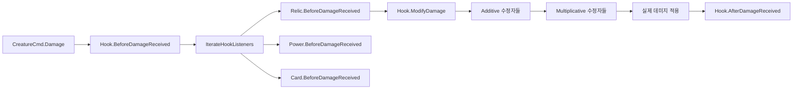
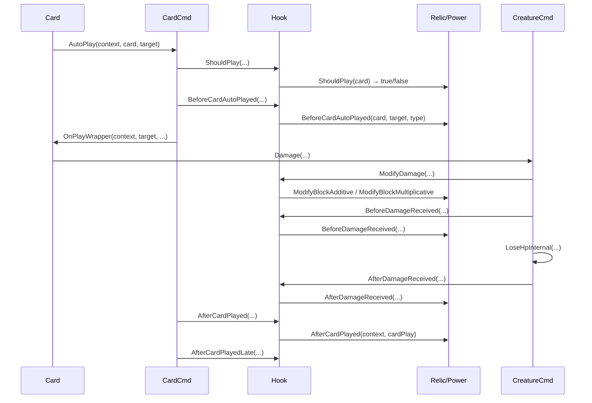

# 10. 훅/이벤트 시스템 (Hook & Event System)

#sts2 #godot #hook #observer #pattern

## 개요

STS2의 훅 시스템은 **정적 클래스 `Hook`** 에 200개 이상의 메서드를 모아놓은 중앙 집중형 옵저버 패턴이다. 카드, 유물, 파워 등 모든 `AbstractModel`이 훅 리스너가 될 수 있으며, 게임의 모든 사건(데미지, 카드 드로우, 턴 시작 등)에서 훅을 통해 효과를 발동한다.



---

## Hook 정적 클래스 구조

```csharp
// Hook.cs — 모든 훅의 진입점
public static class Hook
{
    // 이벤트 훅 (async Task 반환)
    public static async Task BeforeAttack(CombatState combatState, AttackCommand command)
    {
        foreach (AbstractModel model in combatState.IterateHookListeners())
        {
            await model.BeforeAttack(command);
            model.InvokeExecutionFinished();  // 멀티플레이어 동기화용
        }
    }

    // 값 수정 훅 (동기, decimal 반환)
    public static decimal ModifyDamage(IRunState runState, CombatState? combatState,
        Creature? target, Creature? dealer, decimal damage, ValueProp props,
        CardModel? cardSource, ModifyDamageHookType type, CardPreviewMode previewMode,
        out IEnumerable<AbstractModel> modifiers)
    { ... }

    // 판정 훅 (동기, bool 반환)
    public static bool ShouldDie(IRunState runState, CombatState? combatState,
        Creature creature, out AbstractModel? preventer)
    { ... }
}
```

---

## IterateHookListeners — 순회 순서

훅 리스너의 실행 순서는 `CombatState.IterateHookListeners()` / `IRunState.IterateHookListeners(combatState)`로 결정된다. 실제 순서는 **유물 → 파워 → 카드** 우선순위로 정렬되며, 같은 카테고리 안에서는 `EntrySortingId`로 결정론적 순서를 보장한다.

```csharp
// IRunState.IterateHookListeners(combatState?) 패턴
// 런 레벨 리스너 (유물 등) + 전투 레벨 리스너 (파워, 카드 등)

// 전투 전용
combatState.IterateHookListeners()

// 런 + 전투 통합
runState.IterateHookListeners(combatState)

// 런 전용 (전투 외부 — 맵, 이벤트 등)
runState.IterateHookListeners(null)
```

각 모델에서 `ShouldReceiveCombatHooks`가 `true`여야 전투 훅을 받는다.

```csharp
// MonsterModel
public override bool ShouldReceiveCombatHooks => true;

// EventModel
public override bool ShouldReceiveCombatHooks => false;  // 이벤트는 전투 훅 안 받음
```

---

## 훅 카테고리 분류

### 생명주기 훅

```csharp
// 전투
Hook.BeforeCombatStart(runState, combatState)
Hook.BeforeCombatStartLate(runState, combatState)   // Late 변형
Hook.AfterCombatEnd(runState, combatState, room)
Hook.AfterCombatVictoryEarly(runState, combatState, room)
Hook.AfterCombatVictory(runState, combatState, room)

// 턴
Hook.BeforeSideTurnStart(combatState, side)
Hook.AfterSideTurnStart(combatState, side)
Hook.AfterPlayerTurnStartEarly(combatState, context, player)
Hook.AfterPlayerTurnStart(combatState, context, player)
Hook.AfterPlayerTurnStartLate(combatState, context, player)
Hook.BeforeTurnEndVeryEarly(combatState, side)
Hook.BeforeTurnEndEarly(combatState, side)
Hook.BeforeTurnEnd(combatState, side)
Hook.AfterTurnEnd(combatState, side)
Hook.AfterTurnEndLate(combatState, side)

// 방
Hook.BeforeRoomEntered(runState, room)
Hook.AfterRoomEntered(runState, room)
Hook.AfterActEntered(runState)
```

### 카드 훅

```csharp
Hook.BeforeCardPlayed(combatState, cardPlay)
Hook.AfterCardPlayed(combatState, context, cardPlay)
Hook.AfterCardPlayedLate(combatState, context, cardPlay)
Hook.BeforeCardAutoPlayed(combatState, card, target, type)
Hook.AfterCardDrawnEarly(combatState, context, card, fromHandDraw)
Hook.AfterCardDrawn(combatState, context, card, fromHandDraw)
Hook.AfterCardDiscarded(combatState, context, card)
Hook.AfterCardExhausted(combatState, context, card, causedByEthereal)
Hook.AfterCardRetained(combatState, card)
Hook.AfterCardChangedPiles(runState, combatState, card, oldPile, source)
Hook.AfterCardChangedPilesLate(...)
Hook.AfterCardEnteredCombat(combatState, card)
Hook.AfterCardGeneratedForCombat(combatState, card, addedByPlayer)
Hook.BeforeCardRemoved(runState, card)
Hook.AfterHandEmptied(combatState, context, player)
Hook.BeforeHandDraw(combatState, player, context)
Hook.BeforeHandDrawLate(...)
Hook.BeforeFlush(combatState, player)
Hook.BeforeFlushLate(...)
```

### 데미지/방어 훅

```csharp
// 공격
Hook.BeforeAttack(combatState, attackCommand)
Hook.AfterAttack(combatState, attackCommand)

// 데미지
Hook.BeforeDamageReceived(context, runState, combatState, target, amount, props, dealer, cardSource)
Hook.AfterDamageReceived(context, runState, combatState, target, result, props, dealer, cardSource)
Hook.AfterDamageReceivedLate(...)
Hook.AfterDamageGiven(context, combatState, dealer, results, props, target, cardSource)

// 블록
Hook.BeforeBlockGained(combatState, creature, amount, props, cardSource)
Hook.AfterBlockGained(combatState, creature, amount, props, cardSource)
Hook.AfterBlockBroken(combatState, creature)
Hook.AfterBlockCleared(combatState, creature)

// 사망
Hook.BeforeDeath(runState, combatState, creature)
Hook.AfterDeath(runState, combatState, creature, wasRemovalPrevented, deathAnimLength)
Hook.AfterPreventingDeath(runState, combatState, preventer, creature)
Hook.AfterDiedToDoom(combatState, creatures)
```

### 파워 훅

```csharp
Hook.BeforePowerAmountChanged(combatState, power, amount, target, applier, cardSource)
Hook.AfterPowerAmountChanged(combatState, power, amount, applier, cardSource)
```

### 보상/맵 훅

```csharp
Hook.BeforeRewardsOffered(runState, player, rewards)
Hook.AfterRewardTaken(runState, player, reward)
Hook.AfterMapGenerated(runState, map, actIndex)
Hook.AfterItemPurchased(runState, player, item, goldSpent)
Hook.AfterGoldGained(runState, player)
Hook.AfterRestSiteHeal(runState, player, isMimicked)
Hook.AfterRestSiteSmith(runState, player)
```

### 오브/에너지/별 훅

```csharp
Hook.AfterOrbChanneled(combatState, context, player, orb)
Hook.AfterOrbEvoked(context, combatState, orb, targets)
Hook.AfterEnergyReset(combatState, player)
Hook.AfterEnergyResetLate(combatState, player)
Hook.AfterEnergySpent(combatState, card, amount)
Hook.AfterStarsGained(combatState, amount, gainer)
Hook.AfterStarsSpent(combatState, amount, spender)
Hook.AfterSummon(combatState, context, summoner, amount)
Hook.AfterForge(combatState, amount, forger, source)
```

---

## Modify* 패턴 — 값 수정 훅

수정자 훅은 항상 **Additive → Multiplicative** 두 패스로 실행된다. 각 패스에서 수정을 가한 모델을 `modifiers` 리스트에 수집하고, 나중에 `AfterModifying*` 훅으로 알린다.

### ModifyDamage

```csharp
public static decimal ModifyDamage(IRunState runState, CombatState? combatState,
    Creature? target, Creature? dealer, decimal damage, ValueProp props, ...)
{
    decimal num = damage;

    // 0. 인챈트먼트 먼저
    if (cardSource?.Enchantment != null)
    {
        num += cardSource.Enchantment.EnchantDamageAdditive(num, props);
        num *= cardSource.Enchantment.EnchantDamageMultiplicative(num, props);
    }

    // 1. Additive 패스
    // 2. Multiplicative 패스
    // → ModifyDamageInternal 에서 처리
    num = ModifyDamageInternal(runState, combatState, target, dealer, num, props, ...);

    return Math.Max(0m, num);
}
```

### ModifyBlock

```csharp
public static decimal ModifyBlock(CombatState combatState, Creature target,
    decimal block, ValueProp props, CardModel? cardSource, CardPlay? cardPlay,
    out IEnumerable<AbstractModel> modifiers)
{
    List<AbstractModel> list = new List<AbstractModel>();
    decimal num = block;

    // 인챈트먼트 우선
    if (cardSource?.Enchantment != null)
    {
        num += cardSource.Enchantment.EnchantBlockAdditive(num, props);
        num *= cardSource.Enchantment.EnchantBlockMultiplicative(num, props);
    }

    // Additive 패스 — 각 리스너가 얼마나 더할지 반환
    foreach (AbstractModel item in combatState.IterateHookListeners())
    {
        decimal delta = item.ModifyBlockAdditive(target, num, props, cardSource, cardPlay);
        num += delta;
        if (delta != 0m) list.Add(item);
    }

    // Multiplicative 패스 — 곱셈 배율 반환 (1.0 = 변화 없음)
    foreach (AbstractModel item2 in combatState.IterateHookListeners())
    {
        decimal factor = item2.ModifyBlockMultiplicative(target, num, props, cardSource, cardPlay);
        num *= factor;
        if (factor != 1m) list.Add(item2);
    }

    modifiers = list;
    return Math.Max(0m, num);
}
```

### 기타 Modify* 훅들

```csharp
Hook.ModifyMaxEnergy(combatState, player, amount)
Hook.ModifyHandDraw(combatState, player, originalCardCount, out modifiers)
Hook.ModifyHandDrawLate(...)
Hook.ModifyHealAmount(runState, combatState, creature, amount)
Hook.ModifyHpLostBeforeOsty(runState, combatState, target, amount, props, dealer, ...)
Hook.ModifyHpLostAfterOsty(runState, combatState, target, amount, ...)
Hook.ModifyAttackHitCount(combatState, attackCommand, originalHitCount)
Hook.ModifyPowerAmountGiven(combatState, power, giver, amount, target, cardSource, ...)
Hook.ModifyPowerAmountReceived(combatState, canonicalPower, target, amount, giver, ...)
Hook.ModifySummonAmount(combatState, summoner, amount, source)
Hook.ModifyOrbValue(combatState, player, amount)
Hook.ModifyMerchantPrice(runState, player, entry, result)
Hook.ModifyCardPlayCount(combatState, card, playCount, target, out modifiers)
Hook.ModifyEnergyCostInCombat(combatState, card, originalCost)
Hook.ModifyStarCost(combatState, card, originalCost)
Hook.ModifyXValue(combatState, card, originalValue)
```

---

## Should* 패턴 — 판정 훅

하나라도 `false` 반환하면 전체가 막힌다 (AND 논리). `preventer`로 누가 막았는지 알 수 있다.

```csharp
// 사망 판정 — 연명 아이템 등이 false 반환 가능
public static bool ShouldDie(IRunState runState, CombatState? combatState,
    Creature creature, out AbstractModel? preventer)
{
    foreach (AbstractModel item in runState.IterateHookListeners(combatState))
    {
        if (!item.ShouldDie(creature))
        {
            preventer = item;
            return false;   // 사망 방지
        }
    }
    // Late 패스도 있음
    foreach (AbstractModel item2 in runState.IterateHookListeners(combatState))
    {
        if (!item2.ShouldDieLate(creature))
        {
            preventer = item2;
            return false;
        }
    }
    preventer = null;
    return true;
}

// 히트 가능 여부 — 무적 파워 등
public static bool ShouldAllowHitting(CombatState combatState, Creature creature)
{
    foreach (AbstractModel item in combatState.IterateHookListeners())
    {
        if (!item.ShouldAllowHitting(creature)) return false;
    }
    return true;
}

// 블록 유지 여부 (턴 시작 시 블록 초기화 방지)
public static bool ShouldClearBlock(CombatState combatState, Creature creature,
    out AbstractModel? preventer)
{
    foreach (AbstractModel item in combatState.IterateHookListeners())
    {
        if (!item.ShouldClearBlock(creature))
        {
            preventer = item;
            return false;  // 블록 유지
        }
    }
    preventer = null;
    return true;
}
```

### 주요 Should* 목록

```csharp
Hook.ShouldDie(runState, combatState, creature, out preventer)
Hook.ShouldDieLate(...)
Hook.ShouldAllowHitting(combatState, creature)
Hook.ShouldAllowTargeting(combatState, target, out preventer)
Hook.ShouldClearBlock(combatState, creature, out preventer)
Hook.ShouldCreatureBeRemovedFromCombatAfterDeath(combatState, creature)
Hook.ShouldAfflict(combatState, card, affliction)
Hook.ShouldPowerBeRemovedOnDeath(power)
Hook.ShouldAddToDeck(runState, card, out preventer)
Hook.ShouldPlay(combatState, card, out preventer, type)
Hook.ShouldAllowMerchantCardRemoval(runState, player)
Hook.ShouldAllowSelectingMoreCardRewards(runState, player, reward)
Hook.ShouldDisableRemainingRestSiteOptions(runState, player)
Hook.ShouldAllowAncient(runState, player, ancient)
Hook.ShouldPayExcessEnergyCostWithStars(combatState, player)
```

---

## 훅 실행 흐름 예시 — 카드 플레이



---

## AbstractModel의 가상 메서드들

모든 훅 메서드는 `AbstractModel`에 빈 기본 구현이 있고, 각 모델이 필요한 것만 오버라이드한다.

```csharp
// AbstractModel — 모든 훅 메서드의 기본 구현 (아무것도 하지 않음)
public abstract class AbstractModel
{
    // 이벤트 훅 — 기본: Task.CompletedTask
    public virtual Task BeforeAttack(AttackCommand command) => Task.CompletedTask;
    public virtual Task AfterAttack(AttackCommand command) => Task.CompletedTask;
    public virtual Task AfterDamageReceived(...) => Task.CompletedTask;
    public virtual Task AfterCardPlayed(...) => Task.CompletedTask;
    // ... 200+ 메서드

    // Additive 수정자 — 기본: 0 (변화 없음)
    public virtual decimal ModifyBlockAdditive(...) => 0m;
    public virtual decimal ModifyDamageAdditive(...) => 0m;
    public virtual decimal ModifyHandDraw(Player player, decimal originalCardCount)
        => originalCardCount;

    // Multiplicative 수정자 — 기본: 1.0 (변화 없음)
    public virtual decimal ModifyBlockMultiplicative(...) => 1m;
    public virtual decimal ModifyDamageMultiplicative(...) => 1m;

    // Should 판정 — 기본: true (허용)
    public virtual bool ShouldDie(Creature creature) => true;
    public virtual bool ShouldAllowHitting(Creature creature) => true;
    public virtual bool ShouldClearBlock(Creature creature) => true;
    public virtual bool ShouldPlay(CardModel card, ...) => true;
}
```

---

## Late / Early / VeryEarly 변형 패턴

많은 훅이 여러 타이밍 변형을 가진다. 순서는 `Early → (기본) → Late`.

```csharp
// 예: 턴 종료 훅 (3단계)
Hook.BeforeTurnEndVeryEarly(combatState, side)  // 1st
Hook.BeforeTurnEndEarly(combatState, side)       // 2nd
Hook.BeforeTurnEnd(combatState, side)            // 3rd (기본)

// 예: 플레이어 턴 시작
Hook.AfterPlayerTurnStartEarly(...)  // 1st
Hook.AfterPlayerTurnStart(...)       // 2nd
Hook.AfterPlayerTurnStartLate(...)   // 3rd

// 예: 카드 플레이 후
Hook.AfterCardPlayed(...)            // 1st
Hook.AfterCardPlayedLate(...)        // 2nd

// 예: 데미지 수신 후
Hook.AfterDamageReceived(...)        // 1st
Hook.AfterDamageReceivedLate(...)    // 2nd
```

---

## PlayerChoiceContext — 선택 컨텍스트

일부 훅은 멀티플레이어에서 플레이어 선택을 기다려야 한다. `choiceContext.PushModel` / `PopModel`로 현재 어떤 모델이 실행 중인지 추적한다.

```csharp
// 선택이 필요한 훅의 패턴
public static async Task AfterCardDiscarded(CombatState combatState,
    PlayerChoiceContext choiceContext, CardModel card)
{
    foreach (AbstractModel model in combatState.IterateHookListeners())
    {
        choiceContext.PushModel(model);    // "이 모델이 선택을 요청할 수 있음"
        await model.AfterCardDiscarded(choiceContext, card);
        model.InvokeExecutionFinished();
        choiceContext.PopModel(model);     // 선택 완료
    }
}
```

---

> [!note] InvokeExecutionFinished
> 각 훅 호출 후 `model.InvokeExecutionFinished()`를 반드시 호출한다.
> 이는 멀티플레이어 동기화 시스템(`CombatManager.StateTracker`)에 "이 모델의 실행이 끝났음"을 알리는 신호다. 단일 플레이어에서도 동일하게 호출되어 일관성을 유지한다.

---

## 좀슐랭에 적용한다면

| STS2 개념 | 좀슐랭 적용 |
|---|---|
| `Hook` 정적 클래스 | `GameHook` — 모든 게임 이벤트의 중앙 훅 |
| `IterateHookListeners` | 장비, 버프, 레시피 모두 리스너로 등록 |
| `ModifyDamage` Additive/Multiplicative | `ModifyCookingPower` — 재료 추가(+) 및 조리 기술(×) |
| `ShouldDie` | `ShouldBeEaten` — 요리된 좀비가 먹힐 수 있는지 판정 |
| `ShouldClearBlock` | `ShouldSpoilFood` — 턴 시작 시 음식 상태 초기화 여부 |
| `AfterCardDrawn` | `AfterIngredientPicked` — 재료 선택 시 발동 효과 |
| Late / Early 변형 | 요리 단계별 훅 — BeforeCook / AfterCook / AfterServe |

```csharp
// 좀슐랭 훅 예시
public static class GameHook
{
    public static async Task AfterIngredientPicked(KitchenState state,
        IngredientModel ingredient)
    {
        foreach (AbstractModel model in state.IterateHookListeners())
        {
            await model.AfterIngredientPicked(ingredient);
            model.InvokeExecutionFinished();
        }
    }

    public static decimal ModifyCookingPowerAdditive(KitchenState state,
        ZombieCreature target, decimal power, RecipeCard? source)
    {
        decimal result = power;
        foreach (AbstractModel model in state.IterateHookListeners())
            result += model.ModifyCookingPowerAdditive(target, result, source);
        return result;
    }

    public static bool ShouldBeEaten(ZombieCreature zombie, out AbstractModel? preventer)
    {
        // 독 좀비 등 특수 조건으로 먹기 불가 처리
        foreach (AbstractModel model in ...)
        {
            if (!model.ShouldBeEaten(zombie)) { preventer = model; return false; }
        }
        preventer = null;
        return true;
    }
}
```
