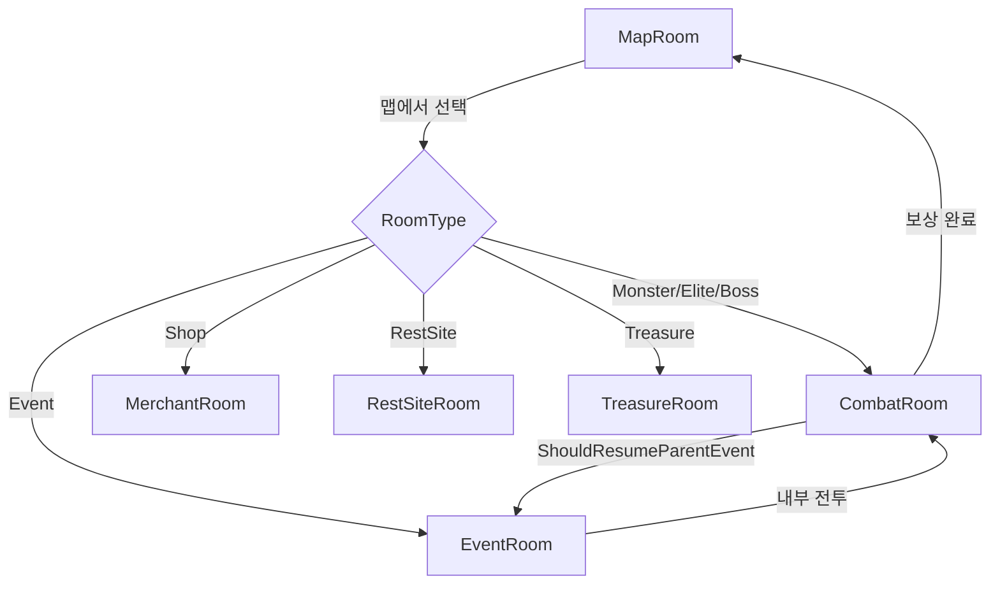
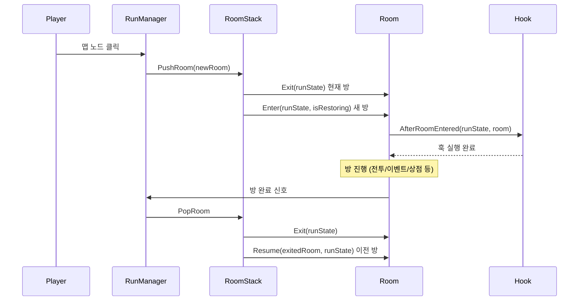
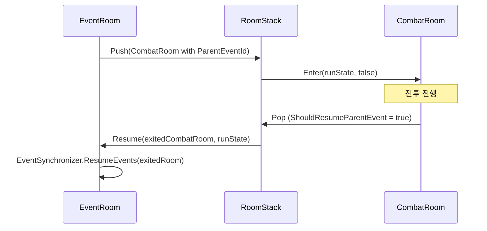

# 11. 방/게임 흐름 (Room & Game Flow)

#sts2 #godot #room #gameflow #statemachine

## 개요

STS2의 게임 흐름은 **AbstractRoom 베이스 클래스** + **방 스택(Room Stack)** 구조로 관리된다. 각 방은 `Enter → (진행) → Exit` 수명주기를 가지며, 이벤트 방이 전투를 내부에 중첩(push)할 수 있는 스택 구조를 지원한다.



---

## AbstractRoom — 베이스 클래스

```csharp
public abstract class AbstractRoom
{
    // 방 타입 식별
    public abstract RoomType RoomType { get; }
    public abstract ModelId? ModelId { get; }

    // IsPreFinished: 이미 완료된 방을 복원할 때 (세이브 로드 등)
    public virtual bool IsPreFinished => false;

    // 승리 방 여부 (TheArchitect 이벤트 = 런 클리어)
    public bool IsVictoryRoom
    {
        get
        {
            if (this is EventRoom eventRoom)
                return eventRoom.CanonicalEvent is TheArchitect;
            return false;
        }
    }

    // 세 가지 수명주기 메서드
    public abstract Task Enter(IRunState? runState, bool isRestoringRoomStackBase);
    public abstract Task Exit(IRunState? runState);
    public abstract Task Resume(AbstractRoom exitedRoom, IRunState? runState);

    // 직렬화 (세이브/로드)
    public virtual SerializableRoom ToSerializable() { ... }
    public static AbstractRoom? FromSerializable(SerializableRoom? s, IRunState? r) { ... }
}
```

### RoomType 열거형

```csharp
public enum RoomType
{
    Unassigned,
    Monster,    // 일반 전투
    Elite,      // 엘리트 전투
    Boss,       // 보스 전투
    Treasure,   // 보물 방
    Shop,       // 상인 (MerchantRoom)
    Event,      // 이벤트
    RestSite,   // 휴식처
    Map         // 맵 화면
}
```

---

## CombatRoom — 전투 방

```csharp
public class CombatRoom : AbstractRoom, ICombatRoomVisuals
{
    public override RoomType RoomType => Encounter.RoomType;  // Monster/Elite/Boss
    public CombatState CombatState { get; }
    public EncounterModel Encounter => CombatState.Encounter;

    // 이벤트에서 발생한 전투인지
    public bool ShouldResumeParentEventAfterCombat { get; init; } = true;
    public ModelId? ParentEventId { get; init; }

    // 탈출한 몬스터 비율로 골드 보상 계산
    public float GoldProportion { get; private set; } = 1f;
}
```

### Enter 흐름

```csharp
public override async Task Enter(IRunState? runState, bool isRestoringRoomStackBase)
{
    // 세이브 로드 시 재구성 불가 (CombatRoom은 스택 베이스 복원 안 함)
    if (isRestoringRoomStackBase)
        throw new InvalidOperationException("...");

    // 플레이어들을 CombatState에 추가
    if (CombatState.Players.Count == 0)
        foreach (Player item in runState?.Players ?? Array.Empty<Player>())
            CombatState.AddPlayer(item);

    if (IsPreFinished)
        await StartPreFinishedCombat();  // 이미 끝난 전투 (보상만 남음)
    else
        await StartCombat(runState);
}

private async Task StartCombat(IRunState? runState)
{
    // 1. 몬스터 생성
    if (!Encounter.HaveMonstersBeenGenerated)
        Encounter.GenerateMonstersWithSlots(CombatState.RunState);

    // 2. 에셋 프리로드
    await PreloadManager.LoadRoomCombatAssets(Encounter, runState ?? NullRunState.Instance);

    // 3. Creature 인스턴스 생성 + CombatState에 추가
    foreach (var (monsterModel, slot) in Encounter.MonstersWithSlots)
    {
        Creature creature = CombatState.CreateCreature(monsterModel, CombatSide.Enemy, slot);
        CombatState.AddCreature(creature);
    }

    // 4. 전투 씬 노드 생성
    NRun.Instance?.SetCurrentRoom(NCombatRoom.Create(this, CombatRoomMode.ActiveCombat));

    // 5. CombatManager 초기화
    CombatManager.Instance.SetUpCombat(CombatState);

    // 6. 훅 발동
    await Hook.AfterRoomEntered(runState, this);
    CombatManager.Instance.AfterCombatRoomLoaded();
}
```

### Exit 흐름

```csharp
public override Task Exit(IRunState? runState)
{
    CombatManager.Instance.Reset(graceful: true);
    if (IsPreFinished)
    {
        // PreFinished 상태의 플레이어 Creature 정리
        foreach (Creature item in CombatState.PlayerCreatures.ToList())
            CombatState.RemoveCreature(item);
    }
    return Task.CompletedTask;
}
```

### 탈출 몬스터 비율 계산

```csharp
public void OnCombatEnded()
{
    // 탈출한 몬스터 수만큼 골드 감소
    GoldProportion = 1f
        - (float)CombatState.EscapedCreatures.Count
        / (float)Encounter.MonstersWithSlots.Count;
}
```

---

## EventRoom — 이벤트 방

이벤트 방은 **EventModel** + **EventSynchronizer**로 멀티플레이어 동기화를 처리한다.

```csharp
public class EventRoom : AbstractRoom
{
    public override RoomType RoomType => RoomType.Event;
    public EventModel CanonicalEvent { get; }  // 읽기전용 원본

    // 로컬 플레이어용 뮤터블 복사본
    public EventModel LocalMutableEvent
        => RunManager.Instance.EventSynchronizer.GetLocalEvent();

    public Action<EventModel>? OnStart { private get; init; }  // 진입 직후 콜백
}
```

### Enter 흐름

```csharp
public override async Task Enter(IRunState? runState, bool isRestoringRoomStackBase)
{
    // 1. 에셋 로드
    await PreloadManager.LoadRoomEventAssets(CanonicalEvent, runState ?? NullRunState.Instance);

    // 2. EventSynchronizer 시작 (멀티플레이어 동기화)
    RunManager.Instance.EventSynchronizer.BeginEvent(CanonicalEvent, IsPreFinished, OnStart);

    // 3. 상태 변화 리스너 등록
    foreach (EventModel @event in RunManager.Instance.EventSynchronizer.Events)
    {
        @event.StateChanged += OnEventStateChanged;
        if (@event.IsFinished && !IsPreFinished)
            OnEventStateChanged(@event);
    }

    // 4. 전투 레이아웃이면 내부 CombatState 생성
    EventModel localEvent = RunManager.Instance.EventSynchronizer.GetLocalEvent();
    if (localEvent.LayoutType == EventLayoutType.Combat)
        localEvent.GenerateInternalCombatState(runState ?? NullRunState.Instance);

    // 5. 씬 노드 생성
    NEventRoom currentRoom = NEventRoom.Create(localEvent, runState, _isPreFinished);
    NRun.Instance?.SetCurrentRoom(currentRoom);

    // 6. 훅 + 이벤트 시작 콜백
    await Hook.AfterRoomEntered(runState, this);
    await localEvent.AfterEventStarted();
}
```

### Resume — 전투 후 이벤트 복귀

```csharp
public override Task Resume(AbstractRoom exitedRoom, IRunState? runState)
{
    // 이벤트에서 발생한 전투가 끝난 뒤 이벤트로 돌아옴
    RunManager.Instance.EventSynchronizer.ResumeEvents(exitedRoom);
    EventModel localEvent = RunManager.Instance.EventSynchronizer.GetLocalEvent();
    NRun.Instance?.SetCurrentRoom(NEventRoom.Create(localEvent, runState, _isPreFinished));
    return Task.CompletedTask;
}
```

### Exit 흐름

```csharp
public override Task Exit(IRunState? runState)
{
    if (CanonicalEvent.IsDeterministic)
        RunManager.Instance.ChecksumTracker.GenerateChecksum($"Exiting event {CanonicalEvent.Id}", null);

    foreach (EventModel @event in RunManager.Instance.EventSynchronizer.Events)
    {
        @event.StateChanged -= OnEventStateChanged;
        @event.EnsureCleanup();
    }
    return Task.CompletedTask;
}
```

### PreFinished 상태 전환

```csharp
// AncientEventModel(멀티플레이어 이벤트)이 모두 끝나면 PreFinished로 전환
private void OnEventStateChanged(EventModel eventModel)
{
    if (!(eventModel is AncientEventModel)) return;

    foreach (EventModel @event in RunManager.Instance.EventSynchronizer.Events)
        if (!@event.IsFinished) return;  // 하나라도 미완료면 중단

    MarkPreFinished();
    TaskHelper.RunSafely(SaveManager.Instance.SaveRun(this));
}
```

---

## EventModel — 이벤트 데이터

```csharp
public abstract class EventModel : AbstractModel
{
    public override bool ShouldReceiveCombatHooks => false;  // 전투 훅 수신 안 함

    public LocString Title => L10NLookup(Id.Entry + ".title");
    public virtual LocString InitialDescription => L10NLookup(Id.Entry + ".pages.INITIAL.description");

    public Player? Owner { get; private set; }      // 이 이벤트를 "소유"한 플레이어
    public virtual bool IsShared => false;          // 멀티플레이어 공유 이벤트 여부
    public bool IsFinished { get; private set; }

    public IReadOnlyList<EventOption> CurrentOptions { get; }  // 현재 선택지들
    public DynamicVarSet DynamicVars { get; }                  // 동적 텍스트 변수

    // 전투 레이아웃인 이벤트는 내부에 CombatState를 가짐
    public virtual EncounterModel? CanonicalEncounter => null;
    protected CombatState? _combatStateForCombatLayout;

    // 이벤트 시작 후 발동
    public virtual Task AfterEventStarted() => Task.CompletedTask;
}
```

---

## MerchantRoom — 상인 방

```csharp
public class MerchantRoom : AbstractRoom
{
    public override RoomType RoomType => RoomType.Shop;
    public MerchantInventory Inventory { get; private set; }

    public override async Task Enter(IRunState? runState, bool isRestoringRoomStackBase)
    {
        // 재고 생성 (로컬 플레이어 기준)
        Inventory = MerchantInventory.CreateForNormalMerchant(LocalContext.GetMe(runState));
        await PreloadManager.LoadRoomMerchantAssets();
        NRun.Instance?.SetCurrentRoom(NMerchantRoom.Create(this, runState?.Players ?? ...));
        await Hook.AfterRoomEntered(runState, this);
    }

    public override Task Exit(IRunState? runState)
    {
        // 재고에 남은 아이템을 히스토리에 기록 (어떤 걸 사지 않았는지)
        foreach (MerchantCardEntry entry in Inventory.CharacterCardEntries)
            if (entry.IsStocked)
                playerMapPointHistoryEntry.CardChoices.Add(
                    new CardChoiceHistoryEntry(entry.CreationResult.Card, wasPicked: false));
        // ... 유물/포션도 동일
        return Task.CompletedTask;
    }

    // Resume은 NotImplementedException — 상인방은 스택 복귀 없음
}
```

---

## RestSiteRoom — 휴식처

```csharp
public class RestSiteRoom : AbstractRoom
{
    public override RoomType RoomType => RoomType.RestSite;
    public IReadOnlyList<RestSiteOption> Options
        => _synchronizer?.GetLocalOptions() ?? Array.Empty<RestSiteOption>();

    public override async Task Enter(IRunState? runState, bool isRestoringRoomStackBase)
    {
        _synchronizer = RunManager.Instance.RestSiteSynchronizer;
        _synchronizer.BeginRestSite();  // 멀티플레이어 동기화 시작
        await PreloadManager.LoadRoomRestSite(runState.Act, Options);
        ShowRoomNode(runState);
        await Hook.AfterRoomEntered(runState, this);
    }

    public override Task Exit(IRunState? runState)
    {
        // 체크섬 생성 (결정론적 상태 검증)
        RunManager.Instance.ChecksumTracker.GenerateChecksum("Exiting rest site room", null);
        return Task.CompletedTask;
    }

    // Resume 지원 — 상인방과 달리 복귀 가능
    public override Task Resume(AbstractRoom _, IRunState? runState)
    {
        ShowRoomNode(runState);
        return Task.CompletedTask;
    }
}
```

---

## TreasureRoom — 보물 방

```csharp
public class TreasureRoom : AbstractRoom
{
    public override RoomType RoomType => RoomType.Treasure;

    public override async Task Enter(IRunState? runState, bool isRestoringRoomStackBase)
    {
        _player = LocalContext.GetMe(runState);
        await PreloadManager.LoadRoomTreasureAssets(runState.Act);
        NRun.Instance?.SetCurrentRoom(NTreasureRoom.Create(this, runState));
        await Hook.AfterRoomEntered(runState, this);
        RunManager.Instance.TreasureRoomRelicSynchronizer.BeginRelicPicking();
    }

    // 정상 보물 보상 처리
    public Task<int> DoNormalRewards()
        => RunManager.Instance.OneOffSynchronizer.DoLocalTreasureRoomRewards();

    // 유물 이후 추가 보상
    public Task DoExtraRewardsIfNeeded()
        => RewardsCmd.OfferForRoomEnd(_player, this);
}
```

---

## MapRoom — 맵 화면

```csharp
public class MapRoom : AbstractRoom
{
    public override RoomType RoomType => RoomType.Map;

    public override Task Enter(IRunState? runState, bool isRestoringRoomStackBase)
    {
        NMapRoom currentRoom = NMapRoom.Create(
            runState?.Act ?? ModelDb.Act<Overgrowth>(),
            runState?.CurrentActIndex ?? 0);
        NRun.Instance.SetCurrentRoom(currentRoom);
        return Task.CompletedTask;  // 훅 없음 — 맵은 단순 화면 전환
    }
}
```

---

## 방 전환 전체 흐름



---

## 이벤트 → 전투 중첩 흐름

이벤트 방이 내부 전투를 발생시킬 때, 방 스택에 CombatRoom이 **push**된다.



```csharp
// CombatRoom 생성 시 부모 이벤트 지정
new CombatRoom(encounter, runState)
{
    ShouldResumeParentEventAfterCombat = true,  // 기본 true
    ParentEventId = parentEvent.Id
};
```

---

## 방 직렬화 패턴 (세이브/로드)

```csharp
// AbstractRoom.FromSerializable — 타입에 따라 복원
public static AbstractRoom? FromSerializable(SerializableRoom? s, IRunState? runState)
{
    switch (s.RoomType)
    {
        case RoomType.Monster:
        case RoomType.Elite:
        case RoomType.Boss:
            return CombatRoom.FromSerializable(s, runState);
        case RoomType.Event:
            return new EventRoom(s);
        default:
            throw new ArgumentOutOfRangeException();
    }
    // RestSite, Treasure, Shop, Map은 세이브에 저장하지 않음
    // (재진입 불가 또는 단순 화면이므로)
}
```

> [!note] isRestoringRoomStackBase 파라미터
> 세이브 파일에서 방 스택을 복원할 때 `true`로 전달된다.
> `CombatRoom`, `MerchantRoom`, `TreasureRoom`, `RestSiteRoom`은 스택 복원을 지원하지 않아 예외를 던진다.
> `EventRoom`만 `isRestoringRoomStackBase = true`를 처리할 수 있다.

---

## 방 타입별 특징 비교

| 방 타입 | Resume 지원 | 직렬화 | 훅 호출 | 특이사항 |
|---------|------------|--------|---------|---------|
| CombatRoom | 미지원 | 지원 | AfterRoomEntered | PreFinished 상태 있음 |
| EventRoom | 지원 | 지원 | AfterRoomEntered | 전투 중첩 가능, EventSynchronizer |
| MerchantRoom | 미지원 | 미지원 | AfterRoomEntered | 재고는 Enter 시 생성 |
| RestSiteRoom | 지원 | 미지원 | AfterRoomEntered | ChecksumTracker 사용 |
| TreasureRoom | 미지원 | 미지원 | AfterRoomEntered | TreasureRoomRelicSynchronizer |
| MapRoom | 미지원 | 미지원 | 없음 | 단순 화면 전환 |

---

## 좀슐랭에 적용한다면

| STS2 개념 | 좀슐랭 적용 |
|---|---|
| `AbstractRoom` | `AbstractLocation` — 요리 구역, 사냥 구역 등 |
| `CombatRoom` | `HuntingZone` — 좀비 사냥 구역 |
| `EventRoom` | `NarrativeEvent` — 생존자 조우, 이벤트 스토리 |
| `MerchantRoom` | `BlackMarket` — 물물 교환소 |
| `RestSiteRoom` | `SafeHouse` — 회복, 레시피 강화 |
| `TreasureRoom` | `AbandonedKitchen` — 식재료 창고 탐색 |
| `MapRoom` | `OverworldMap` — 구역 이동 선택 |
| `EventRoom.Resume` | 좀비 요새 공략 중 이벤트 발생 후 복귀 |
| `ShouldResumeParentEvent` | 이벤트 중 발생한 전투 후 이야기 계속 |

```csharp
// 좀슐랭 예시 구조
public abstract class AbstractLocation
{
    public abstract LocationType LocationType { get; }
    public abstract Task Enter(IRunState? runState, bool isRestoringBase);
    public abstract Task Exit(IRunState? runState);
    public abstract Task Resume(AbstractLocation exitedLocation, IRunState? runState);
}

public class HuntingZone : AbstractLocation
{
    public override LocationType LocationType => LocationType.Hunt;
    public ZombieEncounterModel Encounter { get; }

    public override async Task Enter(IRunState? runState, bool isRestoringBase)
    {
        Encounter.GenerateZombiesWithPositions(runState);
        await PreloadManager.LoadZombieAssets(Encounter, runState);
        // 전투 씬 생성
        GameManager.Instance.SetCurrentLocation(NHuntingZone.Create(this));
        await GameHook.AfterLocationEntered(runState, this);
        GameManager.Instance.StartHunt(CombatState);
    }
}

public enum LocationType
{
    Map, Hunt, Elite, Boss,
    NarrativeEvent, BlackMarket,
    SafeHouse, AbandonedKitchen
}
```
