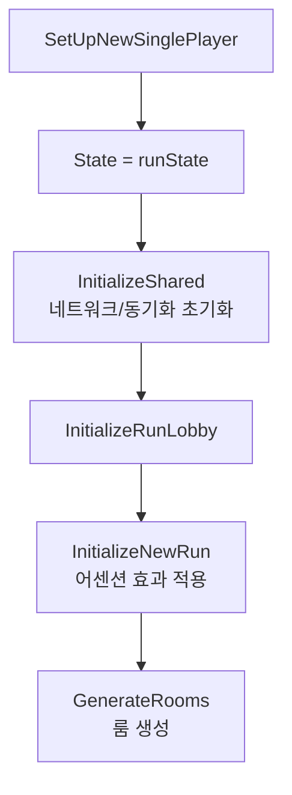
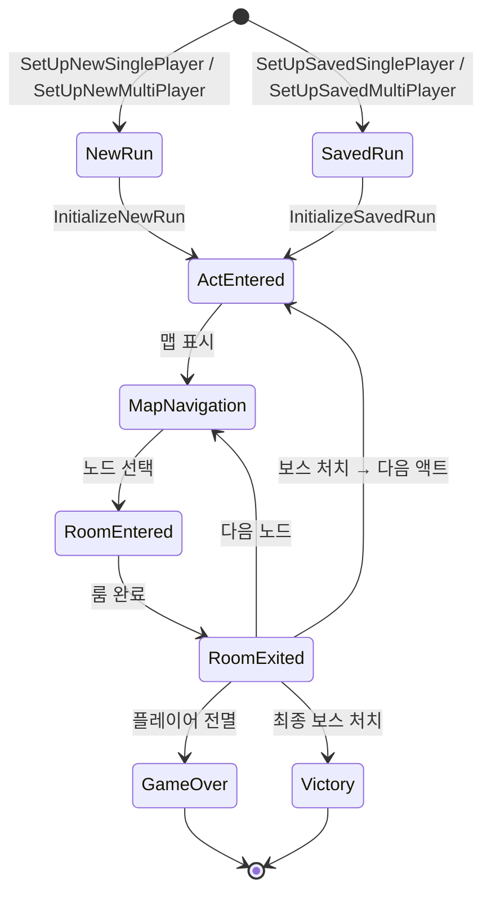

# 12. 런 상태 관리 (Run State Management)

#sts2 #godot #run-state #architecture

## 개요

STS2의 런(run)은 "시작 → 액트 → 맵 → 룸 → 게임오버/승리" 라는 생명주기를 가진다. 이 전체 흐름을 담는 핵심 데이터 구조가 `RunState`이며, 인터페이스 `IRunState`를 통해 외부에 노출된다.

---

## IRunState 인터페이스

```csharp
// IRunState.cs
public interface IRunState : ICardScope, IPlayerCollection
{
    IReadOnlyList<ActModel> Acts { get; }
    int CurrentActIndex { get; set; }
    ActModel Act { get; }
    ActMap Map { get; set; }
    MapCoord? CurrentMapCoord { get; }
    MapPoint? CurrentMapPoint { get; }
    RunLocation CurrentLocation { get; }
    int ActFloor { get; set; }
    int TotalFloor { get; }
    int CurrentRoomCount { get; }
    AbstractRoom? CurrentRoom { get; }
    AbstractRoom? BaseRoom { get; }
    bool IsGameOver { get; }
    int AscensionLevel { get; }
    RunRngSet Rng { get; }
    RunOddsSet Odds { get; }
    RelicGrabBag SharedRelicGrabBag { get; }
    UnlockState UnlockState { get; }
    IReadOnlyList<ModifierModel> Modifiers { get; }
    MultiplayerScalingModel? MultiplayerScalingModel { get; }
    IReadOnlyList<IReadOnlyList<MapPointHistoryEntry>> MapPointHistory { get; }
    ExtraRunFields ExtraFields { get; }

    bool ContainsCard(CardModel card);
    CardModel LoadCard(SerializableCard serializableCard, Player owner);
    void AppendToMapPointHistory(MapPointType mapPointType, RoomType initialRoomType, ModelId? modelId);
    IEnumerable<AbstractModel> IterateHookListeners(CombatState? childCombatState);
}
```

`IRunState`는 두 개의 인터페이스를 상속한다.

| 인터페이스 | 역할 |
|---|---|
| `ICardScope` | 카드 생성/복제/삭제/조회 |
| `IPlayerCollection` | 플레이어 목록 조회, 슬롯 인덱스, NetId 기반 조회 |

### IPlayerCollection

```csharp
public interface IPlayerCollection
{
    IReadOnlyList<Player> Players { get; }
    int GetPlayerSlotIndex(Player player);
    Player? GetPlayer(ulong netId);
}
```

멀티플레이어를 고려해 플레이어를 NetId(ulong)로 구분한다. 슬롯 인덱스는 0-based 순서이며, 찾지 못하면 -1을 반환한다.

---

## RunState 구조

`RunState`는 `IRunState`의 실제 구현체다. 모든 런 데이터를 소유하고 변경 가능(mutable)하다.

```csharp
public class RunState : IRunState, ICardScope, IPlayerCollection
{
    private readonly List<Player> _players;
    private int _currentActIndex;
    private readonly List<MapCoord> _visitedMapCoords;
    private readonly List<List<MapPointHistoryEntry>> _mapPointHistory;
    private readonly List<AbstractRoom> _currentRooms;   // 룸 스택
    private readonly HashSet<ModelId> _visitedEventIds;
    private readonly List<CardModel> _allCards;

    public IReadOnlyList<ActModel> Acts { get; private set; }
    public RunRngSet Rng { get; init; }
    public RunOddsSet Odds { get; init; }
    public RelicGrabBag SharedRelicGrabBag { get; init; }
    public UnlockState UnlockState { get; init; }
    public IReadOnlyList<ModifierModel> Modifiers { get; private set; }
    public ExtraRunFields ExtraFields { get; private set; }
    public MultiplayerScalingModel MultiplayerScalingModel { get; private set; }
    // ...
}
```

### 주요 프로퍼티 설명

| 프로퍼티 | 타입 | 설명 |
|---|---|---|
| `Acts` | `IReadOnlyList<ActModel>` | 런에 포함된 전체 액트 목록 |
| `CurrentActIndex` | `int` | 현재 액트 인덱스 (변경 시 visitedMapCoords 초기화) |
| `Act` | `ActModel` | `Acts[CurrentActIndex]` 단축 접근 |
| `Map` | `ActMap` | 현재 액트의 맵. 초기값은 `NullActMap.Instance` |
| `_currentRooms` | `List<AbstractRoom>` | 룸 스택. 중첩 룸(이벤트 중 전투 등)을 지원 |
| `TotalFloor` | `int` | 전체 방문한 맵 포인트 수 합산 |
| `IsGameOver` | `bool` | 플레이어가 1명 이상이고 모두 사망한 경우 true |
| `Rng` | `RunRngSet` | 시드 기반 RNG 모음 (용도별 분리) |
| `Modifiers` | `IReadOnlyList<ModifierModel>` | 커스텀/데일리 런 모디파이어 |

### CurrentActIndex 변경 시 부작용

```csharp
public int CurrentActIndex
{
    get => _currentActIndex;
    set
    {
        if (_currentActIndex != value)
        {
            _visitedMapCoords.Clear();  // 이전 액트 방문 기록 삭제
            ActFloor = 0;               // 층 카운터 리셋
            _currentActIndex = value;
        }
    }
}
```

> [!note]
> 액트가 바뀌면 방문한 맵 좌표와 층수가 자동으로 초기화된다. 맵 네비게이션 로직은 이 부작용에 의존한다.

---

## RunState 생성 방법 (Factory 메서드)

```csharp
// 새 런 시작
RunState.CreateForNewRun(players, acts, modifiers, ascensionLevel, seed);

// 저장된 런 복원
RunState.FromSerializable(SerializableRun save);

// 테스트용
RunState.CreateForTest(players, acts, modifiers, ascensionLevel, seed);
```

`CreateForNewRun` 내부 흐름:

```csharp
public static RunState CreateForNewRun(...)
{
    RunRngSet runRngSet = new RunRngSet(seed);          // 시드로 RNG 초기화
    RunOddsSet odds = new RunOddsSet(runRngSet.UnknownMapPoint);
    RunState result = CreateShared(players, acts, modifiers, 0, runRngSet, odds, ...);
    foreach (Player player in players)
    {
        player.InitializeSeed(seed);                    // 플레이어별 RNG 초기화
        foreach (CardModel card in player.Deck.Cards)
            card.AfterCreated();                        // 초기 덱 카드 초기화
    }
    return result;
}
```

---

## 룸 스택 (Room Stack)

`RunState`는 현재 룸을 단순 참조가 아닌 **스택**으로 관리한다.

```csharp
public void PushRoom(AbstractRoom room)   // 룸 진입
public AbstractRoom PopCurrentRoom()      // 룸 퇴장
public AbstractRoom? CurrentRoom         // 스택 최상단 (마지막 진입 룸)
public AbstractRoom? BaseRoom            // 스택 최하단 (최초 진입 룸)
```

이벤트 룸 도중 전투가 발생하면 전투룸이 스택에 push되며, 전투 종료 후 pop 되어 이벤트 룸으로 복귀한다.

---

## RunManager

`RunManager`는 싱글턴으로, `RunState`의 생명주기를 관리하는 오케스트레이터다. `RunState` 자체는 순수 데이터이고, `RunManager`가 네트워크/저장/이벤트를 처리한다.

```csharp
public class RunManager : IRunLobbyListener
{
    public static RunManager Instance { get; } = new RunManager();

    private RunState? State { get; set; }  // private! 외부에서 직접 접근 불가

    public bool IsInProgress => State != null;
    public bool IsGameOver => IsInProgress && State.IsGameOver;
    public bool IsAbandoned { get; private set; }

    // 런 시작 메서드
    public void SetUpNewSinglePlayer(RunState state, bool shouldSave, DateTimeOffset? dailyTime = null);
    public void SetUpNewMultiPlayer(RunState state, StartRunLobby lobby, bool shouldSave, DateTimeOffset? dailyTime = null);
    public void SetUpSavedSinglePlayer(RunState state, SerializableRun save);
    public void SetUpSavedMultiPlayer(RunState state, LoadRunLobby lobby);
    public void SetUpReplay(RunState state, CombatReplay replay);
}
```

### 런 시작 흐름



### RunManager 이벤트

```csharp
public event Action<RunState>? RunStarted;
public event Action? RoomEntered;
public event Action? RoomExited;
public event Action? ActEntered;
```

---

## NullRunState (Null Object 패턴)

`NullRunState`는 런이 진행 중이지 않을 때 사용하는 안전한 기본값 객체다. `IRunState`를 완전히 구현하지만 모든 mutate 연산은 예외를 던지고, 조회 연산은 안전한 기본값을 반환한다.

```csharp
public class NullRunState : IRunState, ICardScope, IPlayerCollection
{
    public static NullRunState Instance { get; } = new NullRunState();

    public IReadOnlyList<Player> Players => Array.Empty<Player>();
    public bool IsGameOver => false;
    public int TotalFloor => 0;
    public RunRngSet Rng => new RunRngSet(string.Empty);
    public MapCoord? CurrentMapCoord => null;

    // 쓰기 시도 → 예외
    public int CurrentActIndex
    {
        get => 0;
        set => throw new InvalidOperationException("Cannot set act index in a null run.");
    }

    public CardModel CreateCard(CardModel canonicalCard, Player owner)
        => throw new InvalidOperationException("Cannot create cards in a null run.");
}
```

`IRunState.GetFrom(IEnumerable<Creature>)` 정적 헬퍼는 플레이어 크리처가 없을 때 자동으로 `NullRunState.Instance`를 반환한다.

> [!note]
> NullRunState 덕분에 `if (runState != null)` 체크 없이 항상 `IRunState`를 사용할 수 있다. 코드가 훨씬 간결해진다.

---

## 런 생명주기 다이어그램



---

## ICardScope 주요 메서드

```csharp
// RunState에서 카드 생성 (런에 등록됨)
T CreateCard<T>(Player owner) where T : CardModel
CardModel CreateCard(CardModel canonicalCard, Player owner)
CardModel CloneCard(CardModel mutableCard)

// 카드 추가/제거
void AddCard(CardModel card, Player owner)
void RemoveCard(CardModel card)
bool ContainsCard(CardModel card)
```

모든 `CardModel`은 `RunState._allCards`에 등록되어 GC로부터 보호된다. `HasBeenRemovedFromState` 플래그로 소프트 삭제를 지원한다.

---

## 훅 리스너 순회 (IterateHookListeners)

게임 이벤트가 발생하면 모든 관련 모델에 훅을 전파한다. `IterateHookListeners`는 이 순서를 결정한다.

```csharp
public IEnumerable<AbstractModel> IterateHookListeners(CombatState? childCombatState)
{
    // 1. 활성 플레이어의 덱 카드 + 인챈트먼트
    // 2. (전투 외) 렐릭, 포션, 모디파이어, 멀티플레이어 스케일링
    // 3. (전투 중) childCombatState의 훅 리스너 추가
}
```

---

## 좀슐랭에 적용한다면

> [!tip] 좀슐랭 적용 아이디어

**런 상태 구조 그대로 차용하기:**

```csharp
// 좀슐랭 런 상태 예시
public interface IZombieRunState : IPlayerCollection
{
    int CurrentDayIndex { get; }    // 낮/밤 사이클 = Act
    ZombieMap Map { get; set; }     // 생존 구역 맵
    bool IsNight { get; }           // 밤 = 전투 페이즈
    RunRngSet Rng { get; }
}
```

- **NullRunState 패턴**: 메인메뉴, 로딩 중에도 `IZombieRunState`를 안전하게 참조 가능
- **룸 스택**: "요리 중 좀비 침입" 같은 중첩 이벤트에 활용
- **IterateHookListeners**: 장착 장비/레시피/버프가 이벤트에 반응하는 시스템에 적용
- **RunManager 싱글턴**: 런 진행 상태를 전역에서 `RunManager.Instance.IsInProgress`로 확인
- `CurrentActIndex` 변경 시 자동 초기화 패턴은 **낮/밤 전환 시 구역 상태 리셋**에 응용 가능
