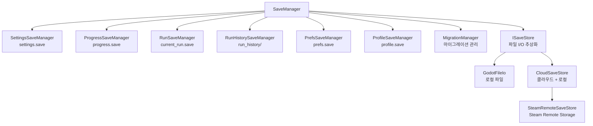

# 13. 저장 시스템 (Save System)

#sts2 #godot #save-system #architecture

## 개요

STS2의 저장 시스템은 **6개의 하위 매니저**를 `SaveManager`가 통합 관리하는 구조다. 각 매니저는 서로 다른 저장 파일과 데이터 타입을 담당하며, 마이그레이션과 클라우드 동기화를 지원한다.

---

## SaveManager 구조

```csharp
public class SaveManager : IProfileIdProvider
{
    // 6개 하위 매니저
    private readonly SettingsSaveManager  _settingsSaveManager;
    private readonly ProgressSaveManager  _progressSaveManager;
    private readonly RunSaveManager       _runSaveManager;
    private readonly RunHistorySaveManager _runHistorySaveManager;
    private readonly PrefsSaveManager     _prefsSaveManager;
    private readonly ProfileSaveManager   _profileSaveManager;

    private readonly ISaveStore _saveStore;
    private readonly MigrationManager _migrationManager;

    public static SaveManager Instance { get; }  // 싱글턴
    public int CurrentProfileId { get; }         // 프로필 ID (다중 저장 슬롯)
}
```

### 아키텍처 다이어그램



---

## 6개 하위 매니저 역할

| 매니저 | 파일명 | 역할 |
|---|---|---|
| `SettingsSaveManager` | `settings.save` | 해상도, 음량, 키바인딩 등 게임 설정 |
| `ProgressSaveManager` | `progress.save` | 잠금해제, 도전과제, 통계 (프로필 범위) |
| `RunSaveManager` | `current_run.save` / `current_run_mp.save` | 현재 진행 중인 런 데이터 |
| `RunHistorySaveManager` | `run_history/*.save` | 완료된 런 기록 목록 |
| `PrefsSaveManager` | `prefs.save` | UI 환경설정 (프로필 범위) |
| `ProfileSaveManager` | `profile.save` | 마지막으로 선택한 프로필 ID |

---

## 저장 타입별 상세

### 1. Settings (게임 설정)

프로필에 무관하게 전역으로 저장된다. 해상도, 그래픽 퀄리티, 오디오 볼륨 등 하드웨어/OS 종속 설정이다.

### 2. Progress (진행 상황)

```csharp
public class ProgressSaveManager
{
    public const string fileName = "progress.save";
    public ProgressState Progress { get; set; } = ProgressState.CreateDefault();

    // 런 완료 후 업데이트
    public void UpdateWithRunData(SerializableRun run, bool victory);
    // 전투 승리 시 업데이트
    public void UpdateAfterCombatWon(Player localPlayer, CombatRoom combatRoom);
}
```

프로필 범위(profile-scoped)로 저장된다. 경로: `profile_{id}/saves/progress.save`

### 3. Run 저장 (현재 런)

```csharp
public class RunSaveManager
{
    public const string runSaveFileName = "current_run.save";
    public const string multiplayerRunSaveFileName = "current_run_mp.save";

    public bool HasRunSave =>
        _saveStore.FileExists(CurrentRunSavePath) ||
        _saveStore.FileExists(CurrentRunSavePath + ".backup");  // 백업 파일도 체크

    public async Task SaveRun(AbstractRoom? preFinishedRoom)
    {
        // 싱글플레이어 또는 호스트만 저장
        if (!RunManager.Instance.ShouldSave ||
            (NetService.Type != Singleplayer && NetService.Type != Host))
            return;

        SerializableRun value = RunManager.Instance.ToSave(preFinishedRoom);
        string savePath = NetService.Type.IsMultiplayer()
            ? CurrentMultiplayerRunSavePath
            : CurrentRunSavePath;
        // JSON 직렬화 후 파일에 기록
    }
}
```

> [!note]
> 멀티플레이어에서는 오직 **호스트(Host)** 만 런 파일을 저장한다. 클라이언트는 저장하지 않는다.

`.backup` 파일: 저장 도중 크래시에 대비해 이전 저장 파일을 `.backup`으로 보관한다.

### 4. RunHistory (런 기록)

완료된 런을 개별 파일로 저장한다. 승/패, 캐릭터, 층수 등 통계 데이터를 포함한다.

### 5. Prefs (환경설정)

프로필 범위의 UI 환경설정. 튜토리얼 완료 여부, UI 레이아웃 선택 등.

### 6. Profile (프로필)

마지막으로 활성화된 프로필 ID를 저장한다. `SwitchProfileId()`로 슬롯 전환 가능.

```csharp
public void SwitchProfileId(int profileId)
{
    _currentProfileId = profileId;
    _profileSaveManager.Profile.LastProfileId = profileId;
    _profileSaveManager.SaveProfile();
    _runHistorySaveManager.CreateRunHistoryDirectory();
    this.ProfileIdChanged?.Invoke(profileId);
}
```

---

## SaveBatchScope (배치 저장)

여러 파일을 한 번에 저장할 때 배치 모드를 사용한다. 특히 클라우드 저장에서 API 호출 횟수를 줄이기 위해 중요하다.

```csharp
public async Task SaveRun(AbstractRoom? preFinishedRoom, bool saveProgress = true)
{
    if (CurrentRunSaveTask != null)
        await CurrentRunSaveTask;

    using (BeginSaveBatch())    // 배치 시작
    {
        if (saveProgress)
            SaveProgressFile(); // progress.save 먼저
        CurrentRunSaveTask = _runSaveManager.SaveRun(preFinishedRoom);
        await CurrentRunSaveTask;
    }   // 배치 종료 시 클라우드에 일괄 업로드
}
```

---

## 클라우드 동기화

```csharp
private static SaveManager ConstructDefault()
{
    ISaveStore saveStore = new GodotFileIo(UserDataPathProvider.GetAccountScopedBasePath(null));

    if (SteamInitializer.Initialized)
    {
        SteamRemoteSaveStore cloudStore = new SteamRemoteSaveStore();
        CloudSaveStore cloudSaveStore = new CloudSaveStore(saveStore, cloudStore);
        saveStore = cloudSaveStore;  // 클라우드로 래핑
    }

    return new SaveManager(saveStore);
}
```

`CloudSaveStore`는 Decorator 패턴으로 로컬 I/O 위에 Steam Remote Storage를 감싼다. 로컬 저장 + 클라우드 업로드를 동시에 수행한다.

### ISaveStore 인터페이스

```
ISaveStore
├── GodotFileIo          - Godot의 FileAccess API 래핑
├── CloudSaveStore       - 로컬 + Steam 클라우드 동시 저장
└── MockGodotFileIo      - 테스트용 인메모리 저장소
```

---

## 마이그레이션 시스템

저장 파일 포맷이 업데이트될 때 구버전 파일을 자동으로 마이그레이션한다.

```csharp
public class MigrationManager
{
    // 각 타입의 최신 스키마 버전 반환
    public int GetLatestVersion<T>();

    // 저장 파일 로드 시 버전 확인 후 마이그레이션 실행
}
```

각 `SerializableXxx` 클래스는 `ISaveSchema`를 구현한다:

```csharp
public class SerializableRun : ISaveSchema, IPacketSerializable
{
    [JsonPropertyName("schema_version")]
    public int SchemaVersion { get; set; }  // 버전 추적
    // ...
}
```

마이그레이션은 `IMigration`을 구현한 클래스로 등록되며, `MigrationAttribute`로 버전 범위를 선언한다.

```
Migrations/
├── IMigration.cs          - 마이그레이션 인터페이스
├── MigrationBase.cs       - 기본 구현
├── MigrationManager.cs    - 등록/실행 관리
└── PrefsSaves/            - Prefs 전용 마이그레이션들
```

---

## SerializableRun 직렬화

`SerializableRun`은 런 전체를 JSON으로 직렬화한다. `IPacketSerializable`도 구현해 멀티플레이어 패킷 전송도 지원한다.

```csharp
public class SerializableRun : ISaveSchema, IPacketSerializable
{
    public int SchemaVersion { get; set; }
    public List<SerializableActModel> Acts { get; set; }
    public List<SerializableModifier> Modifiers { get; set; }
    public DateTimeOffset? DailyTime { get; set; }
    public int CurrentActIndex { get; set; }
    public List<ModelId> EventsSeen { get; set; }
    public SerializableRoom? PreFinishedRoom { get; set; }
    public SerializableRunOddsSet SerializableOdds { get; set; }
    public SerializableRelicGrabBag SerializableSharedRelicGrabBag { get; set; }
    public List<SerializablePlayer> Players { get; set; }
    public SerializableRunRngSet SerializableRng { get; set; }  // Seed + Counter 목록
    public List<MapCoord> VisitedMapCoords { get; set; }
    public List<List<MapPointHistoryEntry>> MapPointHistory { get; set; }
    public long SaveTime { get; set; }
    public long StartTime { get; set; }
    public long RunTime { get; set; }
    public long WinTime { get; set; }
    public int Ascension { get; set; }
    public PlatformType PlatformType { get; set; }
}
```

### RNG 직렬화 방식

RNG를 복원할 때 전체 난수 시퀀스를 저장하는 게 아니라 **카운터(Counter)** 만 저장한다:

```csharp
public SerializableRunRngSet ToSerializable()
{
    var result = new SerializableRunRngSet { Seed = StringSeed };
    foreach (var (key, rng) in _rngs)
        result.Counters[key] = rng.Counter;  // 각 RNG 타입별 소비 횟수
    return result;
}
```

복원 시에는 같은 시드로 재생성 후 `FastForwardCounter(savedCount)`로 동일한 상태를 재현한다.

---

## 저장 디렉토리 구조

```
user://
└── account_{steamId}/            (AccountScopedBasePath)
    ├── settings.save
    └── profile_{id}/             (ProfileScopedBasePath)
        ├── profile.save
        ├── prefs.save
        └── saves/
            ├── progress.save
            ├── current_run.save
            ├── current_run_mp.save
            └── run_history/
                ├── run_001.save
                ├── run_002.save
                └── ...
```

---

## CorruptFileHandler

저장 파일이 손상됐을 때 복구를 시도한다. `.backup` 파일로 롤백하거나, 손상 파일을 격리한다.

```
ReadSaveResult
├── ReadSaveStatus  - Success / Corrupted / NotFound / ...
└── (T) Value       - 성공 시 역직렬화된 데이터
```

---

## 좀슐랭에 적용한다면

> [!tip] 좀슐랭 적용 아이디어

**최소 저장 시스템 설계:**

```csharp
// 좀슐랭 SaveManager 구조
public class ZombieSaveManager
{
    private readonly SettingsSaveManager _settings;
    private readonly RunSaveManager      _run;       // 현재 생존 런
    private readonly ProgressSaveManager _progress;  // 레시피 해금, 업그레이드 기록
    // RunHistory는 선택사항 (통계 시스템 구현 시 추가)
}
```

**핵심 적용 포인트:**

1. **ISaveStore 패턴**: Godot의 `FileAccess`를 인터페이스로 추상화하면 PC/모바일 저장 경로를 쉽게 교체 가능
2. **BackupFile 패턴**: `.backup` 복사본으로 저장 중 크래시 대비 — 작은 로그라이크에도 필수
3. **SerializableRun**: JSON 직렬화 + `schema_version` 필드를 처음부터 넣어두면 나중에 업데이트 시 마이그레이션이 쉬움
4. **RNG Counter 직렬화**: 시드 + 소비 횟수만 저장하면 저장 파일 크기를 최소화하면서 완전한 상태 복원 가능
5. **CloudSaveStore Decorator**: Steam Workshop / 클라우드 저장을 나중에 추가할 때 기존 코드를 건드리지 않고 래핑 가능
