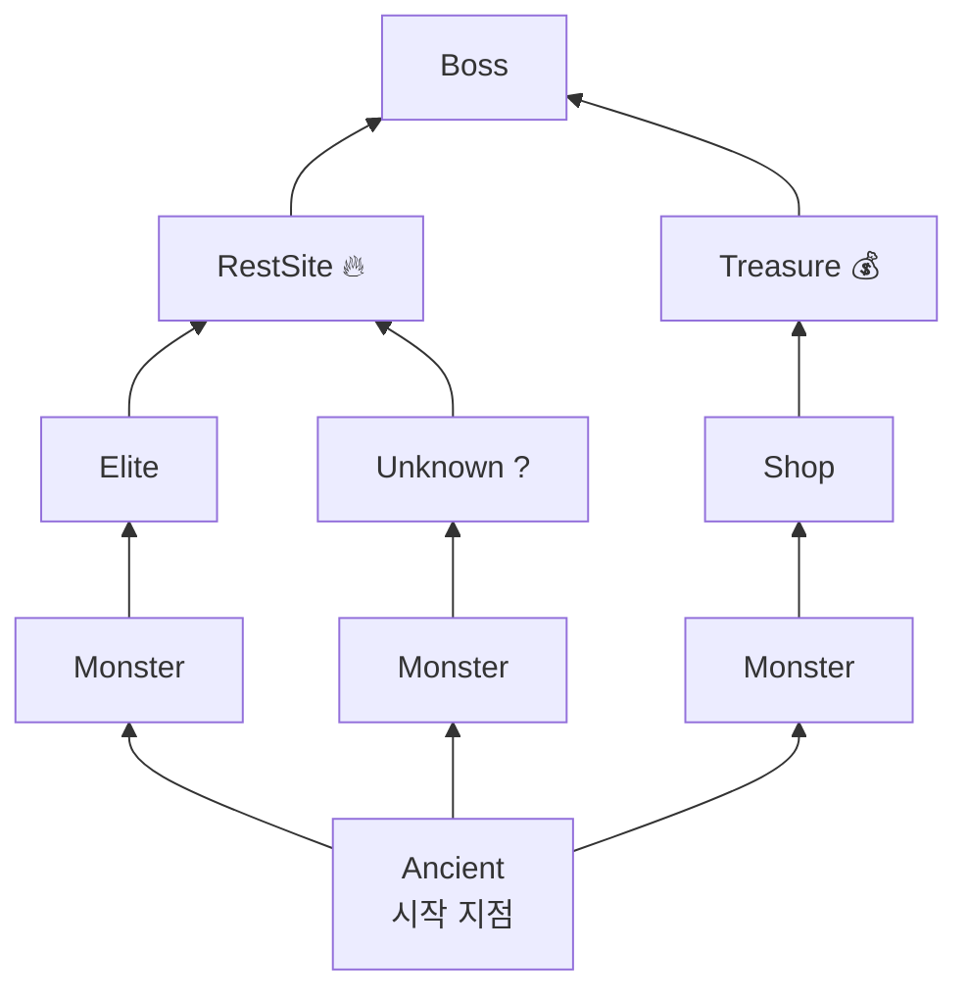
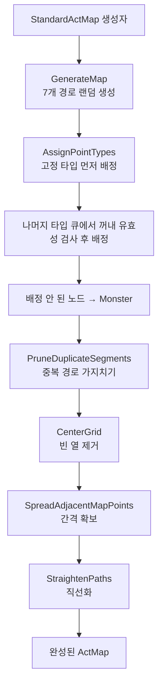

# 14. 맵 생성 (Map Generation)

#sts2 #godot #map-generation #procedural

## 개요

STS2의 맵은 액트마다 절차적으로 생성된다. 7열(column) × N행(row)의 그리드 위에 경로를 생성하고, 노드 타입(전투, 엘리트, 상점, 쉬는 곳 등)을 배치한다. 시드 기반 RNG를 사용하므로 같은 시드는 항상 같은 맵을 만든다.

---

## 핵심 데이터 구조

### MapCoord — 맵 좌표

```csharp
[Serializable]
public struct MapCoord(int col, int row) : IEquatable<MapCoord>, IComparable<MapCoord>, IPacketSerializable
{
    [JsonInclude] public int col = col;  // 열 (0~6)
    [JsonInclude] public int row = row;  // 행 (0~mapLength)

    public void Serialize(PacketWriter writer)
    {
        writer.WriteByte((byte)col);
        writer.WriteByte((byte)row);
    }
}
```

`MapCoord`는 값 타입(struct)이다. 멀티플레이어 패킷 직렬화도 지원한다 (`IPacketSerializable`).

### MapPoint — 맵 노드

```csharp
public class MapPoint : IComparable<MapPoint>
{
    public MapCoord coord;
    public MapPointType PointType { get; set; }
    public HashSet<MapPoint> Children { get; }   // 다음 노드 (위 방향)
    public HashSet<MapPoint> parents;            // 이전 노드 (아래 방향)
    public bool CanBeModified { get; set; } = true;
    public IReadOnlyList<AbstractModel> Quests => _quests;
}
```

`MapPoint`는 방향성 그래프의 노드다. `Children`은 "다음으로 갈 수 있는 노드", `parents`는 "여기로 올 수 있는 노드"다.

```csharp
public void AddChildPoint(MapPoint child)
{
    Children.Add(child);
    child.parents.Add(this);  // 양방향 연결
}
```

### MapPointType — 노드 종류

```csharp
public enum MapPointType
{
    Unassigned,  // 미배정 (생성 중간 상태)
    Unknown,     // ? 방 (무작위)
    Shop,        // 상점
    Treasure,    // 보물
    RestSite,    // 캠프파이어
    Monster,     // 일반 전투
    Elite,       // 엘리트 전투
    Boss,        // 보스
    Ancient      // 시작 지점
}
```

### ActMap — 맵 추상 기반 클래스

```csharp
public abstract class ActMap
{
    public readonly HashSet<MapPoint> startMapPoints;  // 1행의 시작 노드들

    public abstract MapPoint BossMapPoint { get; }
    public abstract MapPoint StartingMapPoint { get; }
    public virtual MapPoint? SecondBossMapPoint => null;  // 두 번째 보스 (선택)

    protected abstract MapPoint?[,] Grid { get; }  // [col, row] 2D 배열

    public int GetColumnCount() => Grid.GetLength(0);  // 7
    public int GetRowCount() => Grid.GetLength(1);

    public IEnumerable<MapPoint> GetAllMapPoints();
    public IEnumerable<MapPoint> GetPointsInRow(int row);
    public virtual MapPoint? GetPoint(MapCoord coord);
    public bool IsInMap(MapPoint mapPoint);
    public bool HasPoint(MapCoord coord);
}
```

**ActMap 구현체 목록:**

| 클래스 | 용도 |
|---|---|
| `StandardActMap` | 실제 게임 맵 (절차적 생성) |
| `NullActMap` | Null Object 패턴 (런 시작 전) |
| `SavedActMap` | 저장 파일에서 복원한 맵 |
| `MockActMap` | 테스트용 |
| `GoldenPathActMap` | 황금 경로 전용 맵 |
| `SpoilsActMap` | 특수 보상 맵 |

---

## StandardActMap — 절차적 맵 생성

```csharp
public sealed class StandardActMap : ActMap
{
    public const int maxElites = 15;
    private const int _iterations = 7;    // 경로 생성 반복 횟수
    private const int _mapWidth = 7;      // 열 개수

    private readonly MapPointTypeCounts _pointTypeCounts;
    private readonly int _mapLength;  // actModel.GetNumberOfRooms() + 1
    private readonly Rng _rng;
}
```

### 생성자 흐름

```csharp
public StandardActMap(Rng mapRng, ActModel actModel, bool isMultiplayer,
    bool shouldReplaceTreasureWithElites, bool hasSecondBoss = false, ...)
{
    _mapLength = actModel.GetNumberOfRooms(isMultiplayer) + 1;
    Grid = new MapPoint[7, _mapLength];

    BossMapPoint = new MapPoint(GetColumnCount() / 2, GetRowCount());    // 중앙 상단
    StartingMapPoint = new MapPoint(GetColumnCount() / 2, 0);            // 중앙 하단

    GenerateMap();        // 1. 경로 생성
    AssignPointTypes();   // 2. 노드 타입 배정
    MapPathPruning.PruneDuplicateSegments(Grid, startMapPoints, StartingMapPoint, _rng);  // 3. 중복 경로 제거
    Grid = MapPostProcessing.CenterGrid(Grid);          // 4. 후처리: 중앙 정렬
    Grid = MapPostProcessing.SpreadAdjacentMapPoints(Grid);  // 5. 인접 노드 분산
    Grid = MapPostProcessing.StraightenPaths(Grid);     // 6. 경로 직선화
}
```

### 맵 시드 생성 방식

```csharp
public static StandardActMap CreateFor(RunState runState, bool replaceTreasureWithElites)
{
    // 런 시드 + 액트 번호로 액트별 고유 맵 RNG 생성
    return new StandardActMap(
        new Rng(runState.Rng.Seed, $"act_{runState.CurrentActIndex + 1}_map"),
        runState.Act,
        runState.Players.Count > 1,
        replaceTreasureWithElites,
        runState.Act.HasSecondBoss);
}
```

같은 런 시드라도 액트마다 다른 맵이 생성된다 (`"act_1_map"`, `"act_2_map"`, ...).

---

## 1단계: 경로 생성 (GenerateMap)

```csharp
private void GenerateMap()
{
    // 7개의 경로를 독립적으로 생성
    for (int i = 0; i < 7; i++)
    {
        MapPoint startPoint = GetOrCreatePoint(_rng.NextInt(0, 7), 1);
        // 두 번째 경로는 첫 번째와 다른 시작점 강제
        if (i == 1)
        {
            while (startMapPoints.Contains(startPoint))
                startPoint = GetOrCreatePoint(_rng.NextInt(0, 7), 1);
        }
        startMapPoints.Add(startPoint);
        PathGenerate(startPoint);  // row 1에서 row (mapLength-1)까지 경로 뻗기
    }

    // 마지막 행 → 보스 노드 연결
    ForEachInRow(Grid, GetRowCount() - 1, x => x.AddChildPoint(BossMapPoint));

    // 시작 노드 → 1행 노드들 연결
    ForEachInRow(Grid, 1, x => StartingMapPoint.AddChildPoint(x));
}
```

### PathGenerate — 단일 경로 생성

```csharp
private void PathGenerate(MapPoint startingPoint)
{
    MapPoint current = startingPoint;
    while (current.coord.row < _mapLength - 1)
    {
        MapCoord nextCoord = GenerateNextCoord(current);
        MapPoint next = GetOrCreateMapPoint(nextCoord);
        current.AddChildPoint(next);
        current = next;
    }
}
```

### GenerateNextCoord — 다음 좌표 결정

```csharp
private MapCoord GenerateNextCoord(MapPoint current)
{
    int col = current.coord.col;
    int left  = Math.Max(0, col - 1);
    int right = Math.Min(col + 1, 6);

    // [-1, 0, +1] 방향을 무작위로 섞어서 시도
    List<int> directions = new List<int> { -1, 0, 1 };
    directions.StableShuffle(_rng);

    foreach (int dir in directions)
    {
        int targetCol = dir switch { -1 => left, 0 => col, 1 => right, _ => throw ... };
        if (!HasInvalidCrossover(current, targetCol))
            return new MapCoord { col = targetCol, row = current.coord.row + 1 };
    }
    throw new InvalidOperationException($"Cannot find next node: seed={_rng.Seed}");
}
```

> [!note]
> **교차 방지(HasInvalidCrossover)**: 두 경로가 X자로 교차하면 맵 탐색이 불가능해진다. `HasInvalidCrossover`는 이를 감지해 해당 방향을 건너뛴다.

---

## 2단계: 노드 타입 배정 (AssignPointTypes)

```csharp
private void AssignPointTypes()
{
    // 고정 위치 타입 먼저 지정
    ForEachInRow(Grid, GetRowCount() - 1,
        p => { p.PointType = MapPointType.RestSite; p.CanBeModified = false; });

    ForEachInRow(Grid, GetRowCount() - 7,
        p => p.PointType = shouldReplace ? MapPointType.Elite : MapPointType.Treasure);

    ForEachInRow(Grid, 1, p => p.PointType = MapPointType.Monster);  // 1행은 항상 전투

    // 나머지 타입을 목록으로 만들어 무작위 배정
    List<MapPointType> typesToAssign = BuildTypeList(_pointTypeCounts);
    Queue<MapPointType> queue = new Queue<MapPointType>(typesToAssign);
    AssignRemainingTypesToRandomPoints(queue);

    // 배정 안 된 노드는 Monster로
    foreach (var point in GetAllMapPoints().Where(x => x.PointType == MapPointType.Unassigned))
        point.PointType = MapPointType.Monster;

    BossMapPoint.PointType = MapPointType.Boss;
    StartingMapPoint.PointType = MapPointType.Ancient;
}
```

### 배치 제약 규칙

| 규칙 | 설명 |
|---|---|
| `_lowerMapPointRestrictions` | row < 5: RestSite, Elite 배치 금지 |
| `_upperMapPointRestrictions` | row >= mapLength-3: RestSite 배치 금지 |
| `_parentMapPointRestrictions` | Elite/RestSite/Treasure/Shop은 인접 부모/자식에 같은 타입 금지 |
| `_childMapPointRestrictions` | 위와 동일 (자식 기준) |
| `_siblingPointTypeRestrictions` | RestSite/Monster/Unknown/Elite/Shop은 같은 행 형제 노드에 중복 금지 |

```csharp
private static readonly HashSet<MapPointType> _lowerMapPointRestrictions = new()
    { MapPointType.RestSite, MapPointType.Elite };

private static readonly HashSet<MapPointType> _parentMapPointRestrictions = new()
    { MapPointType.Elite, MapPointType.RestSite, MapPointType.Treasure, MapPointType.Shop };
```

---

## 3단계: 경로 가지치기 (MapPathPruning)

중복 경로 세그먼트를 제거해 맵의 다양성을 보장한다.

```csharp
public static void PruneDuplicateSegments(MapPoint?[,] grid, HashSet<MapPoint> startMapPoints,
    MapPoint startingMapPoint, Rng rng)
{
    int iterations = 0;
    List<List<MapPoint[]>> matchingSegments = FindMatchingSegments(startingMapPoint);
    while (PrunePaths(grid, startMapPoints, matchingSegments, rng))
    {
        iterations++;
        if (iterations > 50)
            throw new InvalidOperationException($"Unable to prune in {iterations} iterations");
        matchingSegments = FindMatchingSegments(startingMapPoint);
    }
}
```

동일한 노드 타입 시퀀스를 가진 경로를 찾아서 하나를 제거하는 방식으로 반복한다.

---

## 4단계: 후처리 (MapPostProcessing)

```
CenterGrid          → 그리드를 중앙으로 압축 (빈 열 제거)
SpreadAdjacentMapPoints → 같은 행에 인접한 노드가 있으면 간격 확보
StraightenPaths     → 지그재그 경로를 시각적으로 직선화
```

---

## 맵 시각화 구조



---

## 맵 네비게이션

플레이어가 맵에서 노드를 선택하면 `RunState`에 기록된다.

```csharp
// 노드 방문 기록
runState.AddVisitedMapCoord(coord);

// 현재 위치
MapCoord? current = runState.CurrentMapCoord;  // _visitedMapCoords.Last()
MapPoint? currentPoint = runState.CurrentMapPoint;  // Map.GetPoint(CurrentMapCoord)
```

### BFS 경로 탐색

`MapPoint.BFS_FindPath`로 두 노드 사이의 경로를 탐색할 수 있다:

```csharp
public IEnumerable<MapPoint> BFS_FindPath(MapPoint target)
{
    var queue = new Queue<MapPoint>();
    var parentMap = new Dictionary<MapPoint, MapPoint>();
    queue.Enqueue(this);
    while (queue.Count > 0)
    {
        var current = queue.Dequeue();
        if (current.Equals(target))
            return BuildPath(parentMap, target);
        foreach (var child in current.Children)
        {
            if (!parentMap.ContainsKey(child))
            {
                parentMap[child] = current;
                queue.Enqueue(child);
            }
        }
    }
    return new List<MapPoint>();
}
```

### 경로 분석 유틸리티

```csharp
// 두 노드의 첫 번째 공통 자손 찾기
MapPoint? GetFirstCommonDescendant(MapPoint b)

// 두 경로가 같은 타입 시퀀스인지 비교
bool IsDescendantPathSame(MapPoint? other)

// 마지막 분기점까지의 거리
int GetLastJunctionLength()
```

---

## 맵 저장/복원

진행 중인 런의 맵은 `SavedActMap`으로 직렬화된다:

```csharp
// 저장 시
SerializableActMap saved = actMap.ToSerializable();

// 복원 시
RunManager.Instance.SavedMapsToLoad = new Dictionary<int, SerializableActMap>();
```

---

## 전체 생성 흐름



---

## 좀슐랭에 적용한다면

> [!tip] 좀슐랭 적용 아이디어

**생존 구역 맵 구조:**

```csharp
// 좀슐랭 맵 노드 타입
public enum ZombieMapPointType
{
    Unassigned,
    SafeHouse,      // RestSite - 체력 회복, 요리
    Scavenging,     // Unknown - 자원 탐색
    ZombieHorde,    // Monster - 전투
    EliteHorde,     // Elite - 강력한 좀비 무리
    Survivor,       // Shop - NPC 생존자 거래
    Boss,           // 구역 보스 (감염된 거대 좀비)
    Extraction      // 탈출 지점 (보스 이후)
}
```

**알고리즘 직접 활용:**

1. **7열 그리드 구조**: 좀슐랭의 "생존 구역 지도"에 그대로 사용 가능. 가로 7개 경로는 다양한 루트를 자연스럽게 표현
2. **교차 방지 로직**: `HasInvalidCrossover` 코드를 그대로 복사해서 사용 가능 — 경로 교차가 생기면 UI에서 탐색이 혼란스러워짐
3. **배치 제약 시스템**: "같은 행에 SafeHouse 중복 금지", "초반 Elite 금지" 같은 규칙을 `HashSet` 기반으로 선언적으로 관리
4. **시드 기반 맵**: `new Rng(runSeed, "day_3_map")`처럼 날짜별로 다른 맵을 고정 시드로 생성
5. **MapPostProcessing**: Godot에서 맵을 시각적으로 그릴 때 노드 좌표 계산에 직접 활용 가능
