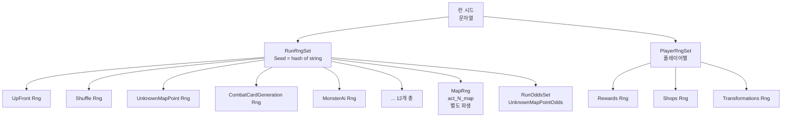

# 15. 시드 기반 랜덤 시스템 (RNG System)

#sts2 #godot #rng #seed #deterministic

## 개요

STS2의 모든 무작위성은 **시드(Seed) 기반 결정적 RNG**로 동작한다. 같은 시드로 시작한 런은 같은 선택을 하면 항상 동일한 결과를 만든다. 리플레이, 멀티플레이어 동기화, 버그 재현이 모두 이 시스템에 의존한다.

핵심 설계는 용도별로 RNG를 **분리(segregation)** 하는 것이다. 전투용 RNG를 1회 소비해도 맵 생성 RNG에는 영향이 없다.

---

## Rng 클래스

```csharp
public class Rng
{
    private readonly System.Random _random;

    public int Counter { get; private set; }  // 지금까지 소비한 횟수
    public uint Seed { get; }                 // 초기 시드값

    // 정적 비결정적 RNG (UI 효과 등 게임 로직 무관한 곳에만)
    public static Rng Chaotic { get; } = new Rng((uint)DateTimeOffset.Now.ToUnixTimeSeconds());

    public Rng(uint seed = 0u, int counter = 0)
    {
        Counter = 0;
        Seed = seed;
        _random = new System.Random((int)seed);
        FastForwardCounter(counter);  // 저장된 상태로 빠르게 복원
    }

    // 이름 기반 생성자: seed + name의 해시로 파생 시드 생성
    public Rng(uint seed, string name)
        : this(seed + (uint)StringHelper.GetDeterministicHashCode(name))
    {
    }
}
```

### Counter 시스템

`Counter`는 이 RNG 인스턴스가 난수를 몇 번 소비했는지 추적한다. **저장/복원의 핵심**이다.

```csharp
// 난수를 소비할 때마다 Counter 증가
public int NextInt(int maxExclusive = int.MaxValue)
{
    Counter++;
    return _random.Next(maxExclusive);
}

public bool NextBool()
{
    Counter++;
    return _random.Next(2) == 0;
}

public float NextFloat(float min, float max)
{
    Counter++;
    return (float)(_random.NextDouble() * (double)(max - min) + (double)min);
}
```

### FastForwardCounter — 상태 복원

저장 파일에서 복원할 때 시퀀스를 처음부터 다시 재생한다:

```csharp
public void FastForwardCounter(int targetCount)
{
    if (Counter > targetCount)
        throw new InvalidOperationException(
            $"Cannot fast-forward to a lower number (current={Counter}, target={targetCount})");

    while (Counter < targetCount)
    {
        Counter++;
        _random.Next();  // 값은 버리고 상태만 진행
    }
}
```

> [!note]
> `FastForwardCounter`는 저장된 카운터까지 `_random.Next()`를 반복 호출해 동일한 내부 상태를 재현한다. 난수 값은 버리지만 `System.Random` 내부 상태가 정확히 복원된다.

### 제공되는 난수 메서드

| 메서드 | 반환 타입 | 설명 |
|---|---|---|
| `NextBool()` | `bool` | 50% 확률 |
| `NextInt(max)` | `int` | [0, max) |
| `NextInt(min, max)` | `int` | [min, max) |
| `NextUnsignedInt(min, max)` | `uint` | unsigned 범위 |
| `NextFloat(min, max)` | `float` | 부동소수점 |
| `NextDouble(min, max)` | `double` | 배정밀도 |
| `NextGaussianFloat(mean, stdDev, min, max)` | `float` | 정규분포 |
| `NextGaussianInt(mean, stdDev, min, max)` | `int` | 정규분포 정수 |
| `NextItem<T>(items)` | `T?` | 목록에서 무작위 선택 |
| `WeightedNextItem<T>(items, weightFetcher)` | `T?` | 가중치 기반 선택 |
| `Shuffle<T>(list)` | `void` | Fisher-Yates 셔플 |

### 가중치 선택 알고리즘

```csharp
public static T WeightedNextItem<T>(float randInput, IEnumerable<T> items,
    Func<T, float> weightFetcher, T fallback)
{
    float totalWeight = items.Sum(weightFetcher);
    float remaining = randInput * totalWeight;
    foreach (T item in items)
    {
        remaining -= weightFetcher(item);
        if (remaining <= 0f)
            return item;
    }
    return fallback;
}
```

---

## RunRngSet — 런 전체 RNG 묶음

런 하나에서 발생하는 모든 무작위 이벤트를 **용도별로 분리된 Rng 인스턴스**로 관리한다.

```csharp
public class RunRngSet
{
    private readonly Dictionary<RunRngType, Rng> _rngs;

    public string StringSeed { get; }  // 원본 문자열 시드
    public uint Seed { get; }          // 해시된 uint 시드

    // 용도별 RNG 프로퍼티
    public Rng UpFront              => GetRng(RunRngType.UpFront);             // 선불 효과
    public Rng Shuffle              => GetRng(RunRngType.Shuffle);             // 카드/아이템 셔플
    public Rng UnknownMapPoint      => GetRng(RunRngType.UnknownMapPoint);     // ? 방 결과
    public Rng CombatCardGeneration => GetRng(RunRngType.CombatCardGeneration); // 전투 카드 생성
    public Rng CombatPotionGeneration => GetRng(RunRngType.CombatPotionGeneration); // 포션 생성
    public Rng CombatCardSelection  => GetRng(RunRngType.CombatCardSelection);  // 카드 선택
    public Rng CombatEnergyCosts    => GetRng(RunRngType.CombatEnergyCosts);    // 에너지 비용
    public Rng CombatTargets        => GetRng(RunRngType.CombatTargets);        // 전투 타겟
    public Rng MonsterAi            => GetRng(RunRngType.MonsterAi);            // 몬스터 AI
    public Rng Niche                => GetRng(RunRngType.Niche);                // 특수 효과
    public Rng CombatOrbGeneration  => GetRng(RunRngType.CombatOrbs);          // 오브 생성
    public Rng TreasureRoomRelics   => GetRng(RunRngType.TreasureRoomRelics);   // 보물방 유물
}
```

### 초기화 — 파생 시드 생성

```csharp
public RunRngSet(string seed)
{
    StringSeed = seed;
    Seed = (uint)StringHelper.GetDeterministicHashCode(seed);

    // 모든 RunRngType에 대해 개별 Rng 생성
    foreach (RunRngType rngType in Enum.GetValues<RunRngType>())
        _rngs[rngType] = CreateRng(rngType);
}

private Rng CreateRng(RunRngType rngType)
{
    string name = StringHelper.SnakeCase(rngType.ToString());
    // Rng(uint seed, string name) 생성자 사용
    // 최종 시드 = Seed + hash("combat_card_generation") 등
    return new Rng(Seed, name);
}
```

각 RNG 타입은 **기본 시드 + 타입 이름 해시**로 파생된 고유 시드를 갖는다. `"ABC123"` 시드라면:
- `CombatTargets` RNG 시드 = hash("ABC123") + hash("combat_targets")
- `MonsterAi` RNG 시드 = hash("ABC123") + hash("monster_ai")

이로써 모든 RNG가 독립적으로 동작한다.

### 직렬화 — Counter만 저장

```csharp
public SerializableRunRngSet ToSerializable()
{
    var result = new SerializableRunRngSet { Seed = StringSeed };
    foreach (var (key, rng) in _rngs)
        result.Counters[key] = rng.Counter;  // 타입별 소비 횟수만 저장
    return result;
}
```

### 역직렬화 — 시드 재생성 + FastForward

```csharp
public static RunRngSet FromSave(SerializableRunRngSet save)
{
    RunRngSet result = new RunRngSet(save.Seed);  // 동일 시드로 재생성
    foreach (var (rngType, savedCount) in save.Counters)
    {
        Rng rng = result.CreateRng(rngType);
        rng.FastForwardCounter(savedCount);       // 저장된 횟수까지 빨리감기
        result._rngs[rngType] = rng;
    }
    return result;
}
```

---

## PlayerRngSet — 플레이어별 RNG 묶음

플레이어마다 개인적인 무작위 이벤트(보상 선택, 상점 재고, 카드 변형)는 별도 RNG 세트를 가진다.

```csharp
public class PlayerRngSet
{
    private readonly Dictionary<PlayerRngType, Rng> _rngs;

    public uint Seed { get; }

    public Rng Rewards         => GetRng(PlayerRngType.Rewards);         // 전투 후 보상
    public Rng Shops           => GetRng(PlayerRngType.Shops);           // 상점 재고
    public Rng Transformations => GetRng(PlayerRngType.Transformations); // 카드 변형
}
```

`PlayerRngSet`은 `uint` 시드를 직접 받으며, 각 플레이어의 `NetId`나 캐릭터 선택에서 파생된다.

---

## Odds 시스템

`Rng` 위에 **확률 상태를 추적하는 레이어**가 `AbstractOdds`다.

```csharp
// RunOddsSet — 런 전체의 Odds 모음
public class RunOddsSet
{
    public UnknownMapPointOdds UnknownMapPoint { get; private init; }
}
```

### UnknownMapPointOdds — ? 방 확률

```csharp
// ? 방에서 어떤 이벤트가 나올지 결정하는 확률값들
public class UnknownMapPointOdds
{
    public float MonsterOdds  { get; set; }
    public float EliteOdds    { get; set; }
    public float TreasureOdds { get; set; }
    public float ShopOdds     { get; set; }
}
```

이 확률값들은 런 진행에 따라 동적으로 변한다(최근에 Monster가 나왔으면 다음엔 줄어드는 식). 저장 파일에도 직렬화된다:

```csharp
// SerializableRunOddsSet
public float UnknownMapPointMonsterOddsValue  { get; set; }
public float UnknownMapPointEliteOddsValue    { get; set; }
public float UnknownMapPointTreasureOddsValue { get; set; }
public float UnknownMapPointShopOddsValue     { get; set; }
```

---

## 결정적 리플레이를 위한 설계

```mermaid
flowchart LR
    Seed[문자열 시드\n"MEGACRIT"] --> Hash[GetDeterministicHashCode\nuint: 3942871]
    Hash --> RR[RunRngSet\n타입별 Rng 12개]
    Hash --> PR[PlayerRngSet\n타입별 Rng 3개]
    RR --> M[act_1_map Rng\n맵 생성]
    RR --> CA[CombatTargets Rng\n전투 타겟]
    RR --> AI[MonsterAi Rng\n몬스터 행동]
    PR --> RW[Rewards Rng\n보상 선택]
    PR --> SH[Shops Rng\n상점 재고]
```

### 결정성 보장 3원칙

1. **시드 고정**: `StringHelper.GetDeterministicHashCode`는 플랫폼/런타임 무관하게 동일한 해시를 반환한다
2. **RNG 분리**: 각 용도의 RNG가 독립적이므로 "이 순간 전투 타겟 RNG를 1번 소비했다"는 사실이 몬스터 AI RNG에 영향을 주지 않는다
3. **Counter 직렬화**: 전체 난수 시퀀스를 저장하는 게 아니라 소비 횟수만 저장하고, 복원 시 `FastForwardCounter`로 재현한다

### 실제 저장 파일 형태

```json
{
  "rng": {
    "seed": "MEGACRIT",
    "counters": {
      "UpFront": 5,
      "Shuffle": 23,
      "UnknownMapPoint": 3,
      "CombatCardGeneration": 147,
      "CombatPotionGeneration": 12,
      "CombatCardSelection": 89,
      "CombatTargets": 34,
      "MonsterAi": 201,
      "Niche": 7,
      "CombatOrbs": 0,
      "TreasureRoomRelics": 4
    }
  }
}
```

---

## 맵 생성에서의 RNG 사용 예시

```csharp
// 맵 전용 파생 RNG 생성
Rng mapRng = new Rng(runState.Rng.Seed, $"act_{runState.CurrentActIndex + 1}_map");

// 경로 생성 시 방향 결정
List<int> directions = new List<int> { -1, 0, 1 };
directions.StableShuffle(mapRng);  // mapRng 소비

// 노드 타입 배정 시
rows.UnstableShuffle(mapRng);      // mapRng 소비
row.StableShuffle(mapRng);         // mapRng 소비
```

맵 RNG는 `RunRngSet` 안의 RNG가 아닌 별도 파생 RNG를 사용한다. 덕분에 맵을 재생성해도 다른 RNG의 Counter에 전혀 영향이 없다.

---

## Rng.Chaotic vs 결정적 Rng

```csharp
// 비결정적 — 시간 기반, 게임 로직에 절대 사용 금지
public static Rng Chaotic { get; } = new Rng((uint)DateTimeOffset.Now.ToUnixTimeSeconds());

// 결정적 — 모든 게임 로직에 사용
Rng myRng = new Rng(seed, "my_purpose");
```

`Rng.Chaotic`는 파티클 효과, 사운드 피치 변화 등 **게임 결과에 영향을 주지 않는 순수 비주얼** 용도로만 사용한다.

---

## 전체 RNG 계층 구조



---

## 좀슐랭에 적용한다면

> [!tip] 좀슐랭 적용 아이디어

**Rng 클래스 직접 이식:**

STS2의 `Rng.cs`는 `System.Random` 래퍼로 Godot에 의존하지 않는다. C# 파일 그대로 Godot 4 프로젝트에 복사해서 사용할 수 있다.

```csharp
// 좀슐랭 RNG 세트
public class ZombieRunRngSet
{
    public Rng ZombieSpawn    => GetRng(ZombieRngType.ZombieSpawn);    // 좀비 등장
    public Rng LootDrops      => GetRng(ZombieRngType.LootDrops);      // 아이템 드랍
    public Rng RecipeRewards  => GetRng(ZombieRngType.RecipeRewards);  // 요리 보상
    public Rng EventOutcomes  => GetRng(ZombieRngType.EventOutcomes);  // 이벤트 결과
    public Rng WeatherSystem  => GetRng(ZombieRngType.WeatherSystem);  // 날씨 변화
}
```

**핵심 적용 포인트:**

1. **Counter 직렬화 패턴**: 저장 파일에 RNG 전체 시퀀스를 저장할 필요 없이 시드 + 소비 횟수만 저장 → 파일 크기 최소화
2. **RNG 분리**: "날씨 RNG 소비 ≠ 좀비 스폰 RNG 소비" — 한 시스템이 다른 시스템의 결과에 영향을 주지 않음
3. **이름 기반 파생 시드**: `new Rng(baseSeed, "day_5_weather")`처럼 날짜/이벤트별로 고유한 RNG 생성
4. **가중치 선택**: `WeightedNextItem`을 레시피 드랍, 좀비 타입 결정에 바로 사용 가능
5. **FastForwardCounter**: 리플레이나 "이 상황 재현" 디버그 기능 구현에 필수

**Godot GDScript에서 쓰려면:**

Godot 4는 C#을 지원하므로 `Rng.cs`를 그대로 사용할 수 있다. GDScript가 필요하다면 `RandomNumberGenerator`에 `seed`와 `state`를 저장하는 방식으로 유사하게 구현 가능하다.
