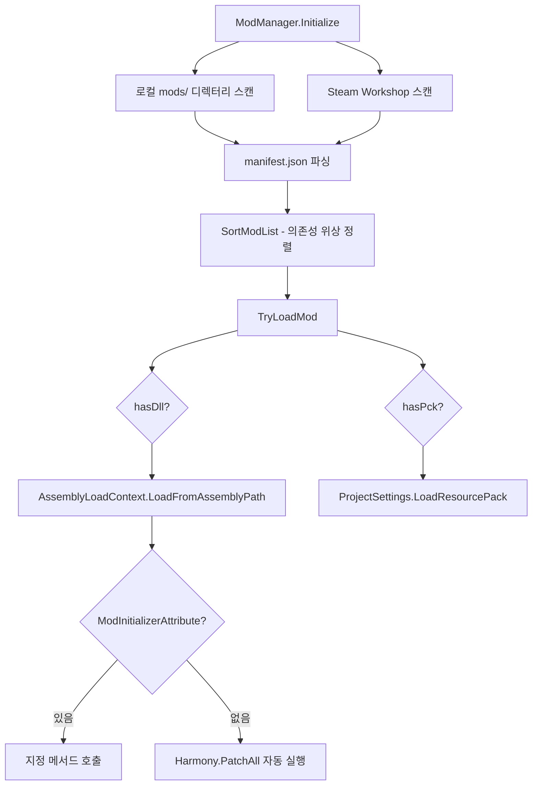

# 16. 모딩 시스템 (Modding System)

#sts2 #godot #modding

STS2는 Steam Workshop과 로컬 디렉터리 기반의 완전한 모딩 파이프라인을 갖추고 있다. Harmony 패치, Godot PCK 확장, 콘텐츠 풀 주입을 모두 지원한다.

---

## 아키텍처 개요



---

## ModManifest — mod JSON 구조

```csharp
// F:/Projects/godot_study/extracted/src/Core/Modding/ModManifest.cs
public class ModManifest
{
    [JsonPropertyName("id")]          public string? id;          // 고유 식별자 (필수)
    [JsonPropertyName("name")]        public string? name;
    [JsonPropertyName("author")]      public string? author;
    [JsonPropertyName("description")] public string? description;
    [JsonPropertyName("version")]     public string? version;
    [JsonPropertyName("has_pck")]     public bool hasPck;         // Godot PCK 포함 여부
    [JsonPropertyName("has_dll")]     public bool hasDll;         // C# DLL 포함 여부
    [JsonPropertyName("dependencies")]public List<string>? dependencies;
    [JsonPropertyName("affects_gameplay")] public bool affectsGameplay = true;
}
```

실제 JSON 예시:
```json
{
  "id": "my_mod",
  "name": "My Awesome Mod",
  "author": "Modder",
  "version": "1.0.0",
  "has_dll": true,
  "has_pck": true,
  "dependencies": ["base_content_mod"],
  "affects_gameplay": true
}
```

> [!note] `id` 필드는 필수. 없으면 로딩 즉시 거부된다.

---

## Mod 클래스 구조

```csharp
// F:/Projects/godot_study/extracted/src/Core/Modding/Mod.cs
public class Mod
{
    public ModSource modSource;            // None / ModsDirectory / SteamWorkshop
    public required string path;           // 매니페스트 파일 디렉터리 경로
    public bool wasLoaded;                 // 실제 로딩 성공 여부
    public ModManifest? manifest;
    public Assembly? assembly;             // 로드된 DLL 어셈블리
    public bool? assemblyLoadedSuccessfully;
}
```

---

## ModManager 초기화 흐름

```csharp
// F:/Projects/godot_study/extracted/src/Core/Modding/ModManager.cs
public static void Initialize(IModManagerFileIo fileIo, ModSettings? settings)
{
    // 1. -nomods 커맨드 라인 인자 체크
    if (CommandLineHelper.HasArg("nomods")) return;

    // 2. 로컬 mods/ 디렉터리 재귀 스캔
    string modsDir = Path.Combine(executableDir, "mods");
    if (fileIo.DirectoryExists(modsDir))
        ReadModsInDirRecursive(modsDir, ModSource.ModsDirectory, null);

    // 3. Steam Workshop 구독 항목 스캔
    if (SteamInitializer.Initialized)
        ReadSteamMods();

    // 4. 위상 정렬 (의존성 기반)
    SortModList(_settings?.ModList ?? new List<SettingsSaveMod>());

    // 5. 각 Mod 로드
    foreach (Mod mod in _mods)
        TryLoadMod(mod);
}
```

---

## 의존성 해결 — 위상 정렬

```csharp
// Kahn's Algorithm (in-degree 기반)
private static void SortModList(List<SettingsSaveMod> manualOrdering)
{
    // in-degree 계산
    // 순환 의존성 감지 및 자동 차단 (BreakCircularDependenciesRecursive)
    // PriorityQueue로 사용자 지정 순서 유지
}
```

- 순환 의존성은 자동 감지 후 마지막 링크를 끊는다
- 동일 `id` 모드가 이미 로드된 경우 중복 로드 차단

---

## PCK 모드 로딩

```csharp
// PCK 로딩 — Godot 리소스 패키지 삽입
if (mod.manifest.hasPck)
{
    string pckPath = Path.Combine(mod.path, modId + ".pck");
    if (!ProjectSettings.LoadResourcePack(pckPath))
        throw new InvalidOperationException("Godot errored while loading PCK!");
}
```

PCK 안에 `res://{modId}/localization/{language}/{file}` 경로로 로케일 파일을 넣으면 자동 인식:

```csharp
public static IEnumerable<string> GetModdedLocTables(string language, string file)
{
    foreach (Mod mod in _mods.Where(m => m.wasLoaded))
    {
        string path = $"res://{mod.manifest.id}/localization/{language}/{file}";
        if (ResourceLoader.Exists(path))
            yield return path;
    }
}
```

---

## Harmony 패치 시스템

### 방법 1: ModInitializerAttribute (권장)

```csharp
[ModInitializerAttribute("Initialize")]
public static class MyModInit
{
    public static void Initialize()
    {
        // 초기화 코드 직접 작성
        ModHelper.AddModelToPool<CardPoolModel, MyCustomCard>();
    }
}
```

### 방법 2: 자동 PatchAll (fallback)

`ModInitializerAttribute`가 없으면 `Harmony.PatchAll(assembly)`가 자동 실행된다:

```csharp
Harmony harmony = new Harmony($"{mod.manifest.author}.{modId}");
harmony.PatchAll(assembly);
```

어셈블리 해결 실패 시 STS2 자체 어셈블리로 폴백:
```csharp
AppDomain.CurrentDomain.AssemblyResolve += HandleAssemblyResolveFailure;
// sts2, 또는 0Harmony 어셈블리 해결 실패 시 자동 처리
```

---

## ModHelper — 콘텐츠 풀 등록

```csharp
// F:/Projects/godot_study/extracted/src/Core/Modding/ModHelper.cs

// 모드 카드를 카드 풀에 추가
ModHelper.AddModelToPool<CardPoolModel, MyCustomCardModel>();

// 내부적으로: 풀이 동결(freeze)되기 전에만 등록 가능
// 동결 후 시도 시 InvalidOperationException 발생
```

`ConcatModelsFromMods<T>` 는 기존 풀과 모드 콘텐츠를 합쳐 반환한다. 풀이 처음 열람될 때 자동으로 동결된다.

---

## ModSettings — 사용자 설정 저장

```csharp
// 사용자가 본 모드 동의 화면 여부
public bool PlayerAgreedToModLoading;

// 모드별 활성화/비활성화 상태
public List<SettingsSaveMod> ModList;
```

> [!warning] `PlayerAgreedToModLoading`이 `false`이면 설치된 모드가 있어도 로딩하지 않는다. 최초 실행 시 동의 팝업이 필요하다.

---

## Steam Workshop 통합

```csharp
private static void ReadSteamMods()
{
    uint count = SteamUGC.GetNumSubscribedItems();
    PublishedFileId_t[] items = new PublishedFileId_t[count];
    SteamUGC.GetSubscribedItems(items, count);
    // 각 아이템의 설치 경로에서 manifest.json 탐색
}

// 새 아이템 설치 시 실시간 감지
_steamItemInstalledCallback = Callback<ItemInstalled_t>.Create(OnSteamWorkshopItemInstalled);
```

앱 ID `2868840` (STS2)의 아이템만 처리한다.

---

## 게임플레이 영향 모드 추적

```csharp
// 런 메타데이터에 모드 목록 기록 (leaderboard 제외 등에 활용)
public static List<string>? GetGameplayRelevantModNameList()
{
    return LoadedMods
        .Where(m => m.manifest?.affectsGameplay ?? true)
        .Select(m => m.manifest?.id + "-" + m.manifest?.version)
        .ToList();
}
```

---

## 좀슐랭에 적용한다면

> [!note] 좀슐랭 모딩 설계

**단기 (프로토타입):** 모딩 시스템 없이 시작. `Resource` 서브클래스로 레시피/재료를 데이터 파일로 분리해두면 나중에 모딩 지원 추가가 쉽다.

**중기 (MVP 이후):** GDScript 기반 플러그인 시스템으로 시작할 수 있다:
```gdscript
# mod_manager.gd
func load_mod(mod_dir: String) -> void:
    var manifest = JSON.parse_string(
        FileAccess.get_file_as_string(mod_dir + "/manifest.json")
    )
    if manifest.has("recipe_pool"):
        for recipe_path in manifest.recipe_pool:
            RecipePool.add(load(mod_dir + recipe_path))
```

**STS2 패턴 차용:**
- `manifest.json` 구조 그대로 사용 (id, name, version, dependencies)
- 의존성 위상 정렬: 레시피 팩이 재료 팩에 의존하는 경우 처리
- `affects_gameplay` 플래그: 스킨 모드와 게임플레이 모드 구분
- PCK 방식: Godot Export → PCK로 애셋 팩 배포 가능
