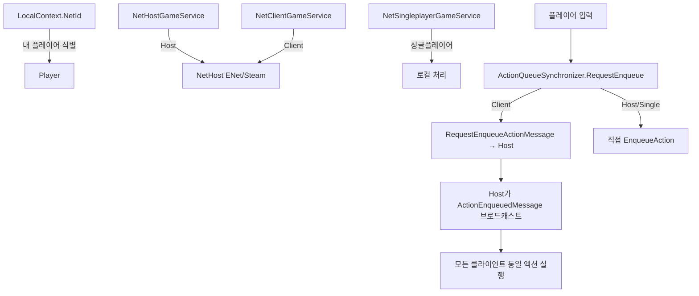
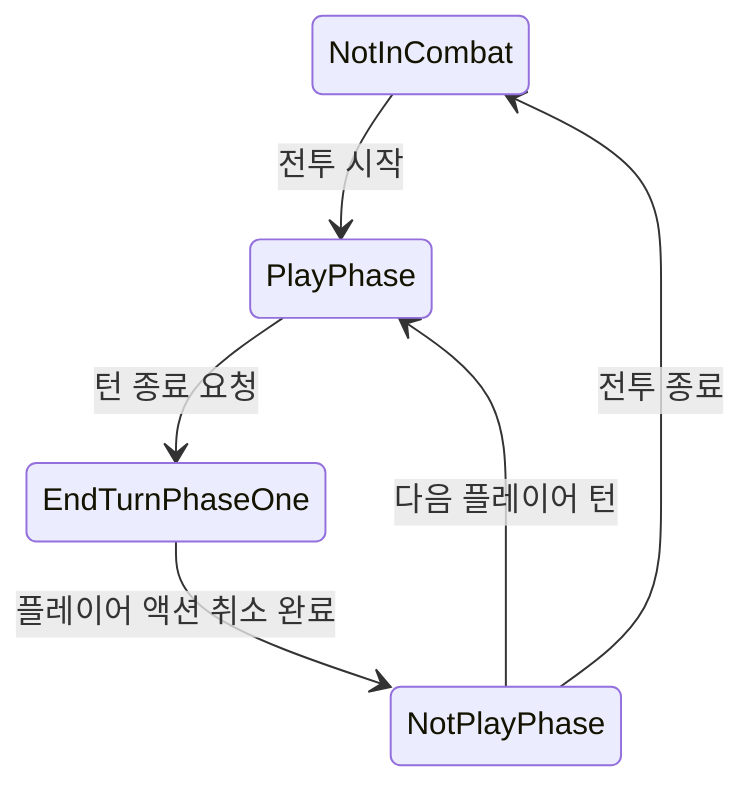

# 17. 멀티플레이어 (Multiplayer)

#sts2 #godot #multiplayer #networking

STS2는 Host/Client 모델의 P2P 멀티플레이어를 지원한다. ENet(직접 연결)과 Steam 릴레이 두 가지 트랜스포트를 사용하며, 모든 플레이어 액션은 NetAction으로 직렬화되어 호스트를 통해 동기화된다.

---

## 전체 아키텍처



---

## LocalContext — 로컬 플레이어 식별

```csharp
// F:/Projects/godot_study/extracted/src/Core/Context/LocalContext.cs
public static class LocalContext
{
    // 현재 기기의 플레이어 NetId (ulong)
    public static ulong? NetId { get; set; }

    // 다양한 컬렉션에서 "나" 찾기
    public static Player? GetMe(CombatState? combatState) { ... }
    public static bool IsMe(Player? player) => player?.NetId == NetId;
    public static bool IsMine(CardModel? card) => IsMe(card?.Owner);
    public static bool IsMine(RelicModel? relic) => IsMe(relic?.Owner);
}
```

**핵심 패턴:** UI에서 "내 카드만 조작 가능"을 체크할 때 사용:
```csharp
if (LocalContext.IsMine(card))
    EnableCardInteraction(card);
```

---

## NetGameType — 서비스 타입

| 타입 | 설명 |
|------|------|
| `Singleplayer` | 멀티플레이어 없음, 직접 처리 |
| `Host` | 서버 역할, 모든 액션을 중재 |
| `Client` | 클라이언트, 호스트에 요청 전송 |

---

## INetAction — 액션 직렬화 인터페이스

```csharp
// F:/Projects/godot_study/extracted/src/Core/GameActions/Multiplayer/INetAction.cs
[GenerateSubtypes]  // 소스 제너레이터로 서브타입 목록 자동 생성
public interface INetAction : IPacketSerializable
{
    GameAction ToGameAction(Player player);
}
```

### 지원되는 NetAction 타입 (INetActionSubtypes.cs)

```csharp
// 11가지 네트워크 액션 타입
NetConsoleCmdGameAction       // 디버그 콘솔 명령
NetDiscardPotionGameAction    // 포션 버리기
NetEndPlayerTurnAction        // 턴 종료
NetMoveToMapCoordAction       // 맵 이동
NetPickRelicAction            // 유물 선택
NetPlayCardAction             // 카드 플레이
NetReadyToBeginEnemyTurnAction // 적 턴 시작 준비 완료
NetUndoEndPlayerTurnAction    // 턴 종료 취소
NetUsePotionAction            // 포션 사용
NetVoteForMapCoordAction      // 맵 좌표 투표
NetVoteToMoveToNextActAction  // 다음 Act 이동 투표
```

---

## ActionQueueSynchronizer — 액션 동기화 핵심

```csharp
// F:/Projects/godot_study/extracted/src/Core/GameActions/Multiplayer/ActionQueueSynchronizer.cs
public void RequestEnqueue(GameAction action)
{
    // 적 턴 중 카드 플레이 시도 → 플레이어 턴까지 지연
    if (action.ActionType == GameActionType.CombatPlayPhaseOnly 
        && CombatState == ActionSynchronizerCombatState.NotPlayPhase)
    {
        _requestedActionsWaitingForPlayerTurn.Add(action);
        return;
    }

    switch (_netService.Type)
    {
        case NetGameType.Client:
            // 호스트에 요청 전송
            _netService.SendMessage(new RequestEnqueueActionMessage {
                action = action.ToNetAction(),
                location = _messageBuffer.CurrentLocation
            });
            break;
        case NetGameType.Singleplayer:
        case NetGameType.Host:
            // 직접 처리 + (Host면 클라이언트에 브로드캐스트)
            EnqueueAction(action, _netService.NetId);
            break;
    }
}
```

### 전투 상태 머신



---

## NetMessageBus — 메시지 버스

```csharp
// F:/Projects/godot_study/extracted/src/Core/Multiplayer/NetMessageBus.cs
public class NetMessageBus
{
    // 직렬화: 메시지 타입 ID(1byte) + 발신자ID(ulong) + 페이로드
    public byte[] SerializeMessage<T>(ulong senderId, T message, out int length)
    {
        _writer.WriteByte((byte)message.ToId());
        _writer.WriteULong(senderId);
        message.Serialize(_writer);
        ...
    }

    // 등록/해제 패턴
    public void RegisterMessageHandler<T>(MessageHandlerDelegate<T> handler) { ... }
    public void UnregisterMessageHandler<T>(MessageHandlerDelegate<T> handler) { ... }
}
```

> [!note] 타입 안전 핸들러: `RegisterMessageHandler<SyncPlayerDataMessage>(OnReceived)`
> 내부적으로 타입별 List로 관리하며, 동일 메시지에 복수 핸들러 등록 가능

---

## CombatStateSynchronizer — 전투 시작 전 상태 동기화

멀티플레이어 전투 시작 전, 모든 플레이어의 덱/유물/RNG 상태를 동기화:

```csharp
// F:/Projects/godot_study/extracted/src/Core/Multiplayer/CombatStateSynchronizer.cs
public void StartSync()
{
    // 1. 내 플레이어 데이터를 직렬화해서 브로드캐스트
    SyncPlayerDataMessage msg = new() { player = LocalContext.GetMe(_runState).ToSerializable() };
    _netService.SendMessage(msg);

    // 2. Host만 RNG 시드를 브로드캐스트 (RNG 동기화의 핵심)
    if (_netService.Type == NetGameType.Host)
    {
        _netService.SendMessage(new SyncRngMessage { rng = _runState.Rng.ToSerializable() });
    }
}

public async Task WaitForSync()
{
    // 모든 플레이어 데이터 수신 대기
    await _syncCompletionSource.Task;

    // Client는 Host의 RNG로 덮어씀 (결정론적 보장)
    if (_netService.Type != NetGameType.Host)
        _runState.Rng.LoadFromSerializable(_rngSet);
}
```

**연결 끊김 처리:** 플레이어가 도중에 연결 끊기면 `OnPeerDisconnected`에서 해당 플레이어를 제외하고 동기화 완료 처리.

---

## PlayerChoiceContext — 플레이어 선택 대기

카드 선택, 유물 선택 등 플레이어 입력이 필요한 순간을 추상화:

```csharp
// F:/Projects/godot_study/extracted/src/Core/GameActions/Multiplayer/PlayerChoiceContext.cs
public abstract class PlayerChoiceContext
{
    // 현재 관련된 Model 스택 (카드 → 유물 → 이벤트 등 중첩 가능)
    public AbstractModel? LastInvolvedModel { get; }
    public void PushModel(AbstractModel model) { ... }
    public void PopModel(AbstractModel model) { ... }

    // 선택 시작/종료 신호 (async/await 기반)
    public abstract Task SignalPlayerChoiceBegun(PlayerChoiceOptions options);
    public abstract Task SignalPlayerChoiceEnded();
}
```

구현체:
- `BlockingPlayerChoiceContext` — 로컬 선택이 완료될 때까지 블로킹
- `HookPlayerChoiceContext` — 훅 기반 선택
- `ThrowingPlayerChoiceContext` — 테스트/예외 상황용

---

## Hook 액션 동기화

유물, 파워 등의 훅에서 발생하는 액션도 동기화 필요:

```csharp
// Hook 액션은 ID로 식별 (양쪽이 같은 ID를 받아야 함)
GenericHookGameAction hook = synchronizer.GenerateHookAction(ownerId, actionType);
synchronizer.RequestEnqueueHookAction(hook);

// 내부: Host가 hookActionId를 포함한 메시지를 브로드캐스트
// 클라이언트는 같은 ID로 자신의 훅 액션을 찾거나 새로 생성
```

---

## 네트워크 토폴로지 & 타임아웃

```csharp
// NetConst.cs
public const int timeoutMsec = 20000; // 20초 타임아웃
```

트랜스포트:
- **ENet**: 직접 P2P, 포트 포워딩 필요
- **Steam**: `SteamHost` / `SteamClient`, Steam 릴레이 서버 사용

멀티플레이어 전용 UI: `scenes/ui/multiplayer_timeout_overlay.tscn`, `scenes/ui/multiplayer_vote_container.tscn`

---

## 좀슐랭에 적용한다면

> [!note] 좀슐랭 멀티플레이어 설계

**좀슐랭은 협동 생존 경영**이므로 STS2의 멀티플레이어 패턴이 직접 적용 가능하다.

**필요한 동기화 대상:**
```
STS2 NetAction          → 좀슐랭 동등체
NetPlayCardAction       → NetCookRecipeAction (레시피 요리)
NetEndPlayerTurnAction  → NetEndDayAction (하루 종료)
NetMoveToMapCoordAction → NetMoveToZoneAction (구역 이동)
NetPickRelicAction      → NetPickEquipmentAction (장비 선택)
```

**GDScript 간략 구현 방향:**
```gdscript
# Godot 내장 멀티플레이어 (ENetMultiplayerPeer) 활용
# STS2의 Host/Client 패턴과 동일한 구조

func request_cook_recipe(recipe_id: String) -> void:
    if multiplayer.is_server():
        _execute_cook_recipe(recipe_id, multiplayer.get_unique_id())
    else:
        _rpc_request_cook.rpc_id(1, recipe_id)  # 서버에 요청

@rpc("any_peer", "call_local", "reliable")
func _rpc_request_cook(recipe_id: String) -> void:
    if multiplayer.is_server():
        _broadcast_cook_recipe.rpc(recipe_id, multiplayer.get_remote_sender_id())

@rpc("authority", "call_local", "reliable")
func _broadcast_cook_recipe(recipe_id: String, player_id: int) -> void:
    _execute_cook_recipe(recipe_id, player_id)
```

**주의:** 싱글플레이어도 동일한 코드 경로를 사용해야 나중에 멀티 추가가 쉽다 (STS2의 `NetSingleplayerGameService` 패턴).
