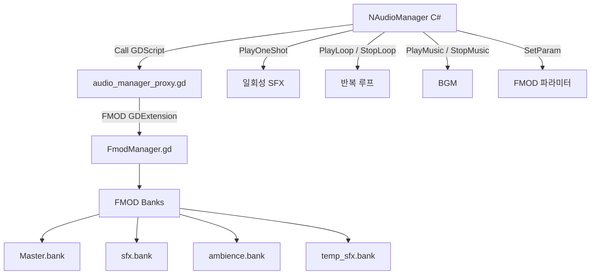

# 19. 오디오/VFX (Audio & Visual Effects)

#sts2 #godot #audio #vfx #fmod #spine

STS2는 FMOD 미들웨어 오디오, Spine 골격 애니메이션, 커맨드 기반 VFX 시스템, 그리고 NScreenShake/NHitStop 피드백 이펙트를 조합해 게임 피드백을 구현한다.

---

## 오디오 아키텍처 개요



---

## FMOD 통합 구조

```
addons/fmod/
├── FmodManager.gd       ← FMOD API 래퍼 (GDScript)
├── FmodPlugin.gd        ← Godot 에디터 플러그인
├── fmod.gdextension     ← GDExtension 바인딩 정의
├── libs/                ← 플랫폼별 fmod 바이너리
└── tool/                ← 에디터 도구
```

FMOD는 GDExtension으로 Godot에 통합된다. C# 코드는 GDScript `Proxy`를 통해 간접 호출한다.

**뱅크 로딩 (game.tscn):**
```
FmodBankLoader 노드:
  bank_paths = [
    "res://banks/desktop/Master.strings.bank",
    "res://banks/desktop/Master.bank",
    "res://banks/desktop/sfx.bank",
    "res://banks/desktop/temp_sfx.bank",
    "res://banks/desktop/ambience.bank"
  ]
```

---

## NAudioManager — C# 오디오 인터페이스

```csharp
// F:/Projects/godot_study/extracted/src/Core/Nodes/Audio/NAudioManager.cs
public partial class NAudioManager : Node
{
    public static NAudioManager? Instance => NGame.Instance?.AudioManager;

    // 일회성 효과음 재생
    public void PlayOneShot(string path, float volume = 1f) { ... }
    public void PlayOneShot(string path, Dictionary<string, float> parameters, float volume) { ... }

    // 루프 사운드
    public void PlayLoop(string path, bool usesLoopParam) { ... }
    public void StopLoop(string path) { ... }
    public void StopAllLoops() { ... }

    // BGM
    public void PlayMusic(string music) { ... }
    public void StopMusic() { ... }

    // FMOD 파라미터 (인터랙티브 뮤직)
    public void SetParam(string path, string param, float value) { ... }
    public void UpdateMusicParameter(string parameter, string value) { ... }

    // 볼륨 (제곱 스케일: 선형 → 지각적)
    public void SetMasterVol(float volume) => _audioNode.Call(_setMasterVolume, Mathf.Pow(volume, 2f));
    public void SetSfxVol(float volume) => _audioNode.Call(_setSfxVolume, Mathf.Pow(volume, 2f));
    public void SetBgmVol(float volume) => _audioNode.Call(_setBgmVolume, Mathf.Pow(volume, 2f));
}
```

> [!note] 볼륨은 `volume^2` 변환을 통해 사용자가 느끼는 선형 감쇠를 구현한다.

**C# → GDScript 브릿지 패턴:**
```csharp
// StringName으로 GDScript 메서드 호출 (리플렉션 오버헤드 최소화)
private static readonly StringName _playOneShot = new StringName("play_one_shot");
_audioNode.Call(_playOneShot, path, dictionary, volume);
```

---

## MegaSpine — Spine 애니메이션 바인딩

```csharp
// F:/Projects/godot_study/extracted/src/Core/Bindings/MegaSpine/MegaSprite.cs
public class MegaSprite : MegaSpineBinding
{
    // SpineSprite GDExtension 노드를 C#에서 래핑
    protected override string SpineClassName => "SpineSprite";

    // 주요 메서드
    public MegaAnimationState GetAnimationState() { ... }
    public MegaSkeleton GetSkeleton() { ... }
    public bool HasAnimation(string animId) { ... }
    public MegaSkin NewSkin(string name) { ... }
    public void SetSkeletonDataRes(MegaSkeletonDataResource skeletonData) { ... }

    // 시그널 연결
    public Error ConnectAnimationStarted(Callable callable) => Connect("animation_started", callable);
    public Error ConnectAnimationCompleted(Callable callable) => Connect("animation_completed", callable);
    public Error ConnectAnimationInterrupted(Callable callable) => Connect("animation_interrupted", callable);
    // + ended, disposed, event, before_update, before_apply, world_transforms 등
}
```

**Spine 클래스 계층:**
```
MegaSpineBinding (기반 래퍼)
└── MegaSprite (SpineSprite 노드)
    ├── MegaAnimationState  ← 애니메이션 상태 머신
    ├── MegaSkeleton        ← 뼈대 접근
    ├── MegaTrackEntry      ← 개별 애니메이션 트랙
    ├── MegaBone            ← 개별 본 제어
    ├── MegaSkin            ← 스킨 (캐릭터 외형)
    └── MegaAnimation       ← 애니메이션 정의
```

---

## CreatureAnimator — 상태 머신 기반 애니메이터

```csharp
// F:/Projects/godot_study/extracted/src/Core/Animation/CreatureAnimator.cs
public class CreatureAnimator
{
    // 애니메이션 트리거 상수
    public const string idleTrigger   = "Idle";
    public const string attackTrigger = "Attack";
    public const string castTrigger   = "Cast";
    public const string deathTrigger  = "Dead";
    public const string hitTrigger    = "Hit";
    public const string reviveTrigger = "Revive";

    public void SetTrigger(string trigger)
    {
        // AnyState 전환 우선 체크 → 현재 상태 전환 체크
        AnimState nextState = _anyState.CallTrigger(trigger)
                           ?? _currentState.CallTrigger(trigger);
        if (nextState != null) SetNextState(nextState);
    }

    private void SetNextState(AnimState state)
    {
        _spineController.GetAnimationState().SetAnimation(state.Id, state.IsLooping);
        // 루프 애니메이션: 시간 오프셋 랜덤화 (동기화 방지)
        if (state.IsLooping) OffsetLoopingAnimation(track);
    }
}
```

**루프 애니메이션 분산:**
```csharp
// 같은 캐릭터 여러 마리가 완전히 동기화되어 움직이지 않도록
private void OffsetLoopingAnimation(MegaTrackEntry track)
{
    track.SetTimeScale(Rng.Chaotic.NextFloat(0.9f, 1.1f));  // 속도 ±10%
    float end = track.GetAnimationEnd();
    track.SetTrackTime((end + Rng.Chaotic.NextFloat(-0.1f, 0.1f)) % end);
}
```

**Idle 초기화:**
```csharp
// Idle 상태로 시작 시 랜덤 시작 위치 (모두 같은 포즈 방지)
if (initialState.Id == "idle_loop")
{
    MegaTrackEntry current = animationState.GetCurrent(0);
    current.SetTrackTime(Rng.Chaotic.NextFloat(current.GetAnimationEnd()));
}
```

---

## NScreenShake — 화면 흔들림

```csharp
// F:/Projects/godot_study/extracted/src/Core/Nodes/Vfx/Utilities/NScreenShake.cs
public partial class NScreenShake : Node
{
    // 강도 레벨: VeryWeak(2), Weak(5), Medium(20), Strong(40), TooMuch(80) px
    // 지속 시간: Short(0.3s), Normal(0.8s), Long(1.2s), Forever(999999s)

    public void Shake(ShakeStrength strength, ShakeDuration duration, float degAngle)
    {
        _shakeInstance = new ScreenPunchInstance(_strength[strength] * _multiplier, ...);
    }

    public void Rumble(ShakeStrength strength, ShakeDuration duration, RumbleStyle style)
    {
        _rumbleInstance = new ScreenRumbleInstance(...);
    }

    public void AddTrauma(ShakeStrength strength)
    {
        _traumaRumble.AddTrauma(strength);  // 트라우마 누적 방식
    }

    public override void _Process(double delta)
    {
        // Punch + Rumble + Trauma 합산 → 타겟 Control 위치 오프셋
        Vector2 offset = _rumbleInstance?.Update(delta) + _shakeInstance?.Update(delta)
                       + _traumaRumble.Update(delta);
        _shakeTarget.Position = _originalTargetPosition + offset;
    }
}
```

**3가지 흔들림 타입:**
- `Punch` — 단방향 충격 후 복귀 (타격감)
- `Rumble` — 진동 스타일별 흔들림
- `Trauma` — 누적 트라우마 기반 (데미지 중첩 등)

---

## NHitStop — 히트스톱 (시간 정지)

```csharp
// F:/Projects/godot_study/extracted/src/Core/Nodes/Vfx/Utilities/NHitStop.cs
public partial class NHitStop : Node
{
    public void DoHitStop(ShakeStrength strength, ShakeDuration duration)
    {
        // 이전 히트스톱 취소 후 새로 시작
        _cancelToken?.Cancel();
        _cancelToken = new CancellationTokenSource();
        TaskHelper.RunSafely(HitStopTask(EaseForStrength(strength), SecondsForDuration(duration)));
    }

    private async Task HitStopTask(Ease.Functions easing, float seconds)
    {
        Engine.SetTimeScale(0.1f);   // 순간 0.1x 슬로우모션
        float timer = 0f;
        while (timer <= seconds)
        {
            await GetTree().ToSignal(GetTree(), SceneTree.SignalName.ProcessFrame);
            float t = Ease.Interpolate(timer / seconds, easing);
            Engine.SetTimeScale(Mathf.Min(0.1f + t * 0.9f, 1f));  // 서서히 복귀
            timer += ...(실제 경과시간);
        }
        Engine.SetTimeScale(1f);
    }

    // 강도별 이징: VeryWeak=CircIn, Weak=SineIn, Medium=QuadIn, Strong=QuartIn, TooMuch=ExpoIn
    // 지속시간: Short=0.15s, Normal=0.3s, Long=0.6s
}
```

> [!note] `Engine.SetTimeScale()`을 사용하므로 전체 게임이 슬로우됨. Physics도 영향받음.

---

## VFX 씬 구조

```
scenes/vfx/
├── vfx_attack_slash.tscn    ← 베기 공격
├── vfx_attack_blunt.tscn    ← 타격 공격
├── vfx_attack_lightning.tscn
├── vfx_block.tscn           ← 블록
├── vfx_block_broken.tscn    ← 블록 파괴
├── vfx_damage_num.tscn      ← 데미지 숫자 팝업
├── vfx_heal_num.tscn        ← 힐 숫자 팝업
├── vfx_card_fly.tscn        ← 카드 날아가기
├── vfx_card_upgrade.tscn    ← 카드 업그레이드
├── vfx_monster_death.tscn   ← 몬스터 사망
├── vfx_power_up/            ← 파워 획득 이펙트
├── vfx_coin_explosion_*.tscn ← 골드 획득 (크기별)
├── whole_screen/            ← 전체화면 이펙트
└── templates/               ← VFX 템플릿
```

**커맨드 패턴 VFX:**
VFX는 GameAction 실행 중 SfxCmd/VfxCmd 형태로 큐에 쌓이고 순서대로 재생된다. 이는 STS2 커맨드 시스템 (`03-Command-System.md`)과 연동된다.

---

## 애니메이션 이벤트 시스템

Spine 애니메이션에서 특정 프레임에 이벤트를 발생시켜 코드 콜백 연동:

```csharp
// MegaSprite.ConnectAnimationEvent 로 등록
_spineController.ConnectAnimationEvent(
    Callable.From<GodotObject, GodotObject, GodotObject>(OnSpineEvent)
);

// 예: 공격 애니메이션의 임팩트 프레임에서 "hit" 이벤트 발생
// → OnSpineEvent에서 VFX 재생, SFX 트리거, 데미지 처리
```

---

## 좀슐랭에 적용한다면

> [!note] 좀슐랭 오디오/VFX 설계

**오디오 (간단한 시작):**
```gdscript
# FMOD 없이 시작 → Godot 기본 AudioStreamPlayer 사용
class_name AudioManager extends Node

static var instance: AudioManager

func play_sfx(path: String, volume_db: float = 0.0) -> void:
    var player = AudioStreamPlayer.new()
    player.stream = load(path)
    player.volume_db = volume_db
    add_child(player)
    player.play()
    player.finished.connect(player.queue_free)

func play_bgm(path: String) -> void:
    $BGMPlayer.stream = load(path)
    $BGMPlayer.play()
```

**히트스톱 패턴 (그대로 차용):**
```gdscript
# NHitStop 패턴 → GDScript 변환
func do_hit_stop(duration: float = 0.15) -> void:
    Engine.time_scale = 0.1
    await get_tree().create_timer(duration, false, false, true).timeout
    # true = ignore_time_scale → 슬로우모션 중에도 타이머 동작
    Engine.time_scale = 1.0
```

**화면 흔들림:**
```gdscript
# NScreenShake 패턴
@export var shake_camera: Camera2D
func shake(strength: float, duration: float) -> void:
    var tween = create_tween()
    var origin = shake_camera.offset
    for i in range(int(duration / 0.05)):
        tween.tween_property(shake_camera, "offset",
            origin + Vector2(randf_range(-strength, strength),
                           randf_range(-strength, strength)), 0.05)
    tween.tween_property(shake_camera, "offset", origin, 0.1)
```

**VFX 우선순위:**
1. 숫자 팝업 (데미지, 골드 획득)
2. 히트 이펙트 (요리 성공/실패)
3. 화면 흔들림 (좀비 공격)
4. 카드/레시피 날아가기 이펙트
5. Spine 애니메이션 (여유 있을 때)

**MegaSpine 대신:** 초기에는 Godot AnimationPlayer + SpriteFrames로도 충분. 고품질 골격 애니메이션이 필요하면 Spine GDExtension을 STS2와 동일하게 통합 가능.
