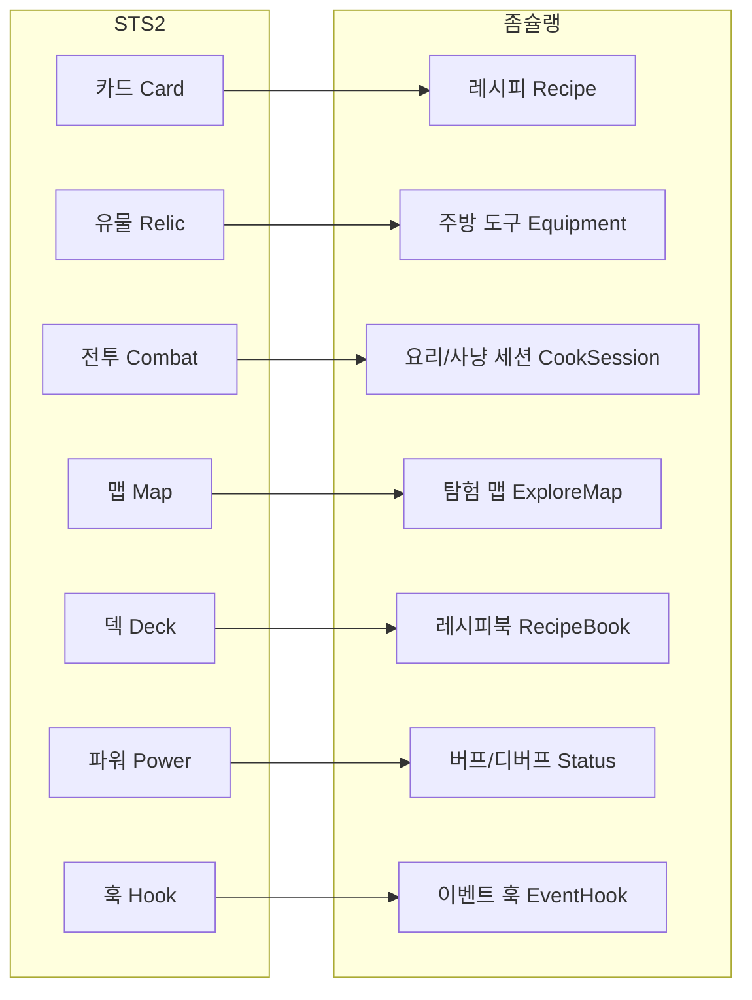

# 20. 좀슐랭에 적용하기 — STS2 아키텍처 실전 가이드

#sts2 #godot #zombchelin #roguelike #practical

> **좀슐랭**: 좀비를 재료로 사냥하고 요리하는 생존 경영 로그라이크.
> STS2의 5년치 아키텍처 결정을 이해하고, 내 게임에 맞게 변환하는 실전 가이드.

---

## STS2 → 좀슐랭 핵심 매핑



---

## 1. STS2 아키텍처에서 빌려올 핵심 패턴

### 1-1. Model-Command-Hook 삼위일체

STS2의 가장 중요한 아키텍처 결정. 좀슐랭에 그대로 적용:

```
STS2 패턴                    좀슐랭 적용
─────────────────────────    ──────────────────────────────
AbstractModel (순수 데이터)  → RecipeModel, ZombieModel, EquipmentModel
GameAction (실행 단위)       → CookAction, HuntAction, ServeAction
Hook (반응 시스템)           → OnBeforeCook, OnZombieKill, OnDishServed
```

**왜 이 패턴인가?**
- 모델은 순수 데이터 → 저장/로드/직렬화가 쉽다
- 액션은 실행 단위 → 멀티플레이어 동기화, 언두가 쉽다
- 훅은 반응 → 도구/스킬 효과를 카드/유물 코드 수정 없이 추가 가능

### 1-2. AbstractModel 패턴

```gdscript
# GDScript 버전의 AbstractModel
class_name BaseModel extends Resource

var id: StringName       # 고유 식별자 (레지스트리 키)
var is_mutable: bool     # 런타임 인스턴스(true) vs 정적 정의(false)

# 런타임 인스턴스화 패턴
static func create_instance(definition: BaseModel) -> BaseModel:
    var inst = definition.duplicate()
    inst.is_mutable = true
    return inst
```

### 1-3. Hook 시스템 (이벤트 반응)

```gdscript
# STS2 Hook 패턴 → GDScript 변환
class_name HookManager extends Node

# 훅 타입 열거
enum HookType {
    ON_BEFORE_COOK,
    ON_COOK_COMPLETE,
    ON_ZOMBIE_KILL,
    ON_DISH_SERVED,
    ON_DAY_START,
    ON_DAY_END,
}

var _hooks: Dictionary = {}  # HookType → Array[Callable]

func register(type: HookType, callback: Callable) -> void:
    if not _hooks.has(type):
        _hooks[type] = []
    _hooks[type].append(callback)

func fire(type: HookType, context: Dictionary = {}) -> void:
    for callback in _hooks.get(type, []):
        callback.call(context)
```

**사용 예:**
```gdscript
# 도마 장비: 요리 시 재료 1개 추가
func _on_equipped() -> void:
    HookManager.register(HookType.ON_BEFORE_COOK, _add_ingredient_hook)

func _add_ingredient_hook(ctx: Dictionary) -> void:
    ctx.recipe.add_ingredient("random_zombie_part")
```

---

## 2. GDScript로 시작할 때 C# 패턴 변환

### 2-1. 정적 클래스 → Autoload 싱글턴

```
C# (STS2)                    GDScript (좀슐랭)
─────────────────────────    ──────────────────────────
static class ModManager      Autoload: ModManager.gd
static class LocalContext    Autoload: LocalContext.gd
NModalContainer.Instance     Autoload: ModalManager.gd
NAudioManager.Instance       Autoload: AudioManager.gd
```

```gdscript
# Project Settings → Autoload에 등록
# audio_manager.gd
extends Node
static var instance: AudioManager  # 전역 접근

func _ready() -> void:
    instance = self
```

### 2-2. interface → duck typing 또는 class_name 상속

```gdscript
# STS2: interface IHoverTip
# GDScript: 공통 base class 사용

class_name HoverTipBase extends Resource
var title: String
var description: String
var icon: Texture2D

# 구현체
class_name RecipeHoverTip extends HoverTipBase
var ingredients: Array[String]
var cook_time: float
```

### 2-3. async/await → await + Signal

```gdscript
# STS2: async Task FadeOut()
# GDScript: await를 Signal과 함께

func fade_out(duration: float = 0.8) -> void:
    var tween = create_tween()
    tween.tween_property(self, "modulate:a", 0.0, duration)
    await tween.finished  # STS2의 await ToSignal과 동일

# 호출부
await transition.fade_out()
load_next_scene()
await transition.fade_in()
```

### 2-4. LINQ → Array 메서드 체인

```gdscript
# C#: loadedMods.Where(m => m.affectsGameplay).Select(m => m.id).ToList()
# GDScript:
var gameplay_mod_ids = loaded_mods \
    .filter(func(m): return m.affects_gameplay) \
    .map(func(m): return m.id)
```

---

## 3. 핵심 시스템 매핑 상세

### 3-1. 카드 → 레시피

```
STS2 CardModel              좀슐랭 RecipeModel
─────────────────────────   ──────────────────────────────
cost (스타 코스트)          → cook_time (요리 시간, 액션 포인트)
cardType (공격/스킬/파워)   → recipe_type (요리/가공/특수)
upgrade()                   → upgrade() (레시피 숙련도 향상)
exhaust (소모)              → one_time_dish (1회용 특수 요리)
retain (유지)               → prep_ahead (사전 준비)
CardPool (카드 풀)          → RecipePool (레시피 풀)
```

```gdscript
class_name RecipeModel extends BaseModel

enum RecipeType { COOK, PROCESS, SPECIAL }

@export var cook_time: int = 1       # STS2 cost
@export var recipe_type: RecipeType
@export var ingredients: Array[StringName]  # 필요 재료 종류
@export var is_one_time: bool        # STS2 exhaust
@export var prep_ahead: bool         # STS2 retain
@export var description: String

# STS2 applyPowers() 패턴
func execute(cook_session: CookSession) -> void:
    HookManager.fire(HookType.ON_BEFORE_COOK, {"recipe": self, "session": cook_session})
    _apply_effects(cook_session)
    HookManager.fire(HookType.ON_COOK_COMPLETE, {"recipe": self, "session": cook_session})
```

### 3-2. 전투 → 요리/사냥 세션

```
STS2 CombatState            좀슐랭 CookSession
─────────────────────────   ──────────────────────────────
player HP                   → 주방 내구도 / 셰프 체력
monster HP                  → 좀비 HP (사냥) / 요리 난이도
block                       → 위생도 (피해 경감)
player hand                 → 현재 사용 가능 레시피
energy (코스트)             → 액션 포인트 (AP)
end turn                    → 요리 완성 / 다음 라운드
monster intent              → 좀비 다음 행동 예고
```

### 3-3. 유물 → 장비/도구

```
STS2 RelicModel             좀슐랭 EquipmentModel
─────────────────────────   ──────────────────────────────
counter (카운터)            → durability (내구도)
onEquip()                   → on_equipped()
onUnequip()                 → on_unequipped()
RelicPool (희귀도별)        → EquipmentPool (일반/희귀/전설)
```

```gdscript
class_name EquipmentModel extends BaseModel

@export var durability: int = -1  # -1 = 무한
@export var rarity: int           # 0=일반, 1=희귀, 2=전설

func on_equipped(session: CookSession) -> void:
    HookManager.register(HookType.ON_BEFORE_COOK, _apply_bonus)
    pass

func on_unequipped() -> void:
    # 훅 해제
    pass
```

### 3-4. 맵 → 탐험 맵

```
STS2 MapNode                좀슐랭 ExploreNode
─────────────────────────   ──────────────────────────────
MONSTER (일반 전투)         → ZOMBIE_HUNT (좀비 사냥)
ELITE (엘리트)              → BOSS_ZOMBIE (보스 좀비)
BOSS                        → MEGA_BOSS
EVENT                       → SURVIVOR (생존자 이벤트)
SHOP (상점)                 → BLACK_MARKET (암시장)
REST (휴식)                 → SAFEHOUSE (안전가옥)
TREASURE (보물)             → SUPPLY_DROP (보급품)
```

---

## 4. AI에게 효율적으로 작업시키는 프롬프트 구조

### 4-1. 컨텍스트 제공 템플릿

AI에게 코드 작성을 요청할 때 항상 이 정보를 포함:

```
[게임 컨텍스트]
- 장르: 좀비 요리 생존 경영 로그라이크
- 엔진: Godot 4.x + GDScript
- 현재 구현된 시스템: (목록)
- STS2 패턴 참조: (해당 문서 번호)

[기존 코드 구조]
- BaseModel 클래스: (코드 스니펫)
- HookManager: (인터페이스)
- 현재 RecipeModel: (코드)

[구현 요청]
- 무엇: CookingBenchEquipment (요리대 장비)
- 효과: 요리 시 랜덤 재료 1개 추가
- 연결: ON_BEFORE_COOK 훅에 등록

[제약 조건]
- 기존 패턴 유지 (HookManager 사용)
- 새 Autoload 추가 금지
- GDScript만 (C# 아님)
```

### 4-2. 디버깅 요청 템플릿

```
[버그 상황]
- 어떤 상황에서: 레시피를 2번 연속 사용할 때
- 기대 동작: 재료가 2번 소모되어야 함
- 실제 동작: 1번만 소모됨

[관련 코드]
(코드 붙여넣기)

[이미 시도한 것]
- print 디버그로 확인한 것
- 시도했지만 실패한 수정
```

### 4-3. 문서 분석 요청 템플릿

```
STS2 소스코드 분석 요청:
파일: F:/Projects/godot_study/extracted/src/Core/[경로]

분석 목표:
1. 이 시스템이 하는 일
2. 좀슐랭의 [시스템명]에 적용 가능한 패턴
3. GDScript로 변환 시 주의사항

관련 문서: [[16-Modding-System]] (참고 패턴)
```

---

## 5. 추천 개발 순서

### Phase 1: 프로토타입 (2~4주)

목표: 핵심 게임 루프 검증. 아트/폴리시 없어도 됨.

```
Week 1: 데이터 구조
  [ ] BaseModel, RecipeModel, ZombieModel 기본 구조
  [ ] RecipePool (카드 풀 대응)
  [ ] HookManager 기본 구현

Week 2: 전투/요리 루프
  [ ] CookSession (전투 상태 대응)
  [ ] 기본 액션 시스템 (레시피 사용, 턴 종료)
  [ ] 좀비 AI 기본 행동 (의도 시스템)

Week 3: 진행 구조
  [ ] 런 상태 (RunState) — 맵 위치, 재료, 장비
  [ ] 보상 화면 (레시피 선택)
  [ ] 게임 오버 / 승리 조건

Week 4: 피드백 & 검증
  [ ] 숫자 팝업 (데미지/골드)
  [ ] 기본 UI (HP, AP, 재료 표시)
  [ ] 밸런스 테스트
```

**프로토타입 완료 체크리스트:**
- [ ] 한 번의 요리 세션을 완주할 수 있다
- [ ] 레시피 선택이 의미있는 결정이다
- [ ] 장비(유물)가 플레이 스타일을 변화시킨다
- [ ] 10분 이내에 런을 완주 또는 실패할 수 있다

---

### Phase 2: MVP (6~12주)

목표: 실제로 재미있는 게임.

```
시스템
  [ ] 전체 맵 생성 (Act 구조)
  [ ] 이벤트 시스템 (텍스트 이벤트)
  [ ] 상점 (암시장)
  [ ] 저장/불러오기

콘텐츠
  [ ] 레시피 20~30개
  [ ] 좀비 타입 5~8개
  [ ] 장비 15~20개
  [ ] 이벤트 10개 이상

UX
  [ ] 화면 전환 (NTransition 패턴)
  [ ] 호버팁 (재료/레시피 설명)
  [ ] 설정 화면 (볼륨, 언어)
  [ ] 튜토리얼 첫 런
```

---

### Phase 3: 폴리시 (릴리즈 전)

```
비주얼
  [ ] 일관된 아트 스타일
  [ ] VFX (요리 이펙트, 타격감)
  [ ] 화면 흔들림, 히트스톱

오디오
  [ ] BGM (요리/전투/맵)
  [ ] SFX (칼질, 불꽃, 좀비 소리)

접근성
  [ ] 텍스트 크기 설정
  [ ] 컬러블라인드 모드
  [ ] 빠른 진행 모드 (STS2 FastMode 패턴)

안정성
  [ ] 크래시 없는 저장/불러오기
  [ ] 모든 런 시나리오 테스트
```

---

## 6. Godot에서 최소한 알아야 할 것 체크리스트

### 기본 (프로토타입 전에 필수)

- [ ] **노드 시스템**: Node 계층, _ready(), _process()
- [ ] **시그널**: emit_signal, connect, 커스텀 signal 선언
- [ ] **Resource**: @export, load(), preload()
- [ ] **씬 인스턴스화**: PackedScene.instantiate(), add_child()
- [ ] **Autoload**: Project Settings에서 등록, 전역 접근
- [ ] **Control 노드**: VBoxContainer, Label, Button, TextureRect
- [ ] **Tween**: 애니메이션 없이 부드러운 움직임

### 중급 (MVP 개발 중)

- [ ] **@export**: 에디터에서 데이터 편집
- [ ] **await**: 비동기 코드 흐름 제어
- [ ] **Groups**: 노드 그룹, call_group()
- [ ] **InputMap**: 인풋 액션 이름 → 코드 분리
- [ ] **FileAccess**: 세이브 파일 읽기/쓰기
- [ ] **JSON**: 직렬화/역직렬화

### 고급 (폴리시 단계)

- [ ] **ShaderMaterial**: 커스텀 비주얼 이펙트
- [ ] **AnimationPlayer**: 복잡한 시퀀스 애니메이션
- [ ] **MultiplayerAPI**: Godot 내장 멀티플레이어 (선택)
- [ ] **GDExtension**: C++ / C# 플러그인 통합 (Spine, FMOD 등)
- [ ] **UID 시스템**: res:// 경로 안정성

---

## 7. STS2에서 빌려오지 말아야 할 것

> [!warning] 복잡성 함정

| STS2 시스템 | 왜 지금은 불필요한가 |
|------------|-------------------|
| Harmony 패치 시스템 | 모딩 지원은 게임 완성 후 |
| CombatStateSynchronizer | 멀티플레이어 없이 시작 |
| NetMessageBus | 싱글플레이어로 먼저 완성 |
| AssemblyLoadContext | GDScript에서 불필요 |
| PCK 모딩 파이프라인 | MVP 이후 고려 |
| MultiplayerScalingModel | 처음부터 멀티 설계 불필요 |

**원칙**: STS2는 5년 프로젝트다. 1인 개발 첫 게임은 6개월 안에 플레이 가능해야 한다.

---

## 8. 최소 작동 코드 — 핵심 루프 GDScript 스켈레톤

```gdscript
# ===== recipe_model.gd =====
class_name RecipeModel extends Resource

@export var id: StringName
@export var display_name: String
@export var cook_time: int = 1
@export var ingredients: Array[StringName] = []
@export var description: String

func execute(session: CookSession) -> void:
    pass  # 서브클래스에서 구현


# ===== cook_session.gd =====
class_name CookSession extends RefCounted

var chef_hp: int = 50
var chef_max_hp: int = 50
var action_points: int = 3
var action_points_max: int = 3
var hand: Array[RecipeModel] = []
var draw_pile: Array[RecipeModel] = []
var discard_pile: Array[RecipeModel] = []
var active_zombie: ZombieModel = null

signal session_ended(victory: bool)

func play_recipe(recipe: RecipeModel) -> void:
    if action_points < recipe.cook_time:
        return
    action_points -= recipe.cook_time
    recipe.execute(self)
    hand.erase(recipe)
    discard_pile.append(recipe)

func end_turn() -> void:
    _zombie_act()
    action_points = action_points_max
    _draw_hand()

func _zombie_act() -> void:
    if active_zombie:
        var damage = active_zombie.get_attack()
        chef_hp -= damage
        if chef_hp <= 0:
            session_ended.emit(false)


# ===== hook_manager.gd (Autoload) =====
extends Node

enum Hook {
    BEFORE_COOK, AFTER_COOK,
    BEFORE_ZOMBIE_ATTACK, AFTER_ZOMBIE_ATTACK,
    ON_ZOMBIE_KILL, ON_DAY_END
}

var _listeners: Dictionary = {}

func register(hook: Hook, callback: Callable) -> void:
    if not _listeners.has(hook):
        _listeners[hook] = []
    _listeners[hook].append(callback)

func unregister(hook: Hook, callback: Callable) -> void:
    if _listeners.has(hook):
        _listeners[hook].erase(callback)

func fire(hook: Hook, ctx: Dictionary = {}) -> void:
    for cb in _listeners.get(hook, []):
        cb.call(ctx)
```

---

## 9. 핵심 요약

```
STS2에서 가져올 것 (중요도 순):
1. Model-Command-Hook 삼위일체 ★★★★★
2. 화면 전환 패턴 (NTransition) ★★★★
3. 모달/호버팁 UI 패턴 ★★★★
4. 히트스톱/화면흔들림 피드백 ★★★
5. 의존성 없는 순수 Model ★★★★★
6. Pool 기반 콘텐츠 관리 ★★★★
7. 저장 직렬화 패턴 ★★★★

나중에 추가할 것:
- 멀티플레이어 동기화
- 모딩 파이프라인
- Steam Workshop 연동
```

> [!note] 가장 중요한 한 가지
> STS2의 `AbstractModel`이 `IsMutable`로 정의(definition)와 인스턴스(instance)를 구분하는 패턴이 핵심이다. `RecipeDefinition`(에디터 데이터)과 `RecipeInstance`(런타임 복사본)를 처음부터 구분해두면, 나중에 저장/로드/멀티플레이어/모딩 모두 깔끔해진다.

---

## 관련 문서

- [[01-Project-Overview]] — STS2 전체 구조
- [[02-Model-System]] — AbstractModel 상세
- [[03-Command-System]] — 액션/커맨드 패턴
- [[07-Hook-System]] — 훅 시스템 상세
- [[12-Run-State-Management]] — 런 상태 관리
- [[16-Modding-System]] — 모딩 파이프라인
- [[17-Multiplayer]] — 멀티플레이어 동기화
- [[18-UI-Scene-Structure]] — UI 구조
- [[19-Audio-VFX]] — 오디오/VFX
