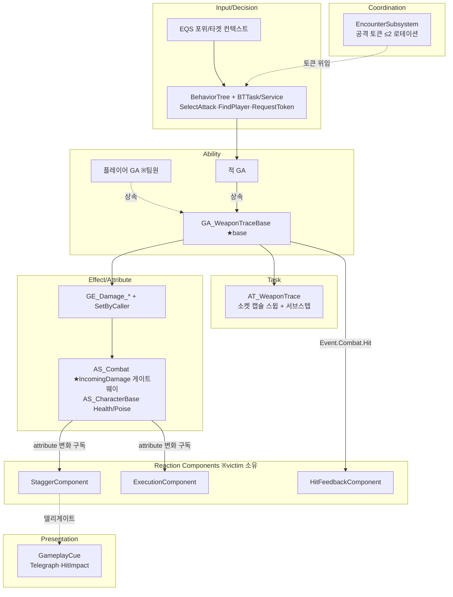
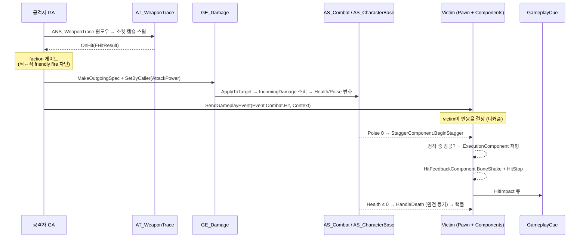

# ProjectKD — 전투 프레임워크 아키텍처

> **이 문서의 역할** — [[ProjectKD-담당작업-시스템정리]]가 "무엇을 만들었나"(기능별 케이스)라면, 이 문서는 **"어떤 구조로 짰나"**(레이어·의존성·데이터 흐름)와 **"어디까지가 내 저작인가"**(2인 페어 경계)를 정직하게 못 박는다.
> 면접에서 "이 시스템 설명해보세요"에 **말로** 답할 수 있게 하는 게 목적.

**엔진/스택** — UE5.6 · GAS(Ability/Tags/Tasks) · C++(헤더 설계 + 구현) · 데이터드리븐(DataAsset)
**한 줄 정체성** — **"전투 프레임워크를 설계하고, 그 위에서 팀원이 플레이어 어빌리티를 저작했다."**

---

## 1. 저작 경계 — 정직한 스코핑 (2인 페어)

> 면접 즉사 사유 1순위 = 남의 작업 클레임. 이 표가 내 클레임의 단일 진실.

| 레이어 | **내 저작 (전투 프레임워크 백본)** | 팀원 저작 (플레이어 콘텐츠/연출) |
|---|---|---|
| Ability | `GA_WeaponTraceBase`·`GA_ActionBase`·적 GA 전체 | 플레이어 어빌리티 GA(LightAttack/Heavy/Dodge/Parry…) |
| Task | `AT_WeaponTrace`(무기 캡슐 스윕) | — |
| Effect/Attr | `GE_Damage_*`·`GE_Stagger`·`AS_CharacterBase`·`AS_Combat` | `AS_Player`·플레이어 어빌리티 GE |
| Reaction | `StaggerComponent`·`ExecutionComponent`·`HitFeedbackComponent` | `ComboComponent`·`LockOnComponent` |
| AI | `EncounterSubsystem`·BT Task/Service·EQS·`EnemyAnimInstance` | — |
| Cue | `GCN_EnemyTelegraph`·`GCN_HitImpact_Light` | `GCN_ExecutionCamera`·`KDCinematicLibrary` |
| Anim Notify | `ANS_WeaponTrace`·`ANS_TelegraphWindow`·`ANS_WindupSlow`·`ANS_CancelWindow`(태그 기반 캔슬 토대) | `ANS_EnemyAttackWindow`·`ANS_MovementCancel`·`AN_WeaponAttach` |

> ⚠ **"적 몽타주에 올라간 노티파이 = 내 거" 아님.** `ANS_EnemyAttackWindow`는 적 몽타주가 *호스트*하지만, 그게 켜주는 건 **플레이어 퍼펙트닷지/패링 윈도우**라 저작·로직은 팀원.

### 처형 seam (면접 단골 — 정확히)
- **로직(언제 처형/생존·데스블로 분기) = 내 `ExecutionComponent`**
- **카메라 연출 큐 = 팀원 `GCN_ExecutionCamera`**
- 답변: *"분기 로직은 제 ExecutionComponent고, 카메라 큐는 팀원이 제 `OnExecutionBegin`/`OnExecutionResolved` 이벤트에 물려 만들었어요."* → 정직 + 디커플 설계 이해 동시 증명.

---

## 2. 레이어드 아키텍처 — 단방향 의존성

프레임워크의 핵심 규율은 **의존성 단방향 강제**(God-class·순환참조 방지). 위 레이어가 아래를 알지만, 아래는 위를 모른다.

**의존성 규칙 (CLAUDE.md §1-3, 코드로 강제):**

| 허용 | 금지 |
|---|---|
| Pawn → Component | Component → Pawn (Owner 캐스팅 ✗ → `IAbilitySystemInterface` 경유) |
| Component → ASC (읽기) | Component → Component (직접참조 ✗ → 델리게이트/메시지) |
| GA → ASC, GE | GA → Component (✗ → GameplayCue 경유) |
| GC → Component (위임만) | AS → 타 시스템 (✗ 데이터만) |

→ `StaggerComponent`·`ExecutionComponent`는 서로도, Pawn도 직접 참조하지 않는다. 통신은 전부 `State.Combat.Staggered` **태그 + 델리게이트**(`OnStaggerBegin`/`Recovered`/`ExecutionBegin`/`Resolved`). **직접 포인터 0개.**

---

## 3. 전투 데이터 흐름 — end-to-end

한 번의 피격이 입력에서 연출까지 어떻게 흐르는가. **디커플의 핵심: 공격자는 "맞았다"만 쏘고, 반응은 victim이 결정한다.**

**이 흐름이 증명하는 설계 가치:**
- **확장에 열림** — 새 victim(보스/신규 적)이 `Event.Combat.Hit`만 구독하면 반응 자동 합류. 공격자 코드 무변경.
- **per-faction은 분기 아니라 데이터** — `bOncePerActor` 등은 `if`가 아니라 **CDO 디폴트(생성자)**로 진영 차이 표현.
- **사망 = 완전 동기** — GE 적용 콜스택 *안에서* `HandleDeath`까지 실행(로그로 증명, 지연사망 가설 폐기). → 상세 [[ProjectKD-담당작업-시스템정리#4-사망-랙돌-처형-데스블로-사이클]]

---

## 4. "프레임워크 오너"의 증거 — 팀원 콘텐츠가 내 토대 위에 얹힌다

면접에서 가장 강한 정직한 클레임. **팀원의 플레이어 어빌리티는 내가 짠 베이스 없이는 동작하지 않는다:**

- 플레이어 어빌리티(팀원: LightAttack/Heavy/Dodge…) **→ 상속 →** `GA_PlayerAttackBase`(나, 진영 base) **→** `GA_WeaponTraceBase`(나): 트레이스 파이프라인·몽타주 태스크·히트 디스패치 전부 내 base 제공. 즉 팀원의 *구체* 어빌리티가 내 *진영 base + 코어 base* 두 층을 경유한다.
- 플레이어 데미지 **→** `AS_Combat`(나)의 `IncomingDamage` 게이트웨이로 들어옴
- 플레이어 피격 **→** 내 `Event.Combat.Hit` 파이프 + faction 게이팅을 탐
- 패링 판정 **→** 내 WeaponTrace 히트에 100% 게이팅됨 ([[ProjectKD-패링-기능명세서]])

→ **나 = 전투 프레임워크 설계자 / 팀원 = 그 위 플레이어 콘텐츠 저자.** 전투-시스템 프로그래머 포지션에서 이게 시니어 트랙 신호다.

---

## 5. 면접 1분 피치 (말로 풀기 드릴)

> 병목 = "말로 못 풀기". 외워서 입으로 나오게.

*"Project_KD에서 제 도메인은 전투 프레임워크였습니다. GAS 위에 WeaponTrace 타격판정을 base GA로 설계하고, 데미지는 AS_Combat의 IncomingDamage 게이트웨이로 일원화했어요. 핵심은 디커플인데 — 공격자는 'Event.Combat.Hit'으로 '맞았다'만 쏘고, 경직·처형·히트피드백 같은 반응은 victim 컴포넌트가 각자 구독해서 결정합니다. 덕분에 컴포넌트끼리 직접 참조가 0이고, 새 적을 붙여도 공격자 코드를 안 건드려요. 팀원이 만든 플레이어 어빌리티도 제 base GA를 상속하고 제 데미지 파이프를 타서, 사실상 제 프레임워크 위에서 굴러갑니다."*

꼬리질문 대비:
- **"왜 컴포넌트로 분리?"** → Pawn이 417줄로 커져서. 경직 상태머신·처형 사이클을 빼서 단위 테스트·재사용 가능하게. 통신은 태그+델리게이트.
- **"디커플 안 하면?"** → 공격 GA가 victim마다 if 분기로 반응을 알아야 함. 적 종류 늘 때마다 공격 코드 수정 → 결합 폭발.
- **"동시 공격자 제한은?"** → `EncounterSubsystem` 토큰 ≤2 + hold-time 로테이션. 안 그러면 군중이 한 번에 덤벼 난이도가 *수*로만 결정됨.

---

## 부록 — 관련 문서

- 기능별 케이스스터디 → [[ProjectKD-담당작업-시스템정리]]
- 한 장 요약 → [[ProjectKD-전투시스템-원페이저]]
- 문제해결/디버깅 → [[ProjectKD-문제해결-사례집]]
- GAS 개념 → [[ProjectKD-GAS핵심개념-치트시트]]
- 코드 줄단위 해설 → [[ProjectKD-코드해설-00-학습인덱스]]
